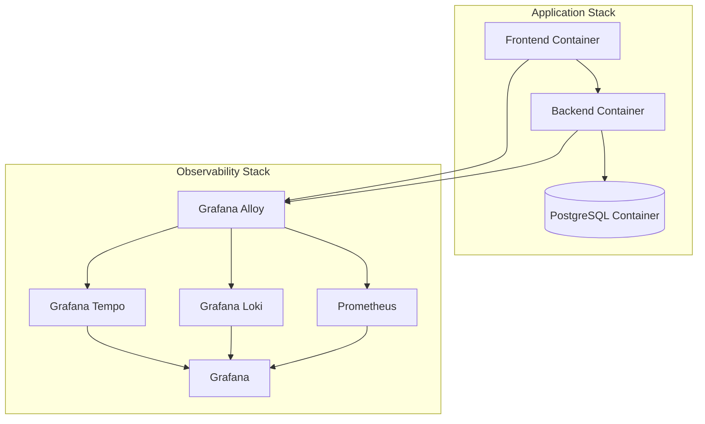

# Observability

ReqTrackManager includes an optional observability stack — Prometheus for metrics, Loki for log aggregation, Tempo for distributed tracing, Grafana Alloy for shipping all three, and Grafana for dashboards.

```bash
docker compose --profile observability up -d
```



This adds Prometheus (http://localhost:9090), Loki, Tempo, Grafana Alloy, and Grafana (http://localhost:3300 — anonymous viewer access enabled for local use; put it behind authentication before running this in production).

## Health checks and metrics

Every container in both Compose stacks has a Docker health check, so `docker compose ps` reports each service's actual liveness rather than just "running." The backend additionally exposes:

- `GET /health` — `{"status": "ok", "database": "ok"}` when the app and its database connection are both healthy.
- `GET /metrics` — Prometheus-format metrics, pre-scraped by the bundled Prometheus configuration when the observability profile is enabled.

## Logs and traces

Grafana Alloy ships container logs to Loki, and exposes an OTLP receiver on port `4317` ready to forward traces to Tempo once the backend is instrumented with OpenTelemetry — this instrumentation is not yet done (see [Architecture overview → Known limitations](../reference/architecture-overview.md#known-limitations)), so the tracing pipeline is wired and ready but currently receives no application traces. Prometheus is pre-configured with a scrape target for the backend's `/metrics` endpoint, and Grafana ships with dashboards pre-wired to these data sources — no manual data-source setup needed after bringing the profile up.

The repo's `observability/` directory holds the raw configuration this profile runs from (`prometheus.yml`, `alloy.river`, `tempo.yaml`), if you want to see or adapt exactly what's being scraped and shipped.

## Next steps

- [Scaling and adding modules](./scaling-and-modules.md)
- [Troubleshooting](./troubleshooting.md)
