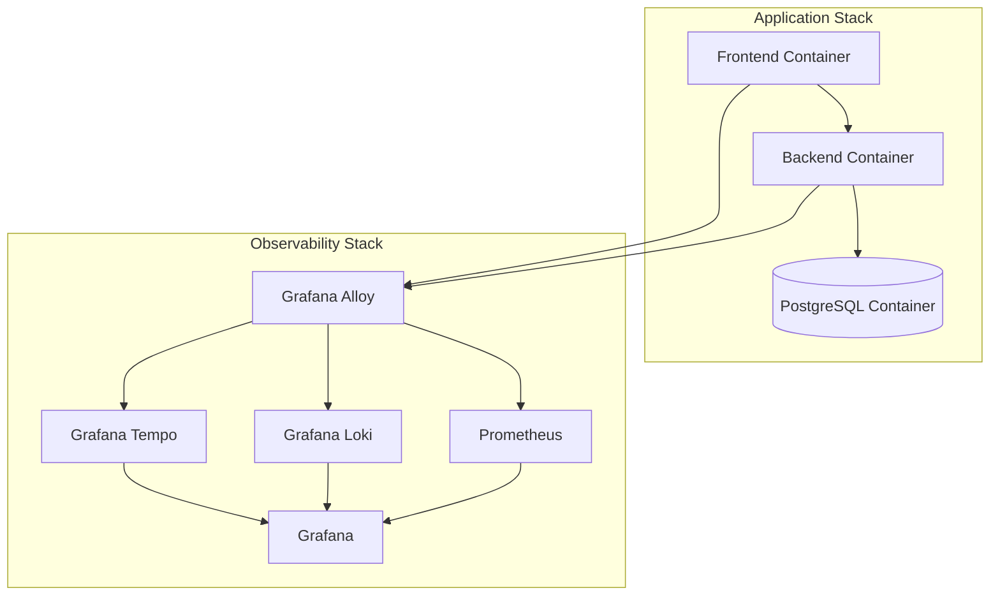

# Observability

ReqTrackManager includes an optional observability stack — Prometheus for metrics, Loki for log aggregation, Tempo for distributed tracing, Grafana Alloy for shipping all three, and Grafana for dashboards.

```bash
docker compose --profile observability up -d
```


```mermaid
flowchart TD
    subgraph App[Application Stack]
        FE[Frontend Container]
        BE[Backend Container]
        DB[(PostgreSQL Container)]
    end

    subgraph Ops[Observability Stack]
        Alloy[Grafana Alloy]
        Prom[Prometheus]
        Loki[Grafana Loki]
        Tempo[Grafana Tempo]
        Grafana[Grafana]
    end

    FE --> BE
    BE --> DB
    BE --> Alloy
    FE --> Alloy
    Alloy --> Prom
    Alloy --> Loki
    Alloy --> Tempo
    Prom --> Grafana
    Loki --> Grafana
    Tempo --> Grafana
```

This adds Prometheus (http://localhost:9090), Loki, Tempo, Grafana Alloy, and Grafana (http://localhost:3300 — anonymous viewer access enabled for local use; put it behind authentication before running this in production).

## Health checks and metrics

Every container in both Compose stacks has a Docker health check, so `docker compose ps` reports each service's actual liveness rather than just "running." The backend additionally exposes:

- `GET /health` — `{"status": "ok", "database": "ok"}` when the app and its database connection are both healthy.
- `GET /metrics` — Prometheus-format metrics, pre-scraped by the bundled Prometheus configuration when the observability profile is enabled.

### Request rate and database activity

Two counters answer "how busy is the API and database". Ask for the window you want at query time; the counters themselves have no window.

| Question | PromQL |
|----------|--------|
| API requests per minute | `sum(rate(http_requests_total[1m])) * 60` |
| API errors per minute (5xx) | `sum(rate(http_requests_total{status_code=~"5.."}[1m])) * 60` |
| Database reads in the last 15 minutes | `sum(increase(db_statements_total{operation="select"}[15m]))` |
| Database writes in the last 15 minutes | `sum(increase(db_statements_total{operation!="select",operation!="other"}[15m]))` |
| Writes per operation, last 15 minutes | `sum by (operation) (increase(db_statements_total{operation!="select",operation!="other"}[15m]))` |

`db_statements_total` counts statements the backend sends to PostgreSQL, labelled only by `operation` (`select`, `insert`, `update`, `delete`, `other`). It carries no table names, ids or SQL text, so it is safe on the unauthenticated `/metrics` endpoint. One bulk statement counts once whatever its row count, and the backend's own `/health` probe lands in `other`. Each backend replica exposes its own counters, so sum across targets as the queries above do.

## Logs and traces

Grafana Alloy ships container logs to Loki, and exposes an OTLP receiver on port `4317` ready to forward traces to Tempo once the backend is instrumented with OpenTelemetry — this instrumentation is not yet done (see [Architecture overview → Known limitations](../reference/architecture-overview.md#known-limitations)), so the tracing pipeline is wired and ready but currently receives no application traces. Prometheus is pre-configured with a scrape target for the backend's `/metrics` endpoint. Grafana starts with no data sources or dashboards provisioned: add Prometheus (`http://prometheus:9090`), Loki and Tempo under **Connections → Data sources**, then use the queries above in Explore or your own dashboards.

The repo's `observability/` directory holds the raw configuration this profile runs from (`prometheus.yml`, `alloy.river`, `tempo.yaml`), if you want to see or adapt exactly what's being scraped and shipped.

## Next steps

- [Scaling and adding modules](./scaling-and-modules.md)
- [Troubleshooting](./troubleshooting.md)
