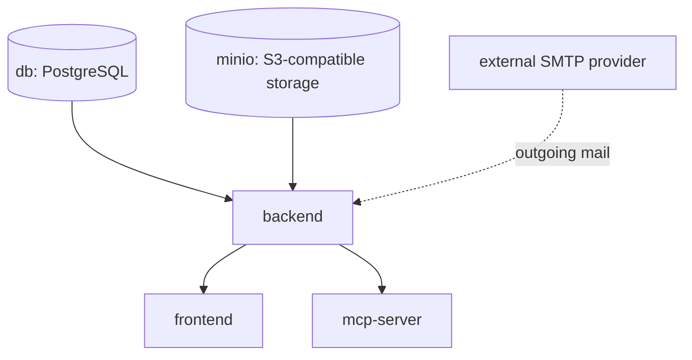

# Overview

ReqTrackManager ships as a set of Docker containers, orchestrated by Docker Compose. There are **two separate Compose files** with different purposes, and using the wrong one for the wrong purpose is the single most important thing to get right before going any further in this chapter.

## Prerequisites

- Docker and Docker Compose v2 (`docker compose`, not the legacy `docker-compose`).
- A host with persistent volume storage for PostgreSQL (and MinIO, if using the bundled S3-compatible storage backend).
- For production: a domain name and TLS termination in front of the frontend/backend — ReqTrackManager does not terminate TLS itself, see [TLS, reverse proxy, and same-origin deployment](./tls-and-reverse-proxy.md).

## Two Compose stacks, two purposes

| | `docker-compose.yml` (repo root) | `tests/container/docker-compose.yml` |
| --- | --- | --- |
| Purpose | **Production.** What a real deployment runs. | **Local development, evaluation, and automated testing.** |
| Secrets | Refuses to start until you provide `JWT_SECRET`, `APP_SECRET_ENCRYPTION_KEY`, `SERVER_ADMIN_PASSWORD`, `POSTGRES_PASSWORD`, `MINIO_ROOT_PASSWORD`, and `SMTP_HOST` — no insecure defaults. | Dev-friendly defaults for everything, no setup required. |
| Extra services | None beyond the application itself (plus an optional observability profile). | MailHog (SMTP catcher) and a real Keycloak instance, for testing per-organisation SSO end-to-end. |
| Database | Your production PostgreSQL. | Its own dedicated `reqtrack_test` database, isolated from anything else. |
| Used by | Real users. | `backend/tests/` (pytest), the Playwright E2E suite, and CI. |

These are deliberately kept separate rather than sharing one file with a dev override. Sharing led to a real, serious bug during this project's development: running the backend test suite against what was meant to be a "just add a test override" version of the same stack silently dropped and recreated the *production* database's schema. **Never run `pytest`, or anything under `tests/`, against the root stack**, and never point the `tests/container/` stack at the internet.

Reading this top to bottom: `db` and `minio` must be healthy before `backend` starts, since the backend runs migrations and talks to storage immediately on boot. `backend` must be healthy before `frontend` or `mcp-server` start — both depend on the API being reachable, though their own health checks are otherwise independent of each other. The backend sends outgoing mail to whatever `SMTP_HOST` points at, which in production is an external provider, not a container in either stack. This is also the right order to check when something won't come up: `db`/`minio` first, then `backend`, then `frontend`/`mcp-server`.

| Service | Purpose | Production stack? | Dev/eval stack? |
| --- | --- | --- | --- |
| `db` | PostgreSQL, the primary data store | Yes | Yes (`reqtrack_test`) |
| `backend` | FastAPI application, runs migrations on startup | Yes | Yes |
| `frontend` | Static React SPA served by nginx | Yes | Yes |
| `minio` | Bundled S3-compatible file storage | Yes, if `STORAGE_BACKEND=s3` | Yes |
| `mcp-server` | Read-only MCP server exposing requirements to AI assistants | Yes | Yes |
| `mailhog` | Local SMTP catcher with a web UI | No — a real SMTP provider is configured via `SMTP_HOST` instead | Yes |
| `keycloak` | Real OIDC identity provider, for testing per-org SSO end-to-end | No — a real deployment points each org at its own IdP instead | Yes |
| `prometheus`, `loki`, `tempo`, `grafana`, `alloy` | Optional observability stack (`--profile observability`) | Yes, opt-in | No |

## Where to go next

- Trying the product out, or hacking on this repo? Start with [Quick start (local / evaluation)](./quick-start.md).
- Standing up a real instance for real users? Go straight to [Production deployment](./production-deployment.md).
