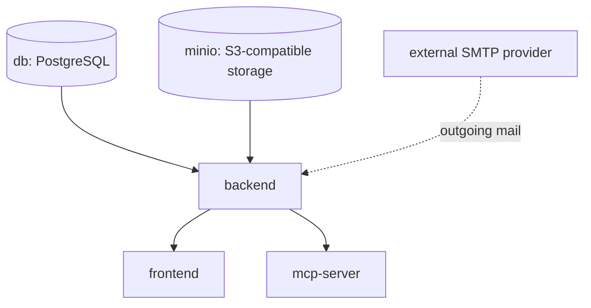

# Production deployment

Production deployment uses the root `docker-compose.yml` and the same container images used for local development — the difference is entirely in configuration, and the compose file itself enforces the important parts of it: `docker compose up` fails immediately with a clear error naming the missing variable if any required secret isn't set, rather than silently starting with an insecure default.

## Minimum `.env`

Create a `.env` file next to `docker-compose.yml` (Docker Compose loads it automatically) and set at minimum:

```bash
# Secrets — generate strong random values, do not reuse the defaults
JWT_SECRET=<random 32+ byte secret>
APP_SECRET_ENCRYPTION_KEY=<random 32+ byte secret>  # distinct from JWT_SECRET — see Configuration reference
SERVER_ADMIN_PASSWORD=<strong password>
POSTGRES_PASSWORD=<strong password>
MINIO_ROOT_PASSWORD=<strong password>          # if using the bundled MinIO

# Networking
CORS_ORIGINS=https://your-domain.example
PUBLIC_API_BASE_URL=https://api.your-domain.example

# Outgoing email — point at a real SMTP provider instead of MailHog
SMTP_HOST=smtp.your-provider.example
SMTP_PORT=587
SMTP_USE_TLS=true
SMTP_USERNAME=<smtp username>
SMTP_PASSWORD=<smtp password>
SMTP_FROM_ADDRESS=noreply@your-domain.example

# Operational alerting
DEPLOYMENT_NOTIFICATION_EMAIL=ops@your-domain.example
```

```bash
docker compose up --build -d
```

The full list of backend environment variables — with defaults and which are actually required — is on the [Configuration reference](./configuration-reference.md) page.

## Beyond the two obvious containers

- **MinIO** is the default file-storage backend (`STORAGE_BACKEND=s3`) — an S3-compatible object store bundled in the compose file so file attachments and shared resources work out of the box. Point `STORAGE_S3_ENDPOINT_URL` at real AWS S3 (or another S3-compatible provider) instead if you'd rather not self-host it, or set `STORAGE_BACKEND=local` to use the backend container's own filesystem — see [Storage, database, and migrations](./storage-database-and-migrations.md).
- **OAuth/OIDC SSO** is per-organisation, not global: each organisation configures its own identity provider (issuer URL, client ID/secret) under its admin settings, so a single deployment can serve organisations with completely different IdPs — or none at all, staying on native email/password login. There's no bundled identity provider in the production stack; the dev/eval stack's Keycloak instance exists purely so SSO login can be tested end-to-end and should never be pointed at from a real deployment.
- **The MCP server** (`mcp-server`, port 8100) is optional but on by default — it holds no credentials of its own and does no authorization itself, only forwarding whatever access token the calling AI assistant already has. Leave it running (nothing reaches it without a valid token) or stop the container if you don't want to expose it at all.



## Obtaining container images

CI builds the production `backend`, `frontend`, and `mcp-server` images on every change and, once tests pass on a push to `main`, pushes all three to `ghcr.io/<owner>/<repo>-{backend,frontend,mcp-server}`. Pull requests still build every image, proving the Dockerfiles work, but never push — only a merge to `main` publishes.

Each image is tagged three ways:

- **`latest`** — always the most recent build from `main`. What `IMAGE_TAG` defaults to.
- **`<git sha>`** — the exact commit it was built from, for pinning to a specific build without needing a release version.
- **a SemVer** (e.g. `1.4.0`) — computed automatically from the commit graph by [GitVersion](https://gitversion.net/): every merge to `main` is a release, so the version increments without anyone pushing a git tag by hand.

`docker-compose.yml` declares both `image:` (pointing at these published tags) and `build:` (a local Dockerfile build) for `backend`/`frontend`/`mcp-server`, so:

- **First run, or `docker compose up --build -d`**: builds locally — nothing requires ever touching `ghcr.io`.
- **To deploy an already-published image instead of building**: set `IMAGE_TAG` in your `.env` (a SemVer to pin a specific release, a commit SHA, or leave it unset/`latest` to track the newest `main` build), then `docker compose pull && docker compose up -d`. This is the faster path for upgrading an existing deployment — no build step, no source checkout needed on the host at all.

If your images live in a different registry/namespace (e.g. a private mirror), override `GHCR_IMAGE_PREFIX` in your `.env` instead of editing `docker-compose.yml`.

**Checking what's actually deployed.** The same SemVer/commit SHA used to tag an image is baked into it at build time, so a running instance can report its own build identity without shell access to the host: the signed-in nav rail shows both the frontend's and the backend's version, fetched from `GET /api/v1/system/version`. A local `docker compose build` with no build args (the default for both paths above) reports placeholder `dev`/`unknown` values instead of failing — only images built by CI carry a real version.

## Hardening: scope MinIO credentials

By default `STORAGE_S3_ACCESS_KEY`/`STORAGE_S3_SECRET_KEY` are wired to `MINIO_ROOT_USER`/`MINIO_ROOT_PASSWORD`, so the backend authenticates to MinIO as its full administrator rather than a credential limited to its own bucket. That's fine to get started, but worth narrowing for a real deployment: a backend compromise (or a leaked environment variable) then only grants access to this app's own files, not the ability to manage every MinIO user/bucket/policy. Provision a scoped service account once, then point the backend at it instead of the root credentials:

```bash
docker compose exec minio mc alias set local http://localhost:9000 "$MINIO_ROOT_USER" "$MINIO_ROOT_PASSWORD"
docker compose exec minio mc admin user add local reqtrackmanager-app <a-different-strong-password>
docker compose exec minio mc admin policy create local reqtrackmanager-app-policy - <<'EOF'
{
  "Version": "2012-10-17",
  "Statement": [{
    "Effect": "Allow",
    "Action": ["s3:GetObject", "s3:PutObject", "s3:DeleteObject", "s3:ListBucket"],
    "Resource": ["arn:aws:s3:::reqtrackmanager", "arn:aws:s3:::reqtrackmanager/*"]
  }]
}
EOF
docker compose exec minio mc admin policy attach local reqtrackmanager-app-policy --user reqtrackmanager-app
```

Then set `STORAGE_S3_ACCESS_KEY=reqtrackmanager-app` and `STORAGE_S3_SECRET_KEY=<the password you chose above>` in your `.env`, instead of reusing `MINIO_ROOT_USER`/`MINIO_ROOT_PASSWORD` there. Keep the root credentials only for this one-time setup (and for the admin console at `:9001`).

## Next steps

- [Configuration reference](./configuration-reference.md) for the full environment-variable table.
- [TLS, reverse proxy, and same-origin deployment](./tls-and-reverse-proxy.md) — required reading before exposing this to real users, since ReqTrackManager does not terminate TLS itself.
- [Observability](./observability.md) to wire up metrics, logs, and traces.
