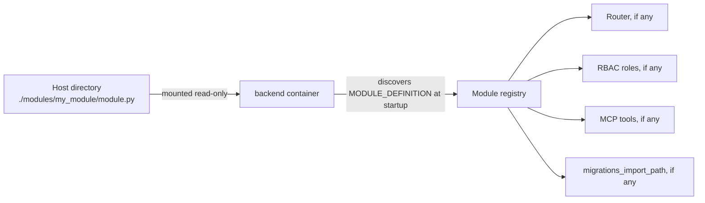

# Scaling and adding modules

## Adding an external module by mounting a directory

The [modular feature system](../modules/overview.md) can load a module from a plain directory mounted into the `backend` container — no rebuild of the backend image required. This is **off by default** and must be deliberately opted into, since it lets code the deployment operator supplies run inside the backend's own process with the backend's own database credentials.



1. Build the module directory on the host, e.g. `./modules/my_module/module.py` exposing a module-level `MODULE_DEFINITION`. If the module has its own database tables, it can also declare `migrations_import_path` pointing at a sibling module exposing an idempotent `run_migrations(connection) -> None`.
2. Mount that directory into the backend container and point `EXTRA_MODULES_PATH` at it, and set `ALLOW_EXTERNAL_MODULES=true`:

   ```yaml
   backend:
     environment:
       ALLOW_EXTERNAL_MODULES: "true"
       EXTRA_MODULES_PATH: /extra-modules
     volumes:
       - ./modules:/extra-modules:ro
   ```
3. `docker compose up -d backend` (or restart the container). At startup the backend discovers `MODULE_DEFINITION`, mounts its router (if any), registers its RBAC roles/MCP tools (if any), imports its models into the schema-comparison metadata, and — because `ALLOW_EXTERNAL_MODULES` is on — automatically applies its own `migrations_import_path` migration if it declares one. No edit to any core ReqTrackManager file is needed for any of this.

A first-party module shipped inside the backend's own image (e.g. the [Compliance module](../modules/compliance-module.md)) is unaffected by any of this — it always loads regardless of `ALLOW_EXTERNAL_MODULES`, and its own schema changes always ship as a reviewed Alembic migration in the core image, never via `migrations_import_path`.

## Adding a Tier C (federated) frontend module

The modular feature system's frontend half also supports a genuinely third-party module with **no rebuild of either the backend or frontend image** — Tier C / Module Federation. See [Third-party and federated modules](../modules/third-party-and-federated-modules.md) for the full module-author/operator contract; this section is the operator's side of it.

:::caution Read this before enabling it
A Tier C module runs with **no sandbox at all** — same origin, same DOM, same cookies, same live component tree as the rest of this app. The trust falls entirely to you, the deployment operator, to review and vet the module before enabling it.
:::

1. Get the module's frontend bundle and `module.py` from its author.
2. Register the backend half exactly like any other external module — place `module.py` under a directory pointed at by `EXTRA_MODULES_PATH`, and set `ALLOW_EXTERNAL_MODULES=true` (same as step 2 above).
3. Mount the frontend bundle into the frontend container's reserved `/usr/share/nginx/external-modules/` directory, served same-origin at `/external-modules/...`, so the module's declared `remote_entry_url` (e.g. `/external-modules/my-module/remoteEntry.js`) resolves:

   ```yaml
   frontend:
     volumes:
       - ./external-modules:/usr/share/nginx/external-modules:ro
   ```

   If you'd rather host the bundle somewhere else entirely — your own CDN, another origin — skip this mount and have the module's `remote_entry_url` point at that absolute URL instead.
4. `docker compose up -d backend frontend` (or restart both containers) — no rebuild of either image.
5. Enable the module for an organisation via the Modules admin UI, exactly like any other module.

## Scaling beyond a single backend replica

The current architecture assumes a single backend process: the WebSocket pub/sub hub, the notification digest job, and the disk-usage monitor all run in-process. Running multiple backend replicas behind a load balancer works fine for the stateless request/response API, but those three background mechanisms would need to move to a shared broker or a dedicated worker service first — this is a deliberate future step, not something the current deployment model supports today.

## Next steps

- [Troubleshooting](./troubleshooting.md)
