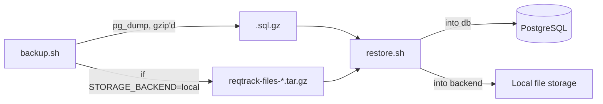

# Storage, database, and migrations

## Storage backend

- **`STORAGE_BACKEND=local`** (default outside Compose) stores files on the backend container's own filesystem, at `STORAGE_LOCAL_DIR`. The root `docker-compose.yml` mounts this as the named volume `reqtrack_local_files` so files survive container recreation; if you run the backend outside this Compose file, mount an equivalent persistent volume yourself. The built-in disk-usage monitor only runs for this backend, emailing `DEPLOYMENT_NOTIFICATION_EMAIL` when usage crosses `DISK_USAGE_WARNING_THRESHOLD_PERCENT`.
- **`STORAGE_BACKEND=s3`** (the Compose default) stores files in any S3-compatible bucket — the bundled MinIO, a self-hosted MinIO cluster, or real AWS S3. Set `STORAGE_S3_ENDPOINT_URL` to your provider (omit it, or point it at AWS's endpoint, for real S3), and set `STORAGE_S3_BUCKET`/`STORAGE_S3_ACCESS_KEY`/`STORAGE_S3_SECRET_KEY`/`STORAGE_S3_REGION` accordingly. This is the recommended choice for any deployment with more than one backend replica, since local disk storage doesn't get shared across replicas.

## Database

PostgreSQL is not started with automatic backups. Use the provided scripts on a schedule — cron, a systemd timer, or your orchestrator's job scheduler:

```bash
./scripts/backup.sh [output-dir]     # pg_dump (gzip'd) + local file storage (tar.gz, if STORAGE_BACKEND=local), timestamped
./scripts/restore.sh <backup-file>   # restores a .sql.gz into db, or a reqtrack-files-*.tar.gz into backend
```



`backup.sh` covers everything in one run for the common case: it always dumps the database, and additionally archives `reqtrack_local_files` when the running deployment has `STORAGE_BACKEND=local`. If you use `STORAGE_BACKEND=s3` (the Compose default, via MinIO), back up the `reqtrack_minio_data` volume with MinIO's own backup/replication tooling instead — it isn't a plain file tree this script can tar up.

Test restores periodically — a backup that has never been restored is not a verified backup.

## Migrations

The backend runs `alembic upgrade head` automatically on every startup. Upgrading to a new ReqTrackManager version is therefore just: pull the new image, `docker compose up -d backend` — no manual migration step is required. Because the migration runs immediately and automatically on container start, **always take a database backup before upgrading**.

## Next steps

- [TLS, reverse proxy, and same-origin deployment](./tls-and-reverse-proxy.md)
- [Scaling and adding modules](./scaling-and-modules.md)
