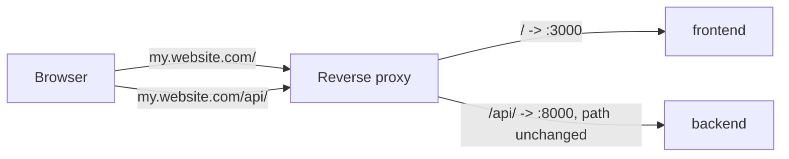

# TLS, reverse proxy, and same-origin deployment

ReqTrackManager's containers serve plain HTTP internally (frontend on 3000, backend on 8000). In production, put a reverse proxy — nginx, Caddy, Traefik, or a cloud load balancer — in front of both that terminates TLS and forwards to the two container ports. There are two supported patterns.

**Security response headers**: both the backend and the frontend's nginx config already set `X-Frame-Options: DENY`, `X-Content-Type-Options: nosniff`, `Referrer-Policy: same-origin`, and a minimal `Content-Security-Policy: frame-ancestors 'none'` on every response — deliberately just enough to close clickjacking-style UI-redress, not a full CSP. A full `Content-Security-Policy` restricting script/style/font sources would need to be tuned against this SPA's actual bundle to add without risking silently breaking the app, and hasn't been. If your deployment wants one, test it thoroughly against a full pass through the app first, and prefer adding it at the reverse-proxy layer (fronting both containers) so it's configured once, not duplicated between the backend and nginx.

## Two hostnames

Point the reverse proxy's public hostnames at `CORS_ORIGINS` (the frontend's origin) and `PUBLIC_API_BASE_URL` (the backend's origin), e.g. `app.example.com` for the UI, `api.example.com` for the backend. This is the simplest pattern to reason about, and needs `CORS_ORIGINS` set correctly on the backend since the browser treats the two as different origins.

## One hostname, routed by path (avoiding CORS)

Instead of two hostnames, the frontend and backend can be served from **one origin** — e.g. the UI at `https://my.website.com/` and the API at `https://my.website.com/api/` — with the reverse proxy routing by path. Because the browser then sees only one origin, this sidesteps CORS entirely rather than configuring around it: same-origin requests never trigger CORS preflight/enforcement, regardless of `CORS_ORIGINS`.

This works with **no backend routing changes**: every REST endpoint the frontend actually calls already lives under `/api/v1/...`, so a reverse proxy that passes `/api/` straight through to the backend, unmodified, lines up with the app's own path structure automatically.



An nginx example:

```nginx
server {
    listen 443 ssl;
    server_name my.website.com;
    # ... TLS config ...

    location /api/ {
        proxy_pass http://backend:8000;   # no path on proxy_pass -> forwards the URI unchanged
        proxy_set_header Host $host;
    }

    location / {
        proxy_pass http://frontend:3000;
        proxy_set_header Host $host;
    }
}
```

Then set, on the backend:

```bash
CORS_ORIGINS=https://my.website.com   # harmless to leave set; same-origin requests ignore it anyway
```

and on the frontend:

```bash
PUBLIC_API_BASE_URL=   # deliberately empty — see below
```

An **empty** `PUBLIC_API_BASE_URL` (not omitted — actually set to an empty value in your `.env`/orchestrator config) tells the frontend to make API calls as relative paths (`/api/v1/...`) rather than against an absolute URL, so they resolve against whatever origin the page itself was loaded from — exactly what's needed once the UI and API share one origin. Leaving `PUBLIC_API_BASE_URL` completely unset instead falls back to the default (`http://localhost:8000`), which is correct for local development but wrong here — the two are deliberately different, and the frontend's runtime config generator is written to preserve that distinction: an explicit empty value is honoured, not silently replaced by the default.

:::danger Common mistake
Do not set `PUBLIC_API_BASE_URL=/api` (or any value containing `/api`). It's a natural-looking choice — it matches the nginx location prefix above — but `PUBLIC_API_BASE_URL` is *prepended* to the frontend's own request paths, not merged with them: the frontend already calls `/api/v1/...`, so `PUBLIC_API_BASE_URL=/api` turns a request for `/api/v1/orgs` into `/api` + `/api/v1/orgs` = `/api/api/v1/orgs`, which 404s. Leave it empty — the nginx `/api/` prefix and the frontend's `/api/v1/...` paths are deliberately chosen to already line up without it.
:::

**What this does and doesn't cover:** the `/api/` location above only reaches paths that genuinely start with `/api/` on the backend — every route the frontend calls (`/api/v1/...`) matches, but `/health`, `/metrics`, `/docs`, and `/openapi.json` don't and won't be reachable at `my.website.com/api/health` etc. This is usually the right default — health checks and metrics are typically scraped over the internal Docker network (see [Observability](./observability.md)), not exposed publicly. If you do want Swagger UI reachable through the public subpath, add matching one-to-one location blocks (`location /api/docs { proxy_pass http://backend:8000/docs; }`, and likewise for `/api/openapi.json` and `/api/metrics`).

## Next steps

- [Observability](./observability.md)
- [Troubleshooting](./troubleshooting.md)
