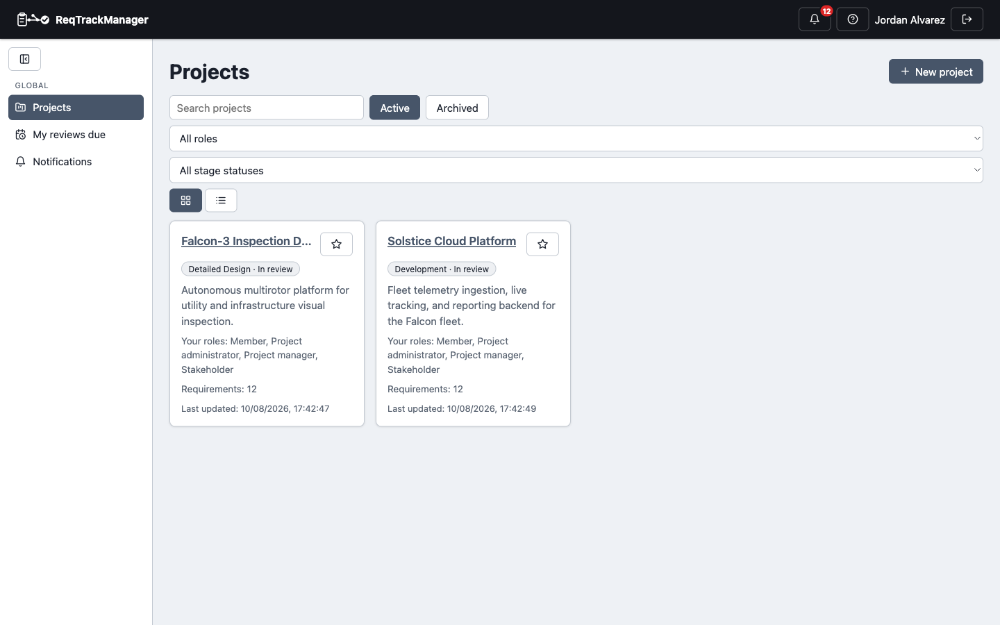
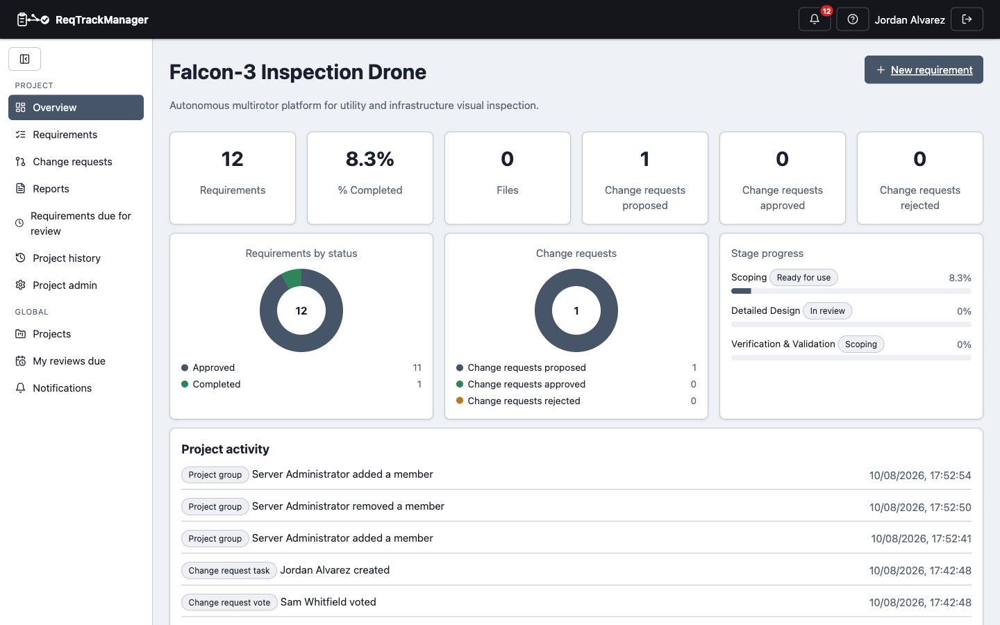

import Head from '@docusaurus/Head';

<Head>
  
</Head>

# Overview

ReqTrackManager is an open-source engineering requirements management system (ERMS) — a formal, collaborative alternative to expensive legacy enterprise requirements tools for product teams that can't justify that cost, without falling back to a static requirements spreadsheet that nobody trusts by the second review cycle. Requirements get a real identity, a full version history, and a paper trail from first draft to shipped and verified; changes to already-approved requirements go through an actual review workflow instead of a silent edit.

It's built to sit at the center of how a hardware, firmware, or regulated-software team actually works day to day — not bolted on as an afterthought. Organisations contain projects, projects have role- and group-based access control enforced server-side, and every requirement and change request carries its own threaded discussion so the reasoning behind a decision lives next to the thing it's about.

## A look at the app

The screenshots below are captured from the seeded demo dataset — a fictional drone-inspection company with two projects at different lifecycle stages.

| Projects dashboard |
| --- |
| Favourites, role/stage filters, tile or list view |
|  |

| Project overview |
| --- |
| Status breakdown, change-request funnel, stage progress, and an activity feed for one project |
|  |

| Requirement detail |
| --- |
| Version history, change log, and discussion thread for a single requirement |
|  |

## Where to go next

- New to the product? Read [Use cases](./use-cases.md) for concrete scenarios this was built for.
- Want to understand the model before clicking around? Start with [Concepts](../concepts/organisations-and-projects.md).
- Ready to run it yourself? [Installation & Deployment](../installation-deployment/overview.md) has a one-command local stack with this exact demo dataset.
- Want to see how a specific screen works, step by step? See [Workflows](../workflows/signing-in.md).
