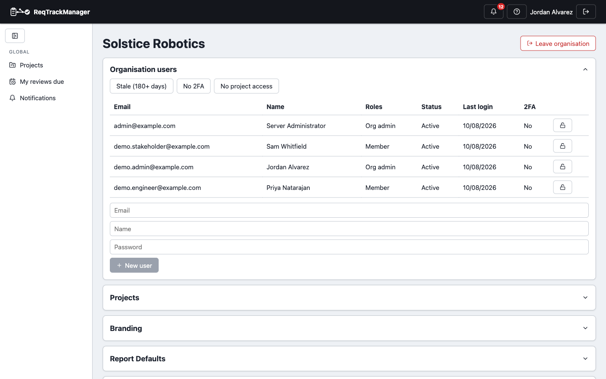

# Use cases

ReqTrackManager isn't aimed at every team that tracks work — it's aimed at teams for whom "what did we actually commit to, and who approved it" needs to stay answerable months or years later. A few concrete situations where that matters:

## A hardware or firmware team that can't justify a legacy enterprise tool's price tag

Hardware and firmware teams have real requirements-management needs — stable requirement IDs, traceability between requirements, an auditable approval trail — but the established enterprise tools in this space are expensive to license and heavy to administer for a team that isn't a large enterprise. ReqTrackManager gives each requirement a real, permanent identity (e.g. `SW-PERF-014`) and typed, bidirectional traceability links (see [Requirements, versions, and the lifecycle](../concepts/requirements-versions-and-lifecycle.md)), without the licensing overhead.

## A regulated-software team that needs an auditable change trail

Medical device, automotive, and aerospace software teams need to show not just what a requirement says today, but what it said at each approved baseline, and exactly what changed and why between them. Every requirement here is versioned, every change to an approved requirement goes through a formal change request with a required reason and an approve/reject decision, and approving a project stage snapshots a permanent baseline of everything in it. See [Change requests and baselines](../concepts/change-requests-and-baselines.md).

## A team outgrowing a shared spreadsheet

The failure mode of a shared requirements spreadsheet is familiar: by the second review cycle, nobody fully trusts the "latest" tab, edits collide, and there's no record of who approved what. Moving to ReqTrackManager keeps the same day-to-day authoring experience — creating, editing, organising requirements — but adds real identity, versioning, and role-based access control underneath it, enforced by the server rather than by convention. See [Roles, groups, and access control](../concepts/roles-groups-and-access-control.md).

## A team tracking a compliance framework against real requirements

Once the optional [Compliance module](../modules/compliance-module.md) is enabled for an organisation, a team can define a reusable compliance standard (an internal security standard, a regulatory obligation, a customer-mandated framework), version it, and track each project's own assessment against it — independently of every other project in the organisation.

## A multi-project engineering organisation

Larger organisations run several projects — sometimes with parent/child relationships between them — and need project-level access control instead of one shared document everyone can edit. An organisation admin manages users, groups, and organisation-wide settings, but doesn't automatically gain access to a project's requirements; each project's own role and group assignments govern who can author, review, or approve there. See [Organisations and projects](../concepts/organisations-and-projects.md).

| Organisation admin |
| --- |
| Members, roles, 2FA status, and access-review filters — access control enforced independently of project content |
|  |
