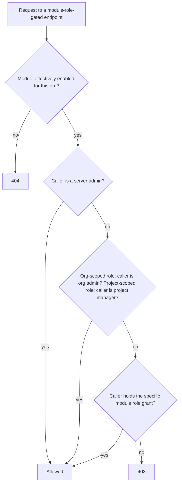

# Building your own module

This page covers building a module that ships **inside** this repository — Tier A, "installed": compiled directly into the same backend and frontend images as the core application, the same way the [Compliance module](./compliance-module/overview.md) itself is built. If you're building a module that was never compiled into this deployment's own images at all — a genuinely third-party package, or a frontend bundle loaded at runtime — see [Third-party and federated modules](./third-party-and-federated-modules.md) instead; the contract below (`ModuleDefinition`, RBAC, MCP tools) still applies, but how your module's *code* actually reaches a running deployment differs.

## The registry: how a module gets discovered

A single registry is the source of truth for "which modules exist," merged once at server startup from three sources, in priority order:

1. **Installed modules** — a static list, in this repository, reviewed the same way any other code change here is. Always loads, regardless of configuration. This is how a first-party module (built in this repo, via a normal PR) is registered.
2. **Installable packages**, discovered via a plugin entry point — the same plugin-discovery idiom pytest and Flask extensions use. Any package installed into the deployment's image that declares this entry point is picked up automatically at startup.
3. **A local directory** an operator points the deployment at — each subdirectory containing a module definition file is loaded.

Sources 2 and 3 are gated behind an explicit, off-by-default deployment setting — a deployment that wants third-party modules has to opt in; first-party modules are unaffected either way. See [Third-party and federated modules](./third-party-and-federated-modules.md) for the full account of that gate and why it exists.

## `ModuleDefinition`: the contract

Everything a module declares about itself is one value — a stable `key` (e.g. `"compliance"`), a display `name`/`description`/`version`, a `default_enabled` flag, a `get_router()` callable returning its primary `APIRouter` (or `None` for a module with no HTTP endpoints of its own), an optional tuple of RBAC `roles`, an optional `frontend_manifest`, an optional tuple of `mcp_tools`, optional paths telling the backend where to find its ORM models and its database migration, and a further set of optional hooks — up to two more routers, scheduled jobs, bundle export/import, and a handful of lifecycle/visibility callbacks — covered in their own sections below. Every field beyond `key`/`name`/`description`/`version`/`default_enabled`/`get_router` is optional; a module declares only the ones its own feature set actually needs.

`key` and every role's `role_key` are load-bearing identifiers — they're used as plain string keys in database rows (entitlement, enablement, role grants), not foreign keys into a "modules" table. **Never change a module's `key` or an existing role's `role_key` once a deployment has data keyed on it.**

**Database tables.** If your module has its own tables, it ships a real, reviewed migration in its own directory — colocated with the rest of the module's code, applied through this repository's normal migration tooling, and participating in the same single, linear, reviewed migration chain as every core migration.

**File attachments.** If your module lets users attach files, reusing this application's existing upload mechanism, it can hook into the core, module-agnostic file-download endpoint so downloads are authorized correctly without that core endpoint importing anything from your module directly — your module supplies a small resolver function that, given a file id, returns the owning project's id if your module's own file-link table references that file.

## Additional routers: project- and global-scoped

`get_router()` is a module's original, organisation-scoped router, mounted at `/api/v1/orgs/{organization_id}/modules/<key>/...`. A module isn't limited to just that one — two further router-returning callables are available, both optional:

- **`get_project_router()`** — a second router mounted at `/api/v1/projects/{project_id}/modules/<key>/...`, for endpoints that belong under a project rather than an organisation. This matters beyond just URL taste: it's what lets an MCP tool take `project_id` as its only path parameter (mirroring a hand-written tool like `get_project(project_id)`) — impossible on the org-scoped router, since every route there also carries `organization_id`. The Compliance module uses this for its project-status/non-compliant-requirements/evidence/pending-approvals/reviews-due endpoints — see its [MCP tools](../api-integrations/ai-assistants-mcp/overview.md#module-contributed-tools) table for the result.
- **`get_global_router()`** — a third router mounted at a path with **neither** an `organization_id` nor a `project_id` placeholder, for the rare endpoint with no single resource id to key off (e.g. one that aggregates across every organisation the caller belongs to). A route here has to resolve its own org/project access checks internally, rather than binding a FastAPI dependency off a path parameter the way the other two routers' routes can.

All three routers are mounted the same way, with no extra gate applied at the mount-loop level beyond what each router's own routes declare internally. `None` (the default) for a module that doesn't need the corresponding surface — most modules need only `get_router()`. `build_mcp_tool_manifest` (see [Module-contributed MCP tools](#module-contributed-mcp-tools) below) validates a tool's `path_template` against whichever of a module's declared routers it actually falls under, not just `get_router()`'s.

## Module-contributed RBAC

A module can declare its own named roles without touching the core role enums:

```python
ModuleRoleDefinition(
    role_key="compliance_manager",
    name="Compliance Manager",
    description="Can create and publish compliance standards for this organisation.",
    scope="org",   # or "project"
)
```

A module gates an endpoint on one of its own roles with a single dependency naming `(module_key, role_key)`. The check composes with the core RBAC model rather than replacing it — a caller is authorized if **any** of the following hold:



In other words: a higher-tier admin never needs the narrower module role explicitly granted too — the same principle already applied to core roles. A role's `scope` isn't limited to `"org"`/`"project"` either — a module may declare any other string as `scope`, tying a role to one specific row of an entity the module itself owns (the Compliance module's own `standards_manager`, scoped to one standard, is the working example).

**UI convention:** a module's roles are never rendered as a bespoke grant/revoke control. The existing roles column on the org admin Users table and the project members table merges in whichever module roles are currently offered by a currently-enabled module, alongside the fixed core-role options — same component, for every role in the system.

## Scheduled jobs

A module that needs periodic background processing — Compliance's daily evidence-expiry, review-due, required-action-due, and target-date sweeps are the working example (see [Compliance module → Scheduled reviews and notifications](./compliance-module/reviews-and-notifications.md)) — declares a tuple of `scheduled_jobs`, each naming a `job_id`, an `hour`/`minute` (container-local time) it fires at, and a `run(db: Session) -> None` callable performing the sweep. The core scheduler registers every module's declared jobs generically, alongside its own two core jobs, job-id-prefixed with the module's own key so two modules can never collide on a job id — no core-file edit needed. Stagger `hour`/`minute` relative to existing jobs to avoid an unnecessary database-load spike; nothing enforces this mechanically. `None`/empty for a module with no scheduled processing of its own.

## Bundle export/import hooks

A module with content that belongs in ReqTrackManager's existing project/organisation export-import bundles (see [Compliance module → Reporting and export](./compliance-module/reporting-and-export.md) for what this looks like from a user's side) declares `org_bundle_hooks` and/or `project_bundle_hooks`:

- **`org_bundle_hooks`** — for content that belongs at the *organisation* level (Compliance's standards/versions/requirements, since a standard is an org-level, reusable resource). An `export(db, org) -> dict` collects the module's own content as plain JSON, merged into the core organisation bundle; a matching `import_(db, org, data, users, warnings, resolutions)` writes it back on restore, resolving user references via the shared resolver and recording anything skipped (never silently fabricated) via the shared warnings mechanism every core bundle section already uses. A module whose content can collide on an org-to-org merge, rather than always being purely additive, can also declare `compute_merge_conflicts` and `merge_resolution_choices` (validated the same way a core conflict already is) and `summarize_merge` for its own named counts in the merge summary.
- **`project_bundle_hooks`** — the project-scoped counterpart, for a module's own per-project content (Compliance's assessment state — assignments, applicability/status/approval, evidence files, review history). `export(db, project)` returns both the JSON payload and any `FileAsset` rows it references; `import_` writes it back, resolving attachment bytes and user references, called after every core bundle section has already run.

Both are optional and independent — a module can declare either, both, or neither depending on whether its content is organisation-level, project-level, or (like a module with no bundle-worthy state at all) not part of bundles.

## Lifecycle and visibility hooks

A handful of further optional hooks let a module react to core lifecycle events, or influence its own visibility, without the core file that triggers them needing to import anything module-specific:

- **`on_org_created(db, organization_id)`** / **`on_project_created(db, project, actor_id)`** — called once, synchronously, right after a new organisation or project is created, for a module that needs to seed its own org- or project-scoped defaults. Compliance uses the project variant to reconcile a newly-created project against every standard that already applies to all projects in its organisation, so a project created after such a standard exists gets the same treatment as one that already existed — never a lazily-computed "in scope but no real row" state.
- **`project_nav_visible(db, project) -> bool`** — lets a module hide its own already-*enabled* project nav entry/route for one specific project, beyond simple enablement (which the core "list enabled modules" endpoint already checks before ever consulting this). Compliance hides its nav entry until the project's organisation has at least one published standard, rather than sending a project to an empty "assign a standard" screen. `None` (the default) means always visible once enabled — a module doesn't need to declare this hook at all unless it has this kind of conditional visibility.
- **`validate_org_group_member_removal(db, org_group_id, member_user_id) -> str | None`** — called before a user is removed from an organisation group, letting a module block the removal if it would leave one of the module's own floor requirements unsatisfiable (Compliance's fallback compliance-managers group, which a standard's last Standards Manager grant can fall back to, is the example). Return a human-readable block message, or `None` to allow the removal.
- **`resolve_file_owner_project_id`** — the file-download authorization hook already covered above under [File attachments](#moduledefinition-the-contract); listed here as the other member of this same "core doesn't import a specific module" family of hooks.

All default to `None`/no-op; declare only the ones your module's own lifecycle actually needs.

## Frontend integration (Tier A)

A first-party module ships its own route components and registers them in its own `frontend/src/modules/<key>/module.ts` file — auto-discovered at build time, with no hand-edit to any shared registry file:

```ts
// frontend/src/modules/compliance/module.ts
export const moduleDefinition: TierAModuleDefinition = {
  key: "compliance",             // must match the backend ModuleDefinition.key
  routes: [
    { path: "/projects/:projectId/modules/compliance", element: <ProjectCompliancePage /> },
  ],
  // Optional — an organisation-level (not project-level) admin surface.
  orgAdminSections: [
    { key: "compliance", label: "Compliance", render: ({ orgId }) => <OrgCompliancePanel orgId={orgId} /> },
  ],
};
```

Because this is compiled directly into the same frontend bundle, the module's own components can import and use every real shared component — toasts, modals, confirmation dialogs, the shared data table, form inputs — genuinely part of the app, not a lookalike. This is the tier recommended for any module, first- or third-party, that can be compiled in.

`routes`/`orgAdminSections` above cover the two original surfaces — a project-scoped page, and an org-admin panel. `TierAModuleDefinition` (`frontend/src/modules/types.ts`) has grown further optional, equally declarative fields since, each covering one more specific place the host will render a module's contribution — use whichever your module actually needs; most modules need only one or two of these:

| Field | Where it renders | Gated on |
|---|---|---|
| `routes` | Project-scoped pages, e.g. `/projects/:projectId/modules/<key>` | This project's currently-enabled-modules list |
| `globalRoutes` | Always-mounted top-level routes with no single project/org in the URL (e.g. Compliance's `/standards`) | Nothing — mounted for every installed module |
| `orgAdminSections` | A `ResourceMenu` group on the Org Admin page | This org's currently-enabled-modules list |
| `projectAdminSections` | A `ResourceMenu` group on the Project Admin page | This project's currently-enabled-modules list |
| `globalNavItems` | A top-level link in the nav rail's "Global" section | The module's own `render` decides — the host has no org/project in context to filter on |
| `standaloneWorkspaces` | A left-nav section for a project-like entity that isn't a `Project` (matched against the current URL) | The module's own `render` decides |
| `projectOverviewTiles` | An extra metric tile on a project's Overview page | This project's currently-enabled-modules list |
| `orgOverviewSections` | A `ResourceMenu` group on the Organisation Overview page | This org's currently-enabled-modules list |
| `orgOverviewTiles` | A headline stat tile in the Organisation Overview page's own stats header | This org's currently-enabled-modules list |
| `requirementDetailSections` | An extra section on a requirement's Links card | This project's currently-enabled-modules list |
| `requirementLinkPickerTabs` | An extra tab in the shared "Add link" picker modal | This project's currently-enabled-modules list |

Every one of these follows the same shape: the module hands the host a `render` function (typed per field in `frontend/src/modules/types.ts`), and the host page — `App.tsx`, `Layout.tsx`, `OrgAdminPage.tsx`, `OrgOverviewPage.tsx`, `ProjectOverviewPage.tsx`, `RequirementDetailPage.tsx`, or `RequirementLinkPickerModal.tsx`, depending on the field — never imports a specific module's own components, only ever the generic `ReactNode` it was handed back. A module needing a new kind of UI surface the table above doesn't already cover should get a new field added to `TierAModuleDefinition` for it, generic across every module, rather than a one-off import of that module into the relevant core file.

## Module-contributed MCP tools

A module can also register its own tools for the MCP server AI assistants already use to read (and, in write mode, author) content — declared the same way as everything else here, as data, not a second implementation of the MCP server's own patterns:

```python
McpToolDefinition(
    name="list_standards",        # local name — not a full global name
    description="Lists compliance standards for an organisation.",
    method="GET",
    path_template="/api/v1/orgs/{organization_id}/modules/compliance/standards",
    params=[
        {"name": "organization_id", "type": "uuid", "required": True, "in": "path"},
    ],
)
```

The manifest builder turns this into a real tool the MCP server can offer an AI client — but derives every security-relevant part **mechanically**, never from what the module itself claims:

- The registered tool name is always **prefixed with the module's own key** — a module can never claim or collide with another module's or the core's tool name.
- **Whether the tool mutates is derived from the HTTP method** (`GET` → read-only, anything else → mutating) — nothing for a module to misdeclare, and a mutating tool is only ever registered when the deployment has explicitly enabled write access for AI assistants.
- **The tool's path must fall inside one of the declaring module's own router prefixes** (`get_router()`, and `get_project_router()`/`get_global_router()` if the module declares them — see [Additional routers](#additional-routers-project--and-global-scoped) above) — an entry pointing outside all of them is excluded and logged, regardless of what the module's own manifest claims.
- **Any tool resolving to an approval-type action is excluded from the manifest entirely** — approval must stay attributably human, the same principle every hand-written tool in this application already enforces by simply never exposing that capability as a tool at all.

See [API & Integrations → AI assistants (MCP)](../api-integrations/ai-assistants-mcp/overview.md) for how a client actually calls these once registered.

## Building a new module: a checklist

**Decide how it will be discovered.** All three registry sources are gated and mounted identically once loaded — this only decides how your `ModuleDefinition` reaches the registry: shipped in this repository via a normal PR (no extra deployment configuration needed), an installable package, or a local directory (both of the latter two need the deployment operator's explicit opt-in — see [Third-party and federated modules](./third-party-and-federated-modules.md)).

**Backend:**
1. Define your models and point your `ModuleDefinition` at them so the schema-comparison tooling includes them automatically — no core-file edit needed for this part.
2. Build an `APIRouter` for your endpoints (plus `get_project_router()`/`get_global_router()` if your endpoints genuinely don't all fit under one org-scoped prefix — see [Additional routers](#additional-routers-project--and-global-scoped) above). Gate each mutating/sensitive endpoint on module enablement, or on one of your own roles if it needs one.
3. Log every mutation through the same audit trail every core mutation already goes through.
4. Declare whichever optional hooks your module actually needs — [scheduled jobs](#scheduled-jobs), [bundle export/import](#bundle-exportimport-hooks), or the [lifecycle/visibility hooks](#lifecycle-and-visibility-hooks) above. Most modules need none of these beyond the fields covered earlier.
5. Assemble your `ModuleDefinition` and register it via whichever discovery path you chose.

**Frontend (if you have a UI):** prefer Tier A — build your route components against the real shared components, add your own `module.ts`, and declare a matching `installed`-tier frontend manifest on your backend definition. See the field table under [Frontend integration (Tier A)](#frontend-integration-tier-a) above for which of `TierAModuleDefinition`'s optional contribution points your module actually needs — most modules need only `routes` and/or `orgAdminSections`. See [Third-party and federated modules](./third-party-and-federated-modules.md) for when Tier B or Tier C is the better (or only available) choice instead.

**MCP tools (optional):** declare tool entries for whichever of your endpoints are safe to expose to an AI assistant. Mark any endpoint that approves or decides something with your route's own approval-action metadata — don't rely on the manifest builder's exclusion as your only defence; design the endpoint itself so an AI-driven caller can't reach an approval action even if the tool mechanism changes later.

**Test it** the way every other change in this codebase is tested: a backend test pinning your endpoints' behaviour (including the disabled/non-entitled case, and, if you declared roles, the grant/composition behaviour), and — if you have a Tier A frontend — component test coverage plus an end-to-end test, matching this project's own standing testing requirements.

## Security model

This system opens a real, new trust boundary — code loading — and is treated that way, not glossed over:

- **The trust boundary is "was deliberately installed."** First-party modules go through this project's own PR review. Third-party modules require a deployment operator to explicitly opt in and either install the package or point the deployment at it — an active, logged choice, not a default-on surface.
- **Sandboxing arbitrary untrusted code execution is explicitly out of scope.** The mitigation is the opt-in gate above, not a sandbox — the same boundary any Python plugin ecosystem relies on.
- **That same opt-in also covers applying an external module's own database migration** — not a second, separate trust decision, just the same "was deliberately installed" gate extended to schema changes rather than only request-time behaviour. A first-party module is exempt from this mechanism regardless: its schema changes always ship as a reviewed migration in the core image.
- **Path-scoping and approval-exclusion for MCP tools are mechanically enforced**, not trusted from a module's own manifest — see above.

## Where this fits

See [Modules → Overview](./overview.md) for the registry/gating model this all sits on top of, and [Modules → Third-party and federated modules](./third-party-and-federated-modules.md) for the tiers this page doesn't cover.
