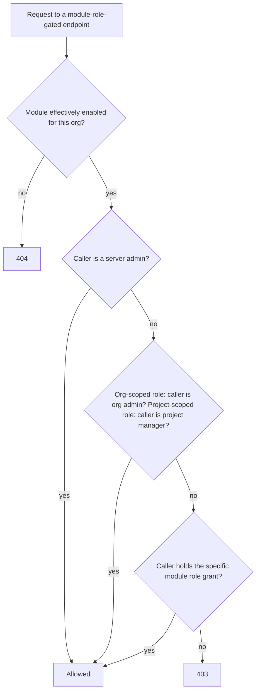

# Building your own module

This page covers building a module that ships **inside** this repository — Tier A, "installed": compiled directly into the same backend and frontend images as the core application, the same way the [Compliance module](./compliance-module.md) itself is built. If you're building a module that was never compiled into this deployment's own images at all — a genuinely third-party package, or a frontend bundle loaded at runtime — see [Third-party and federated modules](./third-party-and-federated-modules.md) instead; the contract below (`ModuleDefinition`, RBAC, MCP tools) still applies, but how your module's *code* actually reaches a running deployment differs.

## The registry: how a module gets discovered

A single registry is the source of truth for "which modules exist," merged once at server startup from three sources, in priority order:

1. **Installed modules** — a static list, in this repository, reviewed the same way any other code change here is. Always loads, regardless of configuration. This is how a first-party module (built in this repo, via a normal PR) is registered.
2. **Installable packages**, discovered via a plugin entry point — the same plugin-discovery idiom pytest and Flask extensions use. Any package installed into the deployment's image that declares this entry point is picked up automatically at startup.
3. **A local directory** an operator points the deployment at — each subdirectory containing a module definition file is loaded.

Sources 2 and 3 are gated behind an explicit, off-by-default deployment setting — a deployment that wants third-party modules has to opt in; first-party modules are unaffected either way. See [Third-party and federated modules](./third-party-and-federated-modules.md) for the full account of that gate and why it exists.

## `ModuleDefinition`: the contract

Everything a module declares about itself is one value — a stable `key` (e.g. `"compliance"`), a display `name`/`description`/`version`, a `default_enabled` flag, a `get_router()` callable returning its `APIRouter` (or `None` for a module with no HTTP endpoints of its own), an optional tuple of RBAC `roles`, an optional `frontend_manifest`, an optional tuple of `mcp_tools`, and optional paths telling the backend where to find its ORM models and its database migration.

`key` and every role's `role_key` are load-bearing identifiers — they're used as plain string keys in database rows (entitlement, enablement, role grants), not foreign keys into a "modules" table. **Never change a module's `key` or an existing role's `role_key` once a deployment has data keyed on it.**

**Database tables.** If your module has its own tables, it ships a real, reviewed migration in its own directory — colocated with the rest of the module's code, applied through this repository's normal migration tooling, and participating in the same single, linear, reviewed migration chain as every core migration.

**File attachments.** If your module lets users attach files, reusing this application's existing upload mechanism, it can hook into the core, module-agnostic file-download endpoint so downloads are authorized correctly without that core endpoint importing anything from your module directly — your module supplies a small resolver function that, given a file id, returns the owning project's id if your module's own file-link table references that file.

## Module-contributed RBAC

A module can declare its own named roles without touching the core role enums:

```python
ModuleRoleDefinition(
    role_key="compliance_manager",
    name="Compliance Manager",
    description="Can create and publish compliance standards for this organisation.",
    scope="org",   # or "project"
)
```

A module gates an endpoint on one of its own roles with a single dependency naming `(module_key, role_key)`. The check composes with the core RBAC model rather than replacing it — a caller is authorized if **any** of the following hold:



In other words: a higher-tier admin never needs the narrower module role explicitly granted too — the same principle already applied to core roles. A role's `scope` isn't limited to `"org"`/`"project"` either — a module may declare any other string as `scope`, tying a role to one specific row of an entity the module itself owns (the Compliance module's own `standards_manager`, scoped to one standard, is the working example).

**UI convention:** a module's roles are never rendered as a bespoke grant/revoke control. The existing roles column on the org admin Users table and the project members table merges in whichever module roles are currently offered by a currently-enabled module, alongside the fixed core-role options — same component, for every role in the system.

## Frontend integration (Tier A)

A first-party module ships its own route components and registers them in its own `frontend/src/modules/<key>/module.ts` file — auto-discovered at build time, with no hand-edit to any shared registry file:

```ts
// frontend/src/modules/compliance/module.ts
export const moduleDefinition: TierAModuleDefinition = {
  key: "compliance",             // must match the backend ModuleDefinition.key
  routes: [
    { path: "/projects/:projectId/modules/compliance", element: <ProjectCompliancePage /> },
  ],
  // Optional — an organisation-level (not project-level) admin surface.
  orgAdminSections: [
    { key: "compliance", label: "Compliance", render: ({ orgId }) => <OrgCompliancePanel orgId={orgId} /> },
  ],
};
```

Because this is compiled directly into the same frontend bundle, the module's own components can import and use every real shared component — toasts, modals, confirmation dialogs, the shared data table, form inputs — genuinely part of the app, not a lookalike. This is the tier recommended for any module, first- or third-party, that can be compiled in; a module that needs a presence outside a specific project or Org Admin page (an always-mounted top-level route, a top-level nav-rail link, or a project-like left-nav section of its own) has three further, equally declarative fields available for exactly that, rather than needing to hand-edit the application's own shell components.

## Module-contributed MCP tools

A module can also register its own tools for the MCP server AI assistants already use to read (and, in write mode, author) content — declared the same way as everything else here, as data, not a second implementation of the MCP server's own patterns:

```python
McpToolDefinition(
    name="list_standards",        # local name — not a full global name
    description="Lists compliance standards for an organisation.",
    method="GET",
    path_template="/api/v1/orgs/{organization_id}/modules/compliance/standards",
    params=[
        {"name": "organization_id", "type": "uuid", "required": True, "in": "path"},
    ],
)
```

The manifest builder turns this into a real tool the MCP server can offer an AI client — but derives every security-relevant part **mechanically**, never from what the module itself claims:

- The registered tool name is always **prefixed with the module's own key** — a module can never claim or collide with another module's or the core's tool name.
- **Whether the tool mutates is derived from the HTTP method** (`GET` → read-only, anything else → mutating) — nothing for a module to misdeclare, and a mutating tool is only ever registered when the deployment has explicitly enabled write access for AI assistants.
- **The tool's path must fall inside the declaring module's own router prefix** — an entry pointing outside it is excluded and logged, regardless of what the module's own manifest claims.
- **Any tool resolving to an approval-type action is excluded from the manifest entirely** — approval must stay attributably human, the same principle every hand-written tool in this application already enforces by simply never exposing that capability as a tool at all.

See [API & Integrations → AI assistants (MCP)](../api-integrations/index.md) for how a client actually calls these once registered.

## Building a new module: a checklist

**Decide how it will be discovered.** All three registry sources are gated and mounted identically once loaded — this only decides how your `ModuleDefinition` reaches the registry: shipped in this repository via a normal PR (no extra deployment configuration needed), an installable package, or a local directory (both of the latter two need the deployment operator's explicit opt-in — see [Third-party and federated modules](./third-party-and-federated-modules.md)).

**Backend:**
1. Define your models and point your `ModuleDefinition` at them so the schema-comparison tooling includes them automatically — no core-file edit needed for this part.
2. Build an `APIRouter` for your endpoints. Gate each mutating/sensitive endpoint on module enablement, or on one of your own roles if it needs one.
3. Log every mutation through the same audit trail every core mutation already goes through.
4. Assemble your `ModuleDefinition` and register it via whichever discovery path you chose.

**Frontend (if you have a UI):** prefer Tier A — build your route components against the real shared components, add your own `module.ts`, and declare a matching `installed`-tier frontend manifest on your backend definition. See [Third-party and federated modules](./third-party-and-federated-modules.md) for when Tier B or Tier C is the better (or only available) choice instead.

**MCP tools (optional):** declare tool entries for whichever of your endpoints are safe to expose to an AI assistant. Mark any endpoint that approves or decides something with your route's own approval-action metadata — don't rely on the manifest builder's exclusion as your only defence; design the endpoint itself so an AI-driven caller can't reach an approval action even if the tool mechanism changes later.

**Test it** the way every other change in this codebase is tested: a backend test pinning your endpoints' behaviour (including the disabled/non-entitled case, and, if you declared roles, the grant/composition behaviour), and — if you have a Tier A frontend — component test coverage plus an end-to-end test, matching this project's own standing testing requirements.

## Security model

This system opens a real, new trust boundary — code loading — and is treated that way, not glossed over:

- **The trust boundary is "was deliberately installed."** First-party modules go through this project's own PR review. Third-party modules require a deployment operator to explicitly opt in and either install the package or point the deployment at it — an active, logged choice, not a default-on surface.
- **Sandboxing arbitrary untrusted code execution is explicitly out of scope.** The mitigation is the opt-in gate above, not a sandbox — the same boundary any Python plugin ecosystem relies on.
- **That same opt-in also covers applying an external module's own database migration** — not a second, separate trust decision, just the same "was deliberately installed" gate extended to schema changes rather than only request-time behaviour. A first-party module is exempt from this mechanism regardless: its schema changes always ship as a reviewed migration in the core image.
- **Path-scoping and approval-exclusion for MCP tools are mechanically enforced**, not trusted from a module's own manifest — see above.

## Where this fits

See [Modules → Overview](./overview.md) for the registry/gating model this all sits on top of, and [Modules → Third-party and federated modules](./third-party-and-federated-modules.md) for the tiers this page doesn't cover.
