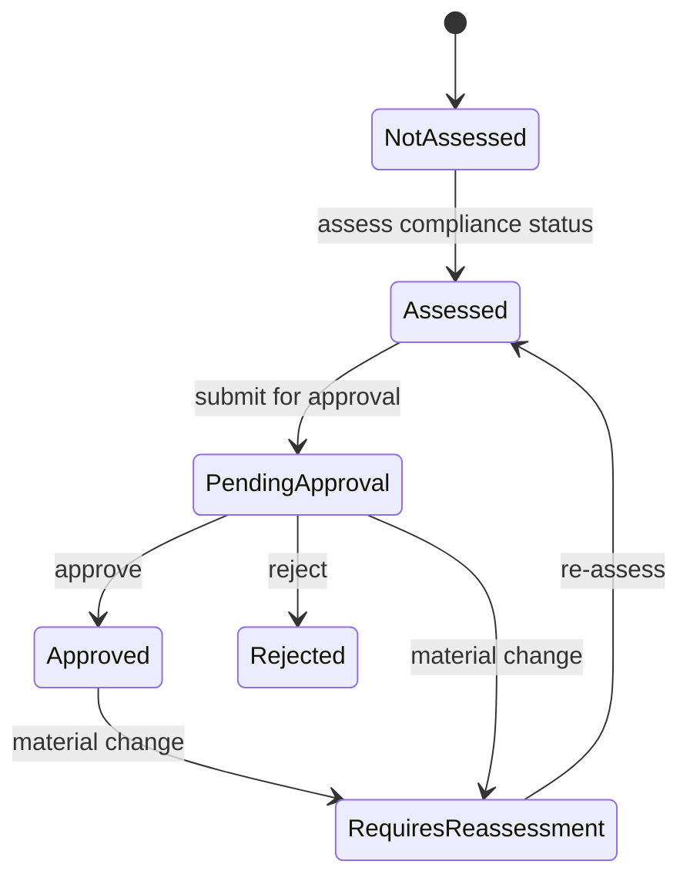

# Assessing a project

Once a standard version is [published](./data-model-and-lifecycle.md#standards-lifecycle), a Compliance Manager assigns it to a project. From there, the project's Project Manager or Compliance Officer(s) work through the assessment.

## The five things an assessment tracks

- **Applicability** — each requirement is marked Applicable or Not Applicable (with a mandatory justification for Not Applicable), inherited down the requirement hierarchy: marking a parent section Not Applicable makes its children Not Applicable too, unless a child is explicitly overridden back to Applicable. Not Applicable requirements never count against the compliance percentage.

  For example, marking "Section 4 — Physical Security" Not Applicable with the justification "fully outsourced to a colocation provider covered by its own SOC 2 report" cascades Not Applicable to every requirement underneath it. If one of those child requirements turns out to still apply — say, a badge-access log requirement the project's own team is separately responsible for — it can be flipped back to Applicable individually without disturbing the rest of the section.

- **Compliance status** — an applicable requirement is assessed Not Started / In Progress / Compliant / Non-Compliant / Blocked / Pending Review / Rejected (a mandatory justification is required for Non-Compliant). A Non-Compliant status with its justification is exactly the kind of thing the [dashboards](#overall-status-and-dashboards) below and the [notification sweeps](./reviews-and-notifications.md#notification-triggers) both surface without anyone having to go looking for it.

- **Required actions** — each requirement's required actions get their own per-project assessment (status, assignee, due date, completion), independent of the requirement's overall compliance status. A requirement can be marked Compliant while one of its required actions (say, an annual penetration test) is still open with a future due date — the two are tracked, and can be reported on, separately.

- **Evidence** — a piece of evidence (a certificate, test report, or similar) can support one or many requirements and/or required actions at once. Evidence can carry an expiry date; the module tracks Valid / Expiring Soon / Expired independently, and a revalidation records the previous and new expiry alongside who did it and why, without losing that history. A single penetration-test report, for instance, might support several requirements at once across "network security" and "vulnerability management" sections — uploading it once and linking it to each is enough; there's no need to duplicate the file per requirement.

- **Approval/sign-off** — a formally distinct step from assessment: an assessed requirement is submitted for approval, then approved or rejected, with the decision and its rationale retained. A material change afterwards (the applicability decision changing, or linked evidence being archived/revalidated) automatically flags an approved or pending requirement as **Requires Re-assessment**, so a stale sign-off is never silently left looking current.

| Assessing a standard |
| --- |
| One standard's assignment: overall compliance status, per-status breakdown, and the requirement tree with each requirement's applicability, status, and approval state |
|  |

Every applicability/status/approval change is logged to the same audit trail every other ReqTrackManager mutation goes through, viewable per-requirement as its own compliance history.

## Overall status and dashboards

For each assignment, the module calculates a compliance percentage (compliant applicable requirements ÷ all applicable requirements), an overall compliance state (Compliant / Non-Compliant / In Progress / Not Applicable), and an overall approval state — kept as two separate figures, since a project can be 100% compliant while still Pending Approval. For example, an assignment with 50 applicable requirements, 42 of them Compliant and the rest In Progress, reports 84% and an overall state of In Progress — its approval state is tracked and shown alongside that, independently, rather than folded into the same number.

A project's own Compliance page shows this per assigned standard, with drill-downs into Non-Compliant requirements, outstanding required actions, expiring/expired evidence, and reviews due. An organisation's Compliance overview rolls the same figures up across every project, with the equivalent cross-project drill-downs and a "standards with the most outstanding issues" summary.

## Where this fits

See [Data model and standards lifecycle](./data-model-and-lifecycle.md) for what a standard/version/requirement actually is before it's assigned, [Scheduled reviews and notifications](./reviews-and-notifications.md) for how people are kept aware of what an assessment needs next, and [Reporting and export](./reporting-and-export.md) for turning an assessment into a PDF/CSV report.
