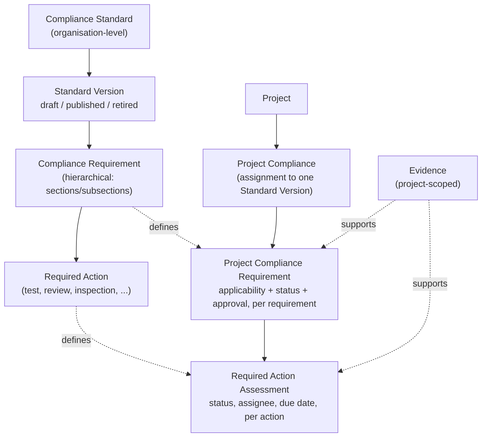
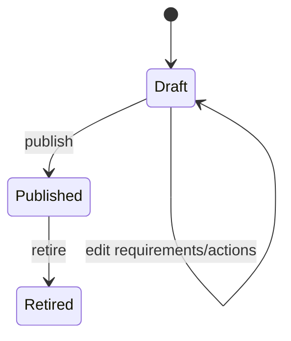

# Data model and standards lifecycle

This page covers the shape of a compliance standard and how it moves from a blank draft to something a project can be assessed against. [Assessing a project](./assessing-a-project.md) picks up from here — once a version is published and assigned, that's where per-project state actually starts to accumulate.

## Data model

A compliance **standard** is an organisation-level, reusable definition — never a project, and never duplicated per project. A standard has one or more **versions**; each version's own requirement tree is immutable once published, so a project that adopts version 1.1 keeps working from exactly that content even after version 2.0 is published or version 1.0 is retired. A project's **assignment** to one specific standard version is where per-project compliance state actually lives — a standard or a requirement definition never itself holds a compliance state.

Every Project Compliance Requirement/Required Action Assessment row is created automatically, in full, the moment a standard version is assigned to a project — nothing is materialised lazily, since a published version's own content can never change underneath an existing assignment.

### What each row means

| Row | Lives at | Holds |
| --- | --- | --- |
| Standard | Organisation | Just identity — name, issuing organisation, reference — plus its list of versions. Never itself holds a compliance state. |
| Standard Version | Standard | One immutable-once-published requirement tree. Draft, Published, or Retired — see [Standards lifecycle](#standards-lifecycle) below. |
| Compliance Requirement | Version | One node in the tree (a section, subsection, or leaf requirement), plus its own required actions. Defines what an assignment will be assessed against, but carries no assessment state itself. |
| Required Action | Requirement | A concrete task tied to a requirement — a test, review, or inspection that has to happen, distinct from the requirement's own overall compliance status. |
| Project Compliance (assignment) | Project | The link between one project and one published standard version. This, not the standard or version, is where "is this project compliant" actually gets answered. |
| Project Compliance Requirement | Assignment | One requirement's per-project state: applicability, compliance status, approval state, history. |
| Required Action Assessment | Assignment | One required action's per-project state: status, assignee, due date, completion. |
| Evidence | Project | A file or record (certificate, test report) that can support one or many requirements and/or required actions at once, with its own validity/expiry tracking. |

## Standards lifecycle

A Compliance Manager authors a standard's requirement tree while its current version is in **draft** — creating, editing, reordering, and deleting requirements and required actions freely. **Publishing** a version locks its content permanently (no further edits, ever) and makes it assignable to projects; a version can later be **retired**, which only stops it being offered to *new* assignments — projects already on it keep working from it unchanged. A new version can be cloned from an existing one (carrying its requirement tree forward as a fresh draft) so an update to a standard doesn't mean starting from a blank sheet.

### Example: authoring and evolving a standard

A Compliance Manager creates "Customer Security Addendum" as a new standard and works on its v1.0 requirement tree over several editing sessions — adding sections, reordering them, attaching required actions — all still fully editable because nothing has been published yet. Once the tree is ready, they publish v1.0: from that moment its content is frozen, and projects can be assigned to it.

Some months later a customer adds a new contractual requirement. Rather than editing the now-locked v1.0, the Compliance Manager clones it into a v1.1 draft, adds the new requirement there, and publishes v1.1 once it's ready. Projects already assigned to v1.0 are entirely unaffected — they keep assessing against exactly the v1.0 tree they started with — until someone explicitly chooses to move one of them onto v1.1, which is a distinct, deliberate action covered in [Cross-standard mapping and version migration](./mapping-and-migration.md#version-migration).

## Where this fits

See [Overview](./overview.md) for enabling the module and its roles, and [Assessing a project](./assessing-a-project.md) for what happens once a version is assigned.
