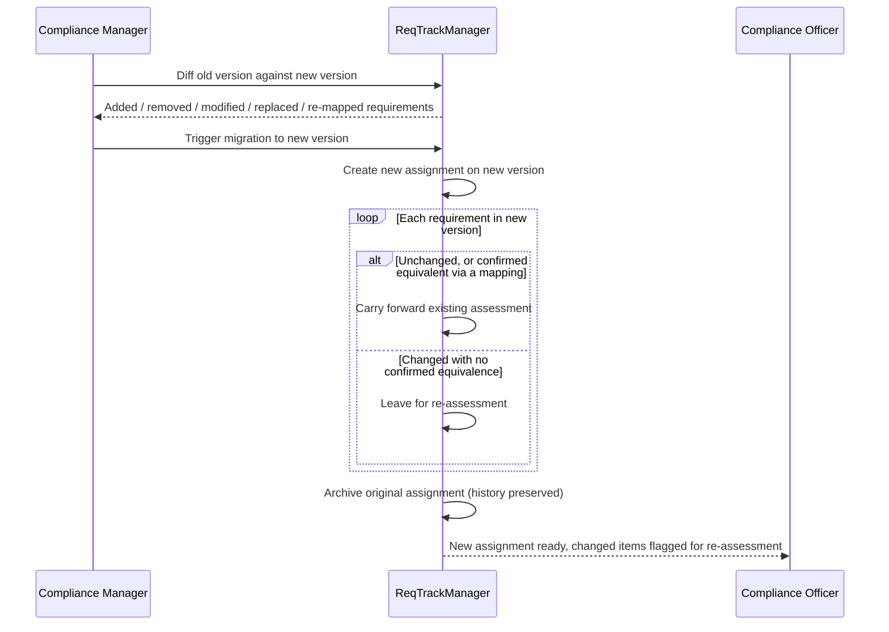

# Cross-standard mapping and version migration

A standard rarely exists in total isolation from every other standard an organisation maintains, and a standard's own content rarely stays frozen forever. This page covers the two mechanisms for handling that: mapping requirements to each other across standards, and deliberately moving a project's assignment onto a newer published version.

## Cross-standard mapping

A Compliance Manager can record a directed, typed relationship between any two requirements — even across different standards, or across two versions of the same standard. Relationship types (Equivalent, Satisfies, Derived From, and similar) are themselves an extensible, organisation-defined vocabulary, not a fixed enum.

| Relationship type | Typical meaning | Example |
| --- | --- | --- |
| Equivalent | The two requirements are understood to demand essentially the same thing | "Access review" in an internal security standard mapped Equivalent to A.9.2.5 in ISO 27001:2022 |
| Satisfies | Meeting one requirement is expected to satisfy the other | A customer-specific "encryption at rest" clause mapped Satisfies to a broader internal encryption standard requirement |
| Derived From | One requirement was written using the other as its starting point | A v1.1 requirement mapped Derived From its v1.0 predecessor after a wording change |

A mapping is metadata for navigation and impact analysis only; it never implies that satisfying one requirement automatically satisfies another, and it never copies or synchronises compliance status between the two linked requirements. Its value is in answering "what else does this requirement relate to" when reviewing a standard, and in the migration confirmation step described below.

## Version migration

When a project wants to move an assignment onto a newer published version of its standard, the two versions can first be **diffed** (added / removed / modified / replaced / re-mapped requirements) so the impact is visible before committing.

Migrating is an explicit, user-triggered action, never automatic: it creates a new assignment on the new version, carries forward assessments only for requirements that are unchanged (or, with the compliance officer's own per-migration confirmation, explicitly marked equivalent via a mapping), and leaves everything else to be reassessed — the original assignment is archived, never overwritten, so its history is preserved.

For example, migrating a project's assignment from "Customer Security Addendum" v1.0 to v1.1 (the [new requirement added in the lifecycle example](./data-model-and-lifecycle.md#example-authoring-and-evolving-a-standard)) carries forward the existing assessment for every unchanged requirement automatically, while the brand-new requirement starts out unassessed on the new assignment — there's nothing to carry forward for a requirement that didn't exist on v1.0.

## Where this fits

See [Data model and standards lifecycle](./data-model-and-lifecycle.md) for how a standard's versions relate to each other in the first place, and [Assessing a project](./assessing-a-project.md) for what an assessment looks like once migration has happened.
