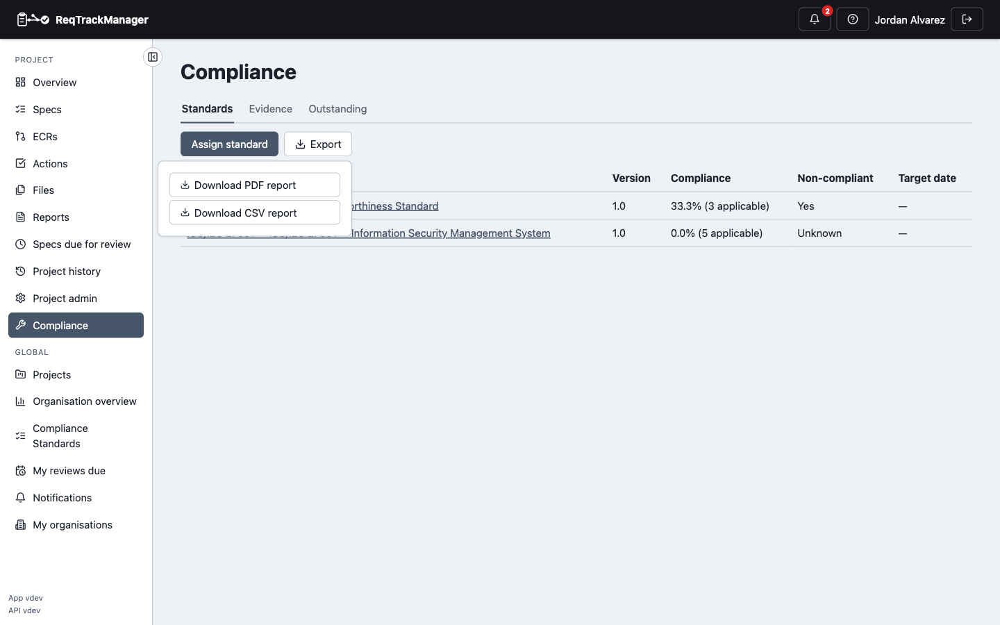

# Reporting and export

## Reports

Both a project's compliance and an organisation's cross-project compliance can be exported as a PDF or CSV report, suitable for internal review and audit preparation — the PDF carries the fuller, multi-section report (main table plus evidence/review/mapping appendices); the CSV carries the flat, one-row-per-requirement (or, at organisation scope, one-row-per-assignment) table.

| Exporting a report |
| --- |
| A project's Compliance page offers a PDF or CSV export of its full assessment |
|  |

A **project's** report covers every requirement's applicability, compliance status, approval state and history, required actions, linked evidence (with validity/expiry), review history, and any cross-standard mappings touching its assigned standards — available to anyone who can view the project's compliance.

An **organisation's** report rolls up across every project (one row per project/assigned-standard-version pair), plus appendices for non-compliant requirements, pending approvals, and expiring/expired evidence across every project — restricted to Compliance Managers.

| Report scope | Format | Contents |
| --- | --- | --- |
| Project | PDF | Main requirement table, plus evidence/review/mapping appendices |
| Project | CSV | One row per requirement |
| Organisation | PDF | One row per project/assigned-standard-version, plus non-compliant/pending-approval/expiring-evidence appendices across every project |
| Organisation | CSV | One row per project/assigned-standard-version pair |

## Export/import bundles

Compliance content is included in ReqTrackManager's existing project/organisation export-and-import bundles, at the level the data actually belongs to:

- An **organisation** bundle carries every compliance standard it owns — with its full version/requirement/required-action tree, its action-type and mapping-relationship-type vocabularies, and its cross-standard requirement mappings — since a standard is an organisation-level, reusable resource.
- A **project** bundle carries that project's own compliance *assessment*: which standards it's assigned to, its per-requirement applicability/status/approval state, its required-action assessments, its evidence (with files and revalidation history), and its own project-level review history. It does not re-embed the standard itself; on import, the assignment is resolved against a standard/version of the same reference and version label already present in the target organisation, and is skipped (with a warning, never silently fabricated) if no match exists there.

Both directions round-trip: exporting and re-importing a project or organisation reproduces its compliance data intact.

## Standard-level import/export

A single standard can also be exported and re-imported on its own, distinct from the whole-organisation bundle above — useful for backing up or transferring just one standard, e.g. into a different organisation or deployment. Every version is always re-created as draft on import, regardless of its original published/retired status — an imported standard must be reviewed and re-published locally before it governs any project, never silently live.

## Where this fits

See [Assessing a project](./assessing-a-project.md) for what generates the data these reports summarise, and [AI assistant (MCP) integration](./mcp-integration.md) for pulling the same kind of information programmatically instead of via a PDF/CSV download.
