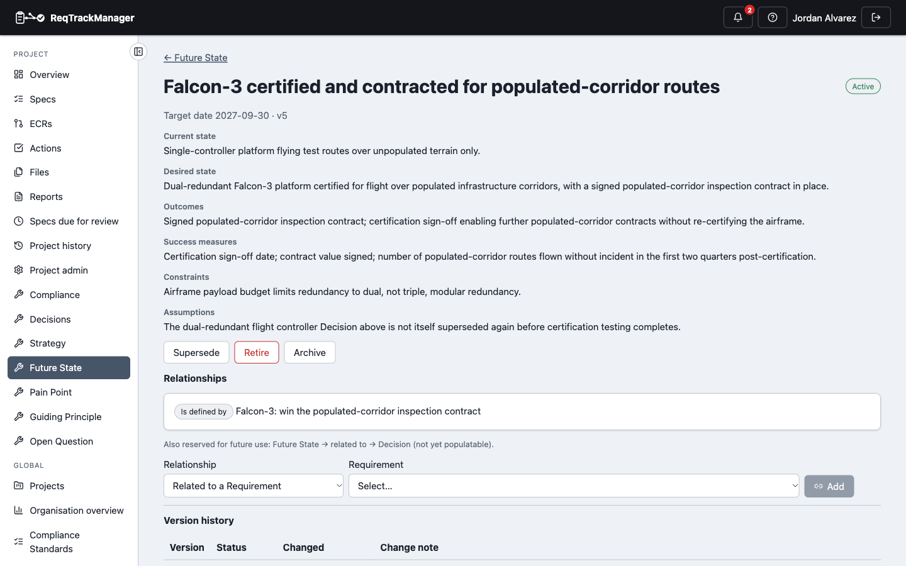
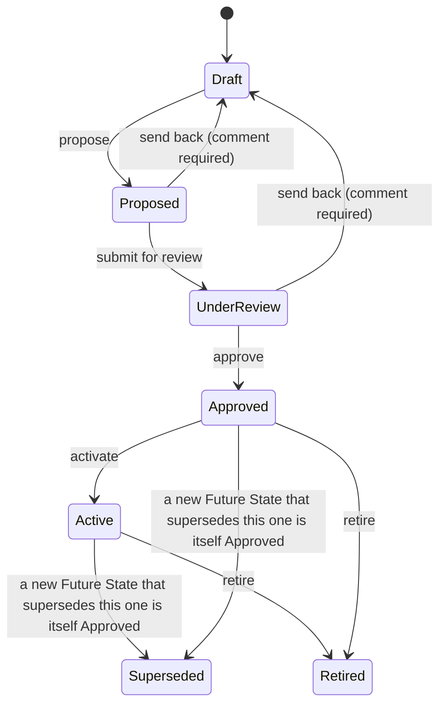

# Future State

A **Future State** records the vision a [Strategy](./strategy.md) is aiming at, as its own record — current state, desired state, a target date, outcomes, success measures, constraints, and assumptions. It's kept separate from Strategy rather than folded into Strategy's own "desired future state" field, because a Future State can need far more elaboration than that short summary field allows, especially at organisation scope — organisational outcomes are typically vaguer and need more room to state than a project-level objective does.

| A project Future State in Active status |
| --- |
| Falcon-3's Future State: current/desired state, outcomes, success measures, and its own "Is defined by" relationship back to the Strategy that defines it |
|  |

## Scope

Exactly one of `organization_id`/`project_id` is set — `scope` is `organization` or `project`, the same discriminator Strategy uses.

## Fields

| Field | Holds |
| --- | --- |
| `title` | Short display title. |
| `current_state` / `desired_state` | The state being moved from and to. |
| `target_date` | When this Future State is targeted for, if known. |
| `outcomes` | Expected outcomes. |
| `success_measures` | How success will be measured. |
| `constraints` | Known constraints. |
| `assumptions` | Assumptions this Future State relies on. |
| `status` | Lifecycle state, below. |

## Lifecycle

Mirrors [Strategy](./strategy.md)'s lifecycle exactly:

**Content lock:** from **Approved** onward — Approved, Active, Superseded, and Retired all lock, the same rule as Strategy.

**Version history:** full (`FutureStateVersion`).

## Roles

| Role | Scope | Grants |
| --- | --- | --- |
| **Future State Owner** | Project | Creates and manages a project's Future State records. |
| **Future State Approver** | Project | Approves, activates, supersedes, and retires a project's Future State records. |
| **Organisation Future State Owner** | Organisation | The organisation-scoped equivalent of Future State Owner. |
| **Organisation Future State Approver** | Organisation | The organisation-scoped equivalent of Future State Approver. |

## Relationships

| Relationship | Target | Reverse label |
| --- | --- | --- |
| Related to *(untyped)* | Pain Point | — |
| Related to *(untyped)* | Requirement | — |
| Related to *(untyped)* | Guiding Principle | — |

All three of a Future State's own outgoing relationships are untyped "related to" associations rather than causal links — this artefact's own source spec uses generic "linkable to" language, unlike Strategy's specific causal verbs. A Future State is also the target of [Strategy](./strategy.md)'s own **Defines** relationship (shown here as "Is defined by") — built once, from Strategy's own side, not duplicated as a Future State-side link as well. See [Relationships → Cross-artefact relationships](./relationships-and-types.md#cross-artefact-relationships) for the full picture.

Creating a relationship from a Future State, or a supersession below, requires the **Future State Owner** role (or its organisation-scoped equivalent for an org-scoped Future State).

`Future State → Related to → Decision` is reserved but not yet built — see [Relationships → Reserved relationship types](./relationships-and-types.md#reserved-relationship-types-not-yet-available).

## Supersession

A Future State supports **Supersedes** / **Is superseded by**, the same mechanism Strategy uses: creating the link and having the new Future State itself reach Approved is what flips the old one's status to Superseded.

## Where this fits

See [Strategy](./strategy.md) for the objective a Future State elaborates the vision of, and [Overview](./overview.md) for the artefact-type summary.
