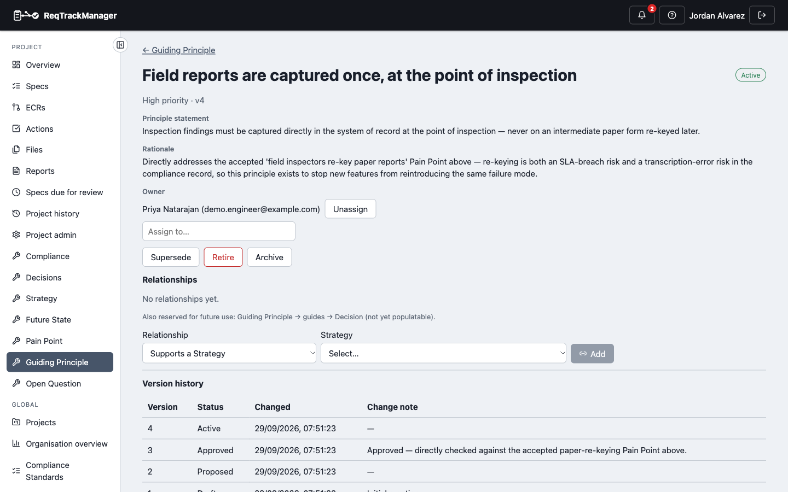
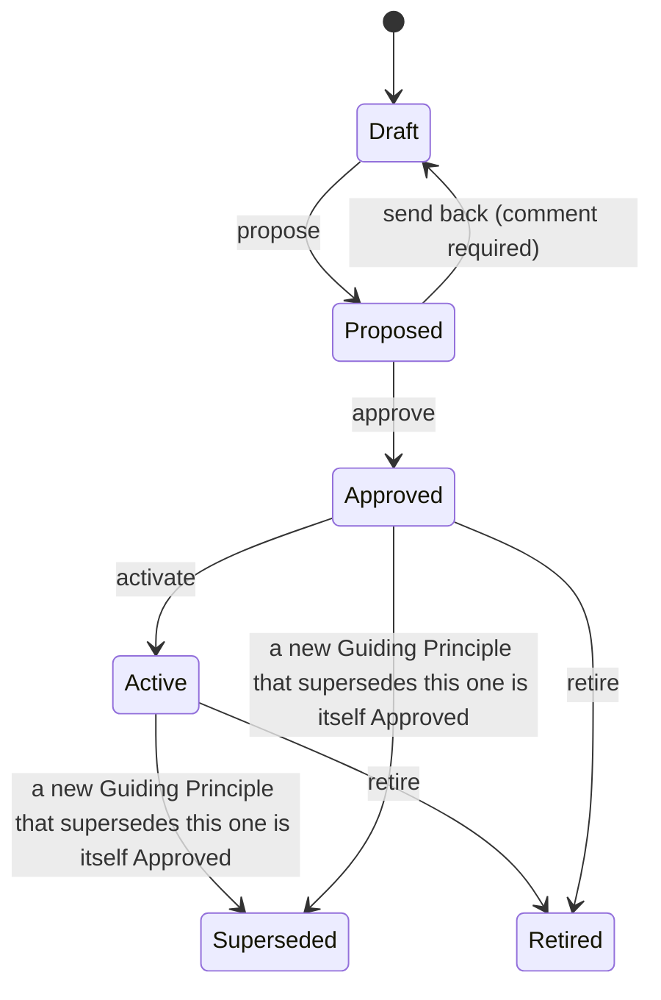

# Guiding Principle

A **Guiding Principle** records a standing statement of value or constraint a later decision should be checked against — e.g. "prefer proven hardware over novel hardware for flight-critical systems." It's kept versioned specifically so the reasoning behind a decision that cited a principle stays resolvable even after that principle is superseded — source overview §8.4 calls this "revision control here protects historical Decision rationale."

| A Guiding Principle in Active status |
| --- |
| Falcon-3's "field reports are captured once" Guiding Principle — statement, rationale, owner, and version history |
|  |

## Scope

Exactly one of `organization_id`/`project_id` is set — `scope` is `organization` or `project`, the same discriminator Strategy/Future State use.

## Fields

| Field | Holds |
| --- | --- |
| `name` | Short display name. |
| `principle_statement` | The principle itself. |
| `rationale` | Why this principle exists. |
| `priority` | `low` / `medium` / `high`. |
| `owner_id` | Who owns this principle, if assigned. |
| `status` | Lifecycle state, below. |

Unlike Pain Point, a Guiding Principle has no `type` field or configurable type vocabulary at all.

## Lifecycle

Shorter than Strategy/Future State's lifecycle — there is no separate `Under Review` step; a proposed Guiding Principle moves directly to Approved. `Superseded` is still kept as its own terminal state (despite the shorter chain) for exactly the version-history reason in this page's own intro above.

**Content lock:** from **Approved** onward — Approved, Active, Superseded, and Retired all lock, the same rule as Strategy/Future State.

**Version history:** full (`GuidingPrincipleVersion`) — see this page's own intro for why this one matters more here than it might first appear.

## Roles

| Role | Scope | Grants |
| --- | --- | --- |
| **Guiding Principle Owner** | Project | Creates and manages a project's Guiding Principle records. |
| **Guiding Principle Approver** | Project | Approves, activates, supersedes, and retires a project's Guiding Principle records. |
| **Organisation Guiding Principle Owner** | Organisation | The organisation-scoped equivalent of Guiding Principle Owner. |
| **Organisation Guiding Principle Approver** | Organisation | The organisation-scoped equivalent of Guiding Principle Approver. |

## Relationships

| Relationship | Target | Reverse label |
| --- | --- | --- |
| Supports | Strategy | Is supported by |
| Informs | Requirement | Is informed by |

Creating a relationship from a Guiding Principle, or a supersession below, requires the **Guiding Principle Owner** role (or its organisation-scoped equivalent for an org-scoped Guiding Principle). See [Relationships → Cross-artefact relationships](./relationships-and-types.md#cross-artefact-relationships) for the full picture across all five artefact types.

`Guiding Principle → Guides → Decision` is reserved but not yet built — see [Relationships → Reserved relationship types](./relationships-and-types.md#reserved-relationship-types-not-yet-available).

## Supersession

A Guiding Principle supports **Supersedes** / **Is superseded by**, the same mechanism Strategy/Future State use: creating the link and having the new Guiding Principle itself reach Approved is what flips the old one's status to Superseded.

## Where this fits

See [Overview](./overview.md) for the artefact-type summary, and [Known limitations](./known-limitations.md) for why this artefact has no type vocabulary the way Pain Point does.
