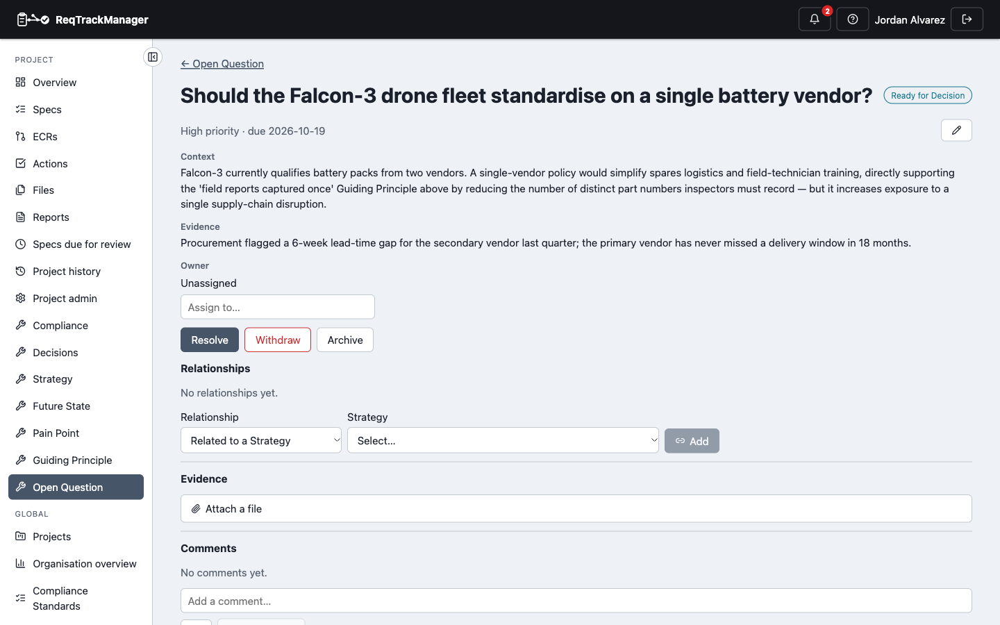
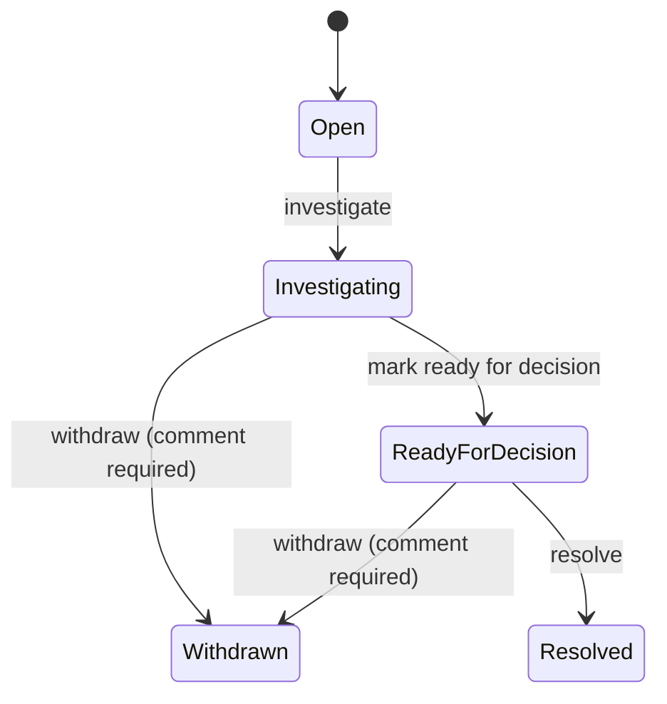

# Open Question

An **Open Question** records something that still needs deciding before a Strategy, Future State, or Requirement can be considered settled — tracked through investigation to a resolution, rather than left open in a comment thread. Like Pain Point, it's **project-scoped only**. Unlike every other artefact type in this module, the question itself doubles as the title — there is no separate `title` field.

| An Open Question, Ready for Decision |
| --- |
| Falcon-3's battery-vendor Open Question — context, evidence, and a Related-to-Strategy picker |
|  |

## Fields

| Field | Holds |
| --- | --- |
| `question` | The question itself — this artefact's core content and display title. |
| `context` | Background context. |
| `evidence` | Supporting evidence (in addition to any file attachments). |
| `priority` | `low` / `medium` / `high`. |
| `owner_id` | Who is driving this question to resolution, if assigned. |
| `due_date` | The due/review date, if set. |
| `status` | Lifecycle state, below. |

## Lifecycle

A **branching** lifecycle, the same shape Pain Point's own lifecycle uses. `Open` cannot skip straight to `Withdrawn` — only `Investigating` and `Ready for Decision` can be withdrawn, mirroring Pain Point's own precedent that only a lifecycle's *middle* state(s) branch, not its very first one. There is no rework/"send back" path (unlike Strategy/Future State/Guiding Principle) — this lifecycle is investigatory, not a formal review-and-approval gate.

**Content lock:** only the two terminal states lock — **Resolved** and **Withdrawn**.

**Version history:** none — an Open Question is mutated in place, audit-log only, mirroring Pain Point.

## Roles

A genuine three-tier split, unlike Pain Point's single elevated role:

| Role | Scope | Grants |
| --- | --- | --- |
| **Open Question Owner** | Project | Assigns, prioritises, edits, and changes an Open Question's status, including withdrawing it. Does not itself resolve one. |
| **Open Question Resolver** | Project | May mark an Open Question Resolved — a deliberately separate role from Open Question Owner. |

Any project member may create an Open Question, without either role — the same broad-creation model Pain Point uses.

## Relationships

| Relationship | Target | Reverse label |
| --- | --- | --- |
| Related to *(untyped)* | Strategy | — |
| Related to *(untyped)* | Requirement | — |

Both of an Open Question's own outgoing relationships are untyped, matching this artefact's own plain "Related Strategy"/"Related Requirements" field naming rather than a causal verb. An Open Question is also the target of two relationships built from the other side: [Strategy](./strategy.md)'s **Requires resolution of** and [Pain Point](./pain-point.md)'s **Raises** (shown here as "Resolution is required by"/"Is raised by"). Creating a relationship from an Open Question requires the **Open Question Owner** role. See [Relationships → Cross-artefact relationships](./relationships-and-types.md#cross-artefact-relationships) for the full picture across all five artefact types.

`Open Question → Resolved by → Decision` is reserved but not yet built — see [Relationships → Reserved relationship types](./relationships-and-types.md#reserved-relationship-types-not-yet-available). An Open Question can be marked Resolved on its own today; there is no built-in conversion into a new Decision record yet.

## Where this fits

See [Overview](./overview.md) for the artefact-type summary, and [Pain Point](./pain-point.md) for the other project-scoped-only artefact this module ships.
