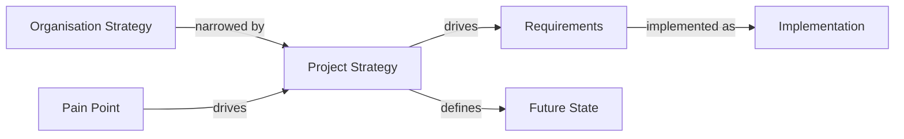

# Overview

The Context & Strategy module gives an organisation or project a place to record *why* it's doing what it's doing, before that reasoning ends up scattered across slide decks and meeting notes. It captures five kinds of first-class, linkable content: **Strategy** (the objective and the plan to get there), **Future State** (the vision that objective is aiming at), **Pain Point** (the problems motivating it), **Guiding Principle** (the standing constraints and values decisions should be checked against), and **Open Question** (the things that still need deciding before the picture is complete).

For example, an organisation records a Strategy ("lead the market in autonomous aerial inspection"), a project records its own Strategy that implements a slice of it ("win the populated-corridor inspection contract"), that project Strategy is linked to a Future State elaborating the vision and to the Requirements that realise it, and a Pain Point uncovered during discovery is linked back to the Strategy it motivated. Anyone can later trace a Requirement back through the Strategy that drove it to the organisational objective behind that.

| A project's Pain Points |
| --- |
| Falcon-3's Pain Points, filterable by status — Accepted, Rejected, and Duplicate in this example |
|  |

## The five artefact types

| Artefact | Scope | When to use it |
| --- | --- | --- |
| [**Strategy**](./strategy.md) | Organisation or project | A specific objective and the plan for it — current state, desired future state, rationale, expected outcomes, constraints, and how success will be measured. An organisation records its own Strategy; a project can record a narrower Strategy that implements a slice of it. |
| [**Future State**](./future-state.md) | Organisation or project | The vision a Strategy is aiming at, as its own record — current state, desired state, a target date, outcomes, success measures, constraints, and assumptions. Kept separate from Strategy rather than folded into its "desired future state" field, because a Future State can need far more elaboration than a Strategy's own short summary field allows, especially at organisation scope. |
| [**Pain Point**](./pain-point.md) | Project only | A problem, deficiency, or improvement opportunity motivating a Strategy or Requirement — with a source, its impact, supporting evidence, and a configurable type (Market/User/Operator by default). Any project member can raise one. |
| [**Guiding Principle**](./guiding-principle.md) | Organisation or project | A standing statement of value or constraint a later decision should be checked against (e.g. "prefer proven hardware over novel hardware for flight-critical systems") — kept versioned so the reasoning behind a decision that cited it stays resolvable even after the principle itself is superseded. |
| [**Open Question**](./open-question.md) | Project only | Something that still needs deciding before a Strategy, Future State, or Requirement can be considered settled — tracked through investigation to a resolution, rather than left open in a comment thread. |

## Enabling the module

Context & Strategy is **not** enabled by default — an org admin opts in per organisation from the organisation's Modules settings, the same entitlement/enablement mechanism every module uses (see [Modules → Overview](../overview.md#gating-entitlement--enablement--overrides)). Enabling it seeds that organisation's default Pain Point types — **Market**, **User**, and **Operator** — available to every project in the organisation from that point on (see [Pain Point → Pain Point type vocabulary](./pain-point.md#pain-point-type-vocabulary)). Disabling the module hides its navigation and endpoints, but deletes no data.

This module is also the first (and, as of this writing, only) one to use [sub-component enablement](../overview.md#sub-component-enablement-finer-grained-than-a-whole-module): its five artefact types (Strategy, Future State, Pain Points, Guiding Principles, Open Questions) are each independently toggleable — an organisation sets each one's availability (Off, or on/off for new projects), and a project admin can switch it for their own project — on top of, not instead of, the whole-module enablement above. Set from Organisation admin → Modules and Project admin → Modules — see [Modules → Overview → Where to set this](../overview.md#where-to-set-this) for both, with screenshots.

## The Organisation Strategy → Project Strategy → Requirements → Implementation chain

A project Strategy doesn't have to reference an organisation Strategy, but when it does, this is the chain that lets someone start at a shipped Requirement and trace all the way back to the organisational objective it exists to serve — or start at the objective and see what's actually been built toward it.

| A project Strategy in Active status |
| --- |
| Falcon-3's Strategy record: fields, its own Drives/Defines relationships, and its version history |
|  |

## The five nav entries

Unlike Compliance and Decision Management, which each surface through one grouped area, Context & Strategy adds **five separate top-level project nav-rail entries** — Strategy, Future State, Pain Point, Guiding Principle, and Open Question — a deliberate choice (Phase 0 Q7 of this module's own plan) to keep each artefact type's own list one click away rather than nested behind tabs. Org-scoped Strategy, Future State, and Guiding Principle lists render as panels on the organisation's **Dashboard** rather than as their own nav entries — see each artefact's own detail page for the org/project toggle.

## Roles

Context & Strategy defines sixteen of its own roles, module-contributed rather than additions to the core role set. Strategy, Future State, and Guiding Principle each follow the same owner/approver shape at both organisation and project scope; Pain Point and Open Question, being project-scoped only, follow narrower shapes of their own:

| Artefact | Role | Scope | Grants |
| --- | --- | --- | --- |
| Strategy | **Strategy Owner** | Project | Creates and manages a project's Strategy records. |
| Strategy | **Strategy Approver** | Project | Approves, activates, supersedes, and retires a project's Strategy records. |
| Strategy | **Organisation Strategy Owner** | Organisation | The organisation-scoped equivalent of Strategy Owner. |
| Strategy | **Organisation Strategy Approver** | Organisation | The organisation-scoped equivalent of Strategy Approver. |
| Future State | **Future State Owner** | Project | Creates and manages a project's Future State records. |
| Future State | **Future State Approver** | Project | Approves, activates, supersedes, and retires a project's Future State records. |
| Future State | **Organisation Future State Owner** | Organisation | The organisation-scoped equivalent of Future State Owner. |
| Future State | **Organisation Future State Approver** | Organisation | The organisation-scoped equivalent of Future State Approver. |
| Pain Point | **Pain Point Manager** | Project | Triages, classifies, and decides Pain Points (reject/accept/address/close), and manages the project's own Pain Point type overrides. A single elevated role, not an owner/approver pair. |
| Pain Point | **Pain Point Type Admin** | Organisation | Manages the organisation's shared Pain Point type vocabulary. |
| Guiding Principle | **Guiding Principle Owner** | Project | Creates and manages a project's Guiding Principle records. |
| Guiding Principle | **Guiding Principle Approver** | Project | Approves, activates, supersedes, and retires a project's Guiding Principle records. |
| Guiding Principle | **Organisation Guiding Principle Owner** | Organisation | The organisation-scoped equivalent of Guiding Principle Owner. |
| Guiding Principle | **Organisation Guiding Principle Approver** | Organisation | The organisation-scoped equivalent of Guiding Principle Approver. |
| Open Question | **Open Question Owner** | Project | Assigns, prioritises, edits, and changes an Open Question's status, including withdrawing it. Does not itself resolve one. |
| Open Question | **Open Question Resolver** | Project | May mark an Open Question Resolved — a deliberately separate role from Open Question Owner. |

Every role above composes with roles that already carry equivalent authority elsewhere — a server admin, an org admin, or (for a project-scoped role) that project's own Project Manager can do everything the corresponding module role can. Every other project member can read this module's content once it's enabled, and — for Pain Point and Open Question specifically — create a new record without needing any of the roles above.

## Data model at a glance

Full fields and a lifecycle diagram live on each artefact's own page (linked below); this table is a quick cross-artefact comparison of the two things that differ most between them:

| Artefact | Version history | Content locks from |
| --- | --- | --- |
| [Strategy](./strategy.md) | Full version history | Approved onward (Approved, Active, Superseded, Retired) |
| [Future State](./future-state.md) | Full version history | Approved onward (same as Strategy) |
| [Pain Point](./pain-point.md) | None — audit log only | Only the 3 true terminal states (Rejected, Duplicate, Closed) — not Accepted/Addressed |
| [Guiding Principle](./guiding-principle.md) | Full version history | Approved onward (same as Strategy) |
| [Open Question](./open-question.md) | None — audit log only | Only the 2 terminal states (Resolved, Withdrawn) |

## In this section

- [Strategy](./strategy.md) — fields, lifecycle, roles, and relationships for a Strategy.
- [Future State](./future-state.md) — fields, lifecycle, roles, and relationships for a Future State.
- [Pain Point](./pain-point.md) — fields, lifecycle, roles, relationships, and the Pain Point type vocabulary.
- [Guiding Principle](./guiding-principle.md) — fields, lifecycle, roles, and relationships for a Guiding Principle.
- [Open Question](./open-question.md) — fields, lifecycle, roles, and relationships for an Open Question.
- [Relationships and types](./relationships-and-types.md) — the bird's-eye view across all five artefact types at once, and the reserved Decision-target relationships not yet built.
- [AI assistant (MCP) integration](./mcp-integration.md) — the tools an AI assistant can call against this module's content.
- [Known limitations](./known-limitations.md) — what this module deliberately doesn't do yet.

## Where this fits

See [Modules → Overview](../overview.md) for how the module system itself works, and [Modules → Building your own module](../building-your-own-module.md) for how a module like this one is put together.
