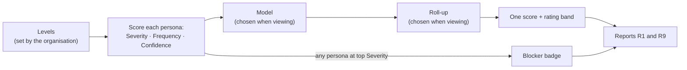
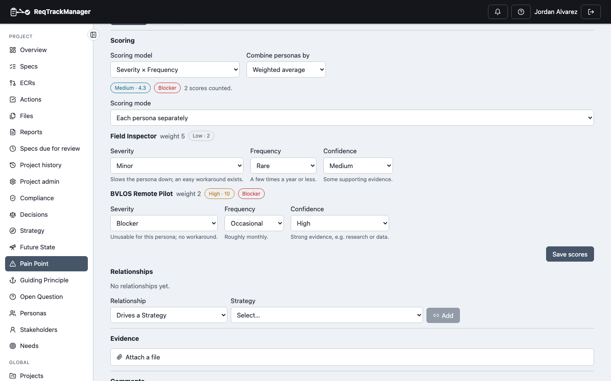
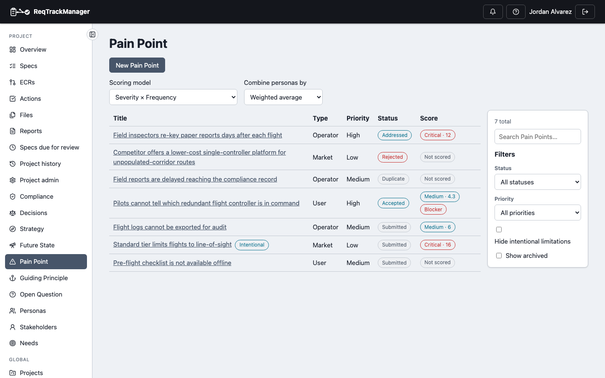
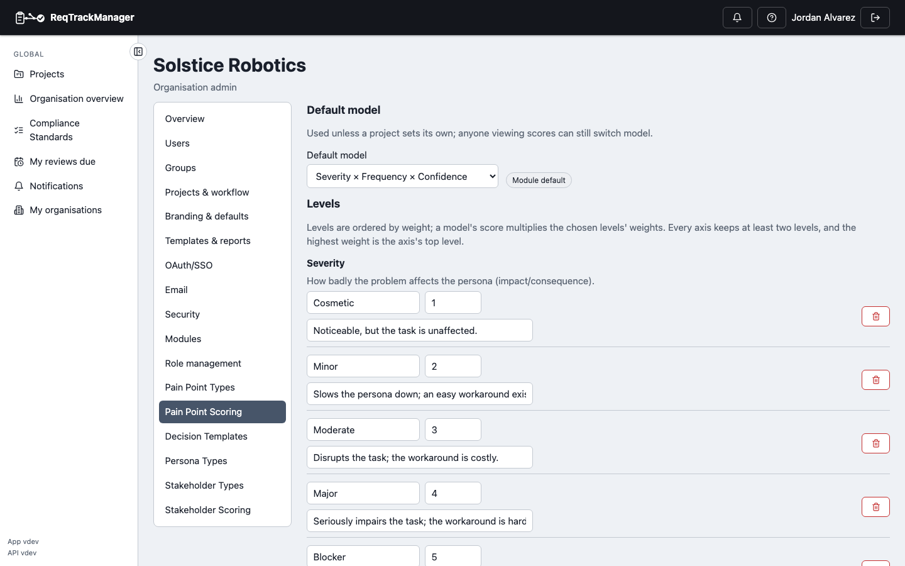
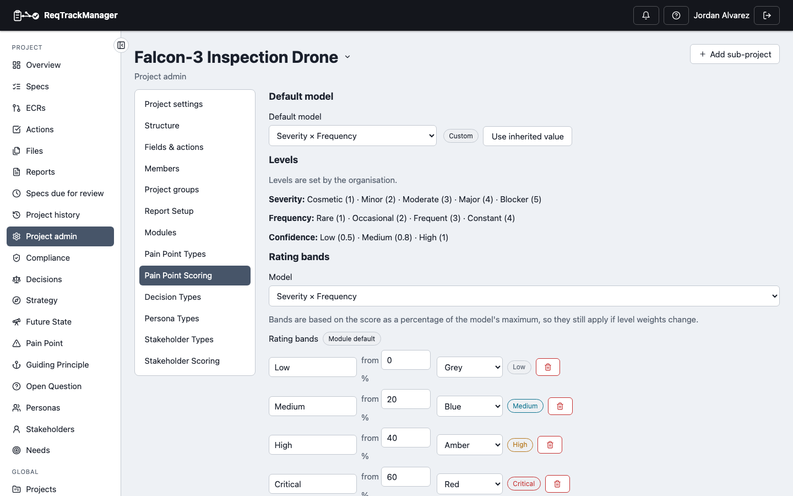
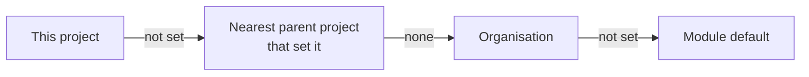

# Pain Point scoring

A Low/Medium/High priority can't rank thirty "High" Pain Points, and a problem that is trivial for one persona can make the product unusable for another. Scoring ranks Pain Points on three inputs, **per persona**, and keeps any problem that blocks a persona visible however the numbers are averaged.

## The three inputs

| Input | Asks | Default levels (weight) |
| --- | --- | --- |
| **Severity** | How badly does the problem affect this persona? | Cosmetic (1) · Minor (2) · Moderate (3) · Major (4) · **Blocker** (5): unusable for this persona, no workaround |
| **Frequency** | How often do they hit it? | Rare (1) · Occasional (2) · Frequent (3) · Constant (4) |
| **Confidence** | How sure are we of the other two? | Low (0.5) · Medium (0.8) · High (1) |

Each level carries short guidance that appears beneath the control when you score, so everyone reads "Major" the same way. The organisation can rename, re-weight, add, or remove levels (see [Configuring scoring](#configuring-scoring)).

A **scoring model** multiplies the chosen levels' weights:

| Model | Multiplies | Highest possible (defaults) |
| --- | --- | --- |
| Severity × Frequency | Severity, Frequency | 20 |
| Severity × Confidence | Severity, Confidence | 5 |
| Severity × Frequency × Confidence | all three | 20 |

With the default weights Confidence only ever discounts a score: a Low-confidence "Blocker" scores less than a High-confidence one.

Scores are shown two ways: the raw product on the Pain Point and in the list (for example **Critical · 12**), and as a 0–100 figure in the [reports](./report-reference.md) (the raw score as a percentage of the model's highest possible score).

## Scoring a Pain Point

Open a Pain Point and use the **Scoring** section. Saving scores is for the **Pain Point Manager** role; anyone who can see the Pain Point can read them.

| The Scoring section of a Pain Point |
| --- |
| Two personas scored separately: the Field Inspector (weight 5) rates it Minor, the BVLOS Remote Pilot (weight 2) rates it a Blocker |
|  |

1. Choose a **Scoring mode**:
   - **All personas together**: one set of ratings for everyone. Use it when you don't have persona-level knowledge yet, or when the problem is universal.
   - **Each persona separately**: one set per persona. This option needs the [Stakeholders & Personas](../stakeholders-personas-module/overview.md) module, and offers the project's personas.
2. Pick a Severity, Frequency and Confidence level. Leave any input blank if you don't know it.
3. Select **Save scores**.

A Pain Point has either one all-personas set **or** per-persona sets, never both: mixing them would make "applies to everyone" ambiguous when the sets are averaged, so saving in one mode replaces the other.

## How personas combine

The **Scoring model** and **Combine personas by** selectors sit above the score on the Pain Point, on the list, and in report R1. They only change what you *see*; nothing is stored, so you can compare rankings freely.

| Combine personas by | Result |
| --- | --- |
| **Weighted average** (default) | Each scored persona's score, weighted by the persona's importance (its **weight**; equal if none is set). |
| **Worst case** | The highest persona score. |
| **Plain average** | Every scored persona counts the same. |

### Worked example

"Pilots cannot tell which redundant flight controller is in command", under **Severity × Frequency** (highest possible 20):

| Persona | Weight | Severity | Frequency | Raw score | 0–100 |
| --- | --- | --- | --- | --- | --- |
| Field Inspector | 5 | Minor (2) | Rare (1) | 2 | 10 |
| BVLOS Remote Pilot | 2 | **Blocker** (5) | Occasional (2) | 10 | 50 |

| Roll-up | Working | Raw score | 0–100 | Band |
| --- | --- | --- | --- | --- |
| Weighted average | (2 × 5 + 10 × 2) ÷ (5 + 2) | 4.3 | 21 | Medium |
| Worst case | the pilot's score | 10 | 50 | High |
| Plain average | (2 + 10) ÷ 2 | 6 | 30 | Medium |

The three roll-ups rank this Pain Point differently, because the inspectors outweigh the pilots. That is the point of choosing when viewing: the weighted figure says "overall, a modest problem", the worst-case figure says "one persona is badly hurt". The **Blocker** badge appears under all three.

## Blockers

A **Blocker** badge shows whenever any counted persona rates Severity at the axis's top level, whatever model or roll-up is chosen. One blocked persona can't be averaged away. The badge names the persona in the reports (**Blocker: BVLOS Remote Pilot**).

## Reading scores in the list

| The Pain Point list with the Score column |
| --- |
| Switching the model or roll-up re-ranks the list; **Hide intentional limitations** takes deliberate restrictions out |
|  |

- **Not scored** means no persona has every input the chosen model needs. It is a gap, not a low priority: switch to a model whose inputs you have, or score it.
- **Unscored personas are left out, not counted as zero.** If only one of five personas is scored, the Pain Point shows that persona's score.
- A persona missing an input the chosen model needs is "Not scored" under that model only.

## Intentional limitations

Some Pain Points are deliberate: a restriction in a lower product tier that exists to drive an upgrade. Switch on **Intentional limitation** when you create or edit the Pain Point.

- They are **still scored**, per persona, like any other.
- They are listed apart from the fix ranking in [R1](./report-reference.md#r1-pain-point-prioritisation), so they aren't "fixed" by mistake.
- [R9 Upgrade drivers](./report-reference.md#r9-upgrade-drivers) reports on them: one that blocks a persona is a **churn risk** rather than an upsell lever.
- Linking an intentional limitation to the product tier it belongs to isn't available yet ([Known limitations](./known-limitations.md)).

## When personas change

| What happened to the persona | Effect on scores |
| --- | --- |
| **Retired** | Still shown, but not counted in the roll-up or the Blocker flag. |
| **Deleted, hidden from the project, or the Personas module turned off** | Its scores still count, without a name or weight, and the page and reports say the personas are unavailable. |

The page never fails on a missing persona.

## Configuring scoring

Levels belong to the organisation; a project can change only the default model and the rating bands.

| Setting | Organisation (**Org Management → Pain Point Scoring**) | Project (**Project Admin → Pain Point Scoring**) |
| --- | --- | --- |
| Levels per input (name, weight, guidance) | Edit, add, delete (at least two per input; deleting an in-use level asks where to move its scores) | Read-only |
| Default model | Set, or reset to the module default | Override, or use the inherited value |
| Rating bands per model | Set, or reset to the module defaults | Override, or use the inherited value |

| Organisation scoring settings | Project scoring settings |
| --- | --- |
|  |  |

**Rating bands** (Low, Medium, High, Critical by default) label a score by where it sits as a percentage of the model's highest possible score, so they keep working when you change level weights. The module's starting points differ by model:

| Model | Medium from | High from | Critical from |
| --- | --- | --- | --- |
| Severity × Frequency | 20% | 40% | 60% |
| Severity × Confidence | 30% | 50% | 80% |
| Severity × Frequency × Confidence | 15% | 30% | 50% |

A project that hasn't overridden a setting inherits it, and the page says where from:

| Who | Can |
| --- | --- |
| Anyone who can see a Pain Point | Read its scores and switch the model and roll-up. |
| Pain Point Manager (project) | Save a Pain Point's scores. |
| Pain Point Type Admin (organisation) or organisation admin | Edit levels, default model and bands for the organisation. |
| Project manager or administrator, or organisation admin | Override the default model and bands for a project. |

## Automation

An AI assistant or script can read and set scores: see the three scoring tools in [AI assistant (MCP) integration](./mcp-integration.md). Over REST, `GET .../pain-points/{id}/scores` returns a Pain Point's per-persona scores and roll-up, and `PUT` replaces them; `GET .../pain-point-scores` ranks every Pain Point under a model and roll-up. Level IDs come from the project's `pain_point` scoring scheme.

## Where this fits

Scores feed [R1 Pain Point prioritisation and R9 Upgrade drivers](./report-reference.md). See [Pain Point](./pain-point.md) for the rest of the Pain Point record and its lifecycle, and [Reports](./reports.md) for finding and exporting reports.
