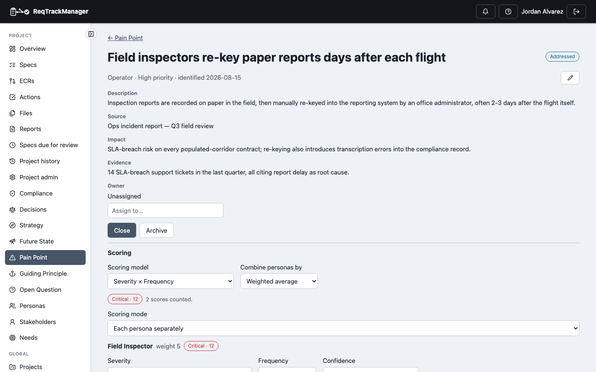
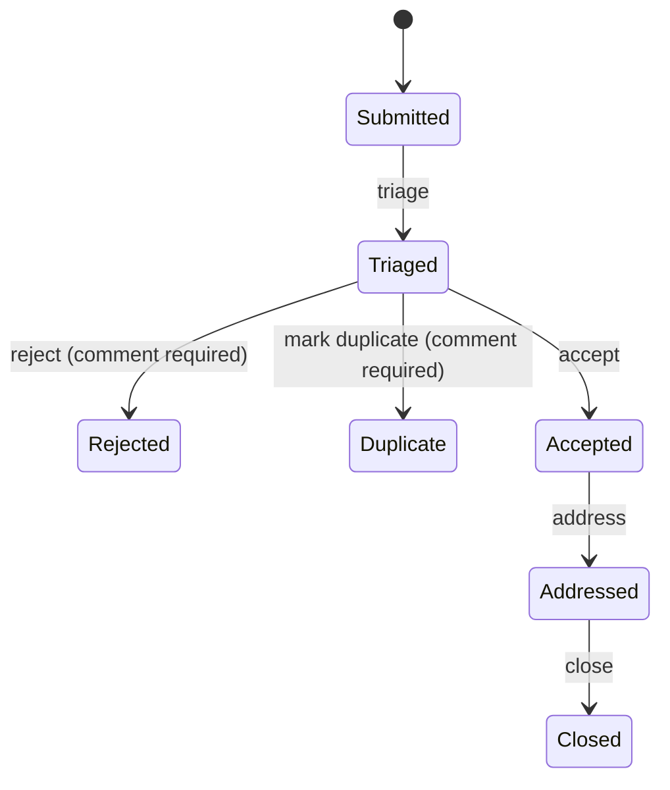
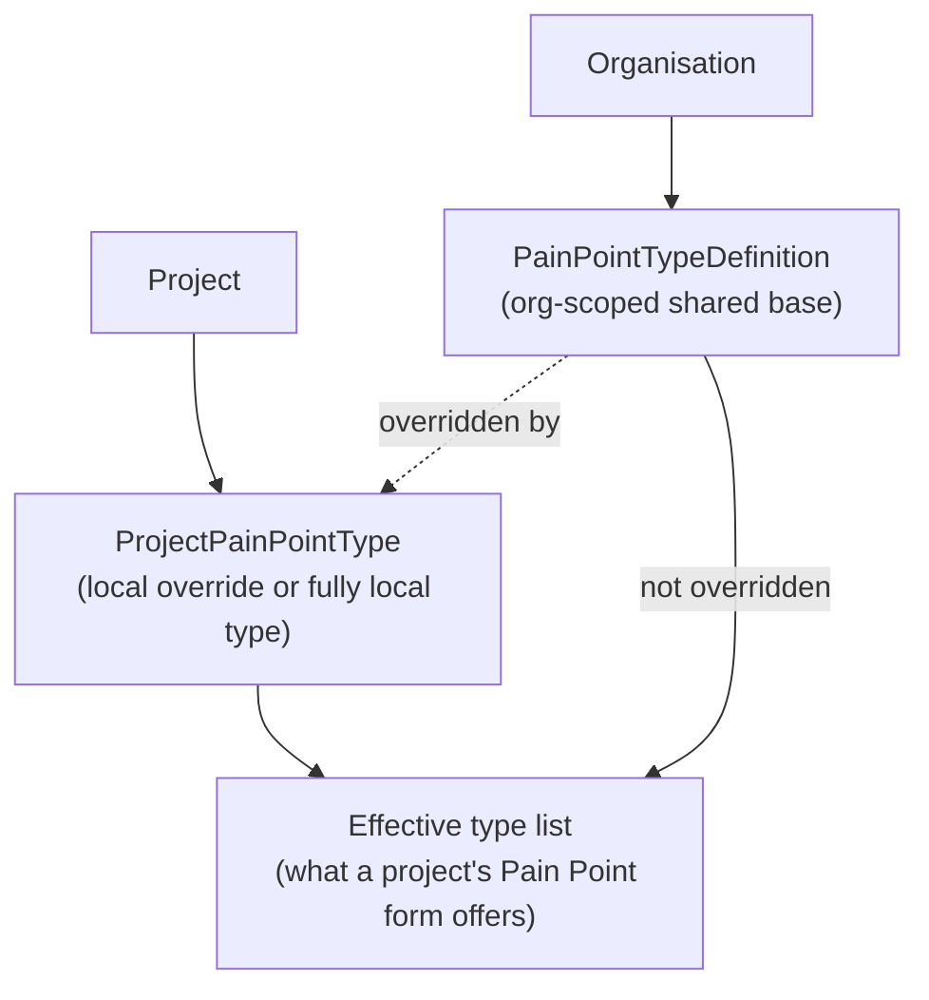
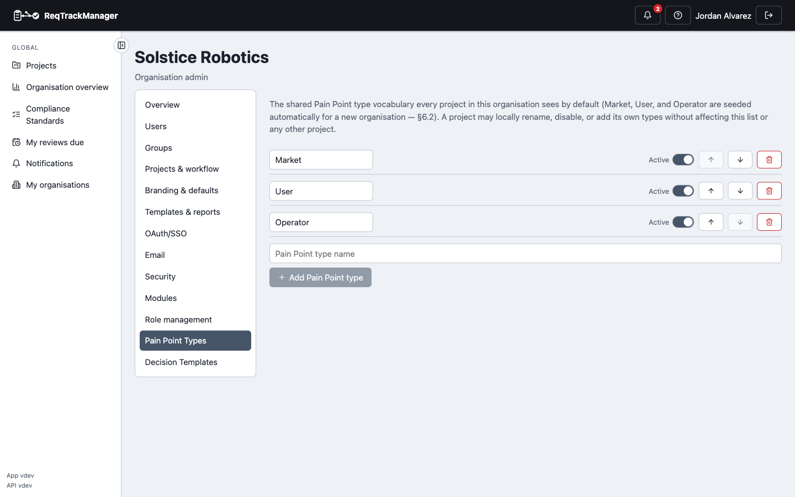

# Pain Point

A **Pain Point** records a problem, deficiency, or improvement opportunity motivating a [Strategy](./strategy.md) or Requirement — with a source, its impact, supporting evidence, and a configurable type. Unlike Strategy, Future State, and Guiding Principle, a Pain Point is **project-scoped only** — there is no organisation-scoped equivalent. Any project member can raise one and attach evidence files; the **Pain Point Manager** role is only needed to triage, decide, reclassify, or manage the type vocabulary (see [Roles](#roles) below) — this broad creation model is deliberate, not an oversight.

| A project's Pain Points |
| --- |
| Falcon-3's Pain Points with their scores, filterable by status — including Addressed, Rejected, Duplicate, Blocker and Intentional examples |
|  |

| An Addressed Pain Point with its persona scores |
| --- |
| Falcon-3's "field inspectors re-key paper reports" Pain Point — description, source, impact, evidence, and the Scoring section (relationships, including the Duplicate-of link from another Pain Point, sit below it) |
|  |

## Fields

| Field | Holds |
| --- | --- |
| `pain_point_type_id` | An effective type for this project — see [Pain Point type vocabulary](#pain-point-type-vocabulary) below. |
| `title` | Short display title. |
| `description` | Description of the problem. |
| `source` | Where this Pain Point came from. |
| `impact` | Its impact. |
| `evidence` | Supporting evidence (in addition to any file attachments). |
| `priority` | `low` / `medium` / `high`. |
| `owner_id` | Who owns this Pain Point, if assigned. |
| `date_identified` | Defaults to today if omitted at creation. |
| `is_intentional` | Marks a **deliberate limitation** (for example, a restriction in a lower product tier that drives upgrades). It is still scored, but isn't something to fix, so the list can hide it. |
| `status` | Lifecycle state, below. |

## Lifecycle

A genuinely **branching** lifecycle, unlike Strategy/Future State/Guiding Principle's linear-chain-plus-terminal-branch shape — `Triaged` has three legal next states, not one.

**Content lock:** only the three true terminal states lock — **Rejected**, **Duplicate**, and **Closed**. `Accepted` and `Addressed` stay unlocked, deliberately, since a Pain Point Manager may still need to reassign its owner or adjust its priority while work is genuinely in progress.

**Version history:** none — a Pain Point is mutated in place, with every change and transition recorded via the audit log rather than a version table.

## Roles

| Role | Scope | Grants |
| --- | --- | --- |
| **Pain Point Manager** | Project | Triages, classifies, and decides Pain Points (reject/accept/address/close), and manages the project's own Pain Point type overrides. A single elevated role, not an owner/approver pair — this artefact names one "Pain Point Manager / Project Manager" tier rather than a two-tier split. |
| **Pain Point Type Admin** | Organisation | Manages the organisation's shared Pain Point type vocabulary and its [scoring configuration](./pain-point-scoring.md#configuring-scoring). |

## Relationships

| Relationship | Target | Reverse label |
| --- | --- | --- |
| Drives | Strategy | Is driven by |
| Motivates | Requirement | Is motivated by |
| Raises | Open Question | Is raised by |
| Related to *(untyped)* | Future State | — |
| Duplicate of | Pain Point (another one) | Is duplicated by |

A Pain Point has no supersession concept (unlike Strategy/Future State/Guiding Principle) — a Pain Point believed obsolete is instead recorded with the **Duplicate of** relationship above, as the screenshot at the top of this page shows. Creating a relationship from a Pain Point requires the **Pain Point Manager** role. See [Relationships → Cross-artefact relationships](./relationships-and-types.md#cross-artefact-relationships) for the full picture across all five artefact types.

`Pain Point → Addresses → Decision` is reserved but not yet built — see [Relationships → Reserved relationship types](./relationships-and-types.md#reserved-relationship-types-not-yet-available).

## Pain Point type vocabulary

A Pain Point's `type` comes from a **two-tier, configurable** vocabulary rather than a fixed enum:

- **Organisation-scoped base types** (`PainPointTypeDefinition`) — the shared vocabulary every project in the organisation starts from, managed by the **Pain Point Type Admin** role. Every organisation is seeded with three defaults when the module is enabled: **Market**, **User**, and **Operator**.
- **Project-scoped overrides/local types** (`ProjectPainPointType`) — a project can override an org type's name or enabled-state just for itself, or define a fully project-local type with no org type behind it at all. Managed by the **Pain Point Manager** role, from that project's own admin page.
- A project's *effective* type list is its own rows layered over the organisation's base types — an org type a project hasn't touched appears as-is; one it has overridden shows the project's own name/enabled-state instead.

| Managing an organisation's Pain Point types |
| --- |
| The org-scoped Pain Point Types panel, from Organisation Management |
|  |

Guiding Principle, by contrast, has no type field or configurable vocabulary at all — see [Known limitations](./known-limitations.md).

## Scoring

Pain Points are prioritised per persona on Severity, Frequency and Confidence rather than a single Low/Medium/High priority, and the **Score** column ranks the list. See [Pain Point scoring](./pain-point-scoring.md) for the levels, models, roll-ups, the Blocker badge, intentional limitations, and how to configure them.

## Where this fits

See [Overview](./overview.md) for the artefact-type summary, and [Relationships and types](./relationships-and-types.md) for the full cross-artefact relationship picture.
