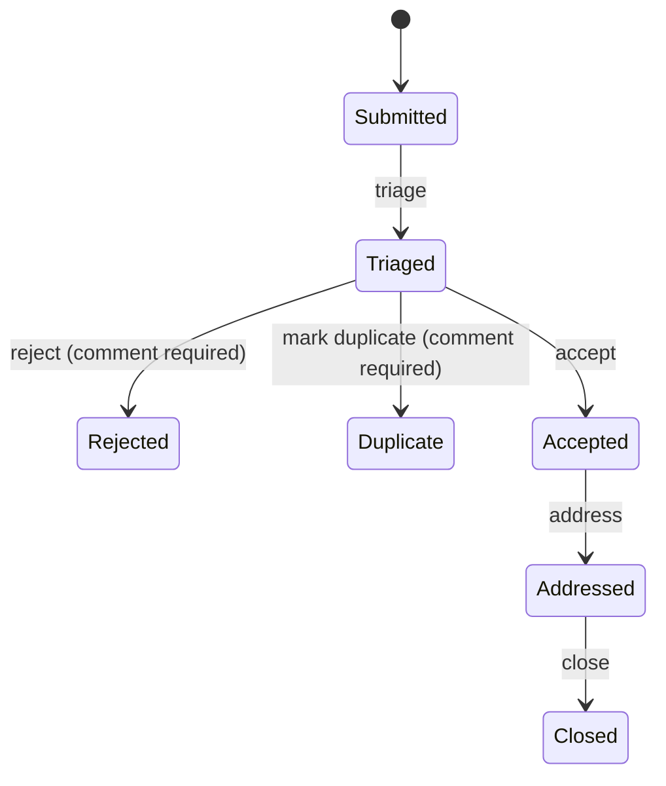
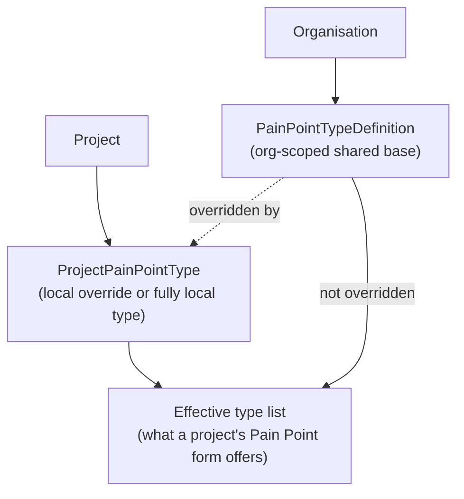
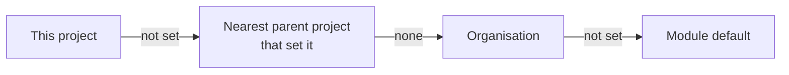
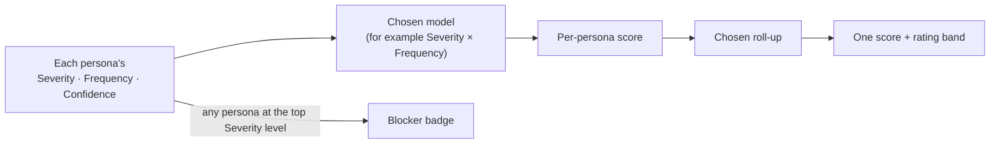

# Pain Point

A **Pain Point** records a problem, deficiency, or improvement opportunity motivating a [Strategy](./strategy.md) or Requirement — with a source, its impact, supporting evidence, and a configurable type. Unlike Strategy, Future State, and Guiding Principle, a Pain Point is **project-scoped only** — there is no organisation-scoped equivalent. Any project member can raise one and attach evidence files; the **Pain Point Manager** role is only needed to triage, decide, reclassify, or manage the type vocabulary (see [Roles](#roles) below) — this broad creation model is deliberate, not an oversight.

| A project's Pain Points |
| --- |
| Falcon-3's Pain Points, filterable by status — Addressed, Rejected, and Duplicate in this example |
|  |

| An Addressed Pain Point, with a real "Is duplicated by" relationship |
| --- |
| Falcon-3's "field inspectors re-key paper reports" Pain Point — description, source, impact, evidence, and a Duplicate-of relationship from another Pain Point |
|  |

## Fields

| Field | Holds |
| --- | --- |
| `pain_point_type_id` | An effective type for this project — see [Pain Point type vocabulary](#pain-point-type-vocabulary) below. |
| `title` | Short display title. |
| `description` | Description of the problem. |
| `source` | Where this Pain Point came from. |
| `impact` | Its impact. |
| `evidence` | Supporting evidence (in addition to any file attachments). |
| `priority` | `low` / `medium` / `high`. |
| `owner_id` | Who owns this Pain Point, if assigned. |
| `date_identified` | Defaults to today if omitted at creation. |
| `is_intentional` | Marks a **deliberate limitation** (for example, a restriction in a lower product tier that drives upgrades). It is still scored, but isn't something to fix, so the list can hide it. |
| `status` | Lifecycle state, below. |

## Lifecycle

A genuinely **branching** lifecycle, unlike Strategy/Future State/Guiding Principle's linear-chain-plus-terminal-branch shape — `Triaged` has three legal next states, not one.

**Content lock:** only the three true terminal states lock — **Rejected**, **Duplicate**, and **Closed**. `Accepted` and `Addressed` stay unlocked, deliberately, since a Pain Point Manager may still need to reassign its owner or adjust its priority while work is genuinely in progress.

**Version history:** none — a Pain Point is mutated in place, with every change and transition recorded via the audit log rather than a version table.

## Roles

| Role | Scope | Grants |
| --- | --- | --- |
| **Pain Point Manager** | Project | Triages, classifies, and decides Pain Points (reject/accept/address/close), and manages the project's own Pain Point type overrides. A single elevated role, not an owner/approver pair — this artefact names one "Pain Point Manager / Project Manager" tier rather than a two-tier split. |
| **Pain Point Type Admin** | Organisation | Manages the organisation's shared Pain Point type vocabulary and its [scoring configuration](#scoring-configuration) (below). |

## Relationships

| Relationship | Target | Reverse label |
| --- | --- | --- |
| Drives | Strategy | Is driven by |
| Motivates | Requirement | Is motivated by |
| Raises | Open Question | Is raised by |
| Related to *(untyped)* | Future State | — |
| Duplicate of | Pain Point (another one) | Is duplicated by |

A Pain Point has no supersession concept (unlike Strategy/Future State/Guiding Principle) — a Pain Point believed obsolete is instead recorded with the **Duplicate of** relationship above, as the screenshot at the top of this page shows. Creating a relationship from a Pain Point requires the **Pain Point Manager** role. See [Relationships → Cross-artefact relationships](./relationships-and-types.md#cross-artefact-relationships) for the full picture across all five artefact types.

`Pain Point → Addresses → Decision` is reserved but not yet built — see [Relationships → Reserved relationship types](./relationships-and-types.md#reserved-relationship-types-not-yet-available).

## Pain Point type vocabulary

A Pain Point's `type` comes from a **two-tier, configurable** vocabulary rather than a fixed enum:

- **Organisation-scoped base types** (`PainPointTypeDefinition`) — the shared vocabulary every project in the organisation starts from, managed by the **Pain Point Type Admin** role. Every organisation is seeded with three defaults when the module is enabled: **Market**, **User**, and **Operator**.
- **Project-scoped overrides/local types** (`ProjectPainPointType`) — a project can override an org type's name or enabled-state just for itself, or define a fully project-local type with no org type behind it at all. Managed by the **Pain Point Manager** role, from that project's own admin page.
- A project's *effective* type list is its own rows layered over the organisation's base types — an org type a project hasn't touched appears as-is; one it has overridden shows the project's own name/enabled-state instead.

| Managing an organisation's Pain Point types |
| --- |
| The org-scoped Pain Point Types panel, from Organisation Management |
|  |

Guiding Principle, by contrast, has no type field or configurable vocabulary at all — see [Known limitations](./known-limitations.md).

## Scoring configuration

Pain Points are prioritised on three inputs rather than a single Low/Medium/High priority — **Severity** (how badly the problem affects a persona; its top level, **Blocker**, means "unusable for this persona"), **Frequency** (how often they hit it) and **Confidence** (how sure you are of the other two). A **scoring model** combines them by multiplying the chosen levels' weights:

| Model | Inputs |
| --- | --- |
| Severity × Frequency | Severity, Frequency |
| Severity × Confidence | Severity, Confidence |
| Severity × Frequency × Confidence | all three (the module default) |

**Rating bands** (Low/Medium/High/Critical by default) label a score by where it sits as a percentage of the model's maximum, so they keep working if you change level weights.

| Setting | Organisation (**Org Management → Pain Point Scoring**) | Project (**Project Admin → Pain Point Scoring**) |
| --- | --- | --- |
| Levels per input (name, weight, guidance) | Edit, add, delete (at least two per input; deleting an in-use level asks where to move its scores) | Read-only |
| Default model | Set, or reset to the module default | Override, or use the inherited value |
| Rating bands per model | Set, or reset to the module defaults | Override, or use the inherited value |

A project that hasn't overridden a setting inherits it, and the page says where from:

Organisation changes need the **Pain Point Type Admin** role or org admin; project overrides need project manager/administrator (or org admin). Anyone viewing scores can still switch model.

## Scoring a Pain Point

Impact differs by persona, so a Pain Point is scored on its detail page either **for all personas together** or **for each persona separately** (the second option appears when the [Stakeholders & Personas](../stakeholders-personas-module/overview.md) module is on). For each, pick a Severity, Frequency and Confidence level; leave an input blank if you don't know it. Saving scores is for Pain Point Managers; anyone who can see the Pain Point can read them.

The model and how personas combine are chosen **when viewing**, on both the detail page and the list, so you can compare rankings without changing any data:

| Combine personas by | Result |
| --- | --- |
| Weighted average (default) | Each scored persona's score, weighted by its importance (equal if none is set). |
| Worst case | The highest persona score. |
| Plain average | Every scored persona counts the same. |

- **Unscored personas are left out, not counted as zero.** If only one of five personas is scored, the Pain Point shows that persona's score. A persona missing an input the chosen model needs is "Not scored" under that model.
- **The Blocker badge always shows** when any counted persona rates Severity at its top level, whatever model or roll-up is chosen, so one blocked persona can't be averaged away.
- **Retired personas** stay visible but aren't counted. If a persona has since been deleted, hidden, or the Personas module is off, its scores still count, without a name or weight, and the page says so.
- The list's **Score** column sorts, and switching the model re-ranks it. Tick **Hide intentional limitations** to take deliberate restrictions out of the list.

## Where this fits

See [Overview](./overview.md) for the artefact-type summary, and [Relationships and types](./relationships-and-types.md) for the full cross-artefact relationship picture.
