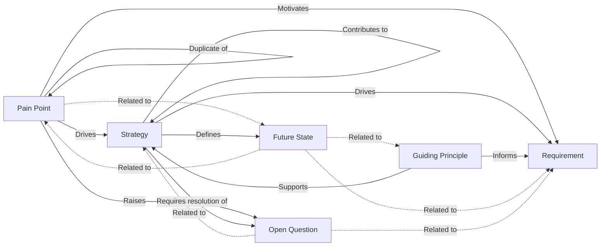

# Relationships and types

Each of Context & Strategy's five artefact types has its own dedicated page — [Strategy](./strategy.md), [Future State](./future-state.md), [Pain Point](./pain-point.md), [Guiding Principle](./guiding-principle.md), [Open Question](./open-question.md) — with its own "Relationships" section covering the links that artefact creates. This page is the bird's-eye view across all five at once, plus the relationships still reserved pending other modules.

## Cross-artefact relationships

Solid arrows are typed (causal) relationships; dashed arrows are untyped "related to" associations. Each relationship is built once, from whichever side's own source spec names it — e.g. `Strategy → Defines → Future State` exists only from Strategy's side, not duplicated as a `Future State → related to → Strategy` link as well.

| Source | Relationship | Target | Reverse label |
| --- | --- | --- | --- |
| Strategy | Drives | Requirement | Is driven by |
| Strategy | Defines | Future State | Is defined by |
| Strategy | Requires resolution of | Open Question | Resolution is required by |
| Strategy | Contributes to | Strategy | Is contributed to by |
| Pain Point | Drives | Strategy | Is driven by |
| Pain Point | Motivates | Requirement | Is motivated by |
| Pain Point | Raises | Open Question | Is raised by |
| Pain Point | Related to *(untyped)* | Future State | — |
| Pain Point | Duplicate of | Pain Point | Is duplicated by |
| Guiding Principle | Supports | Strategy | Is supported by |
| Guiding Principle | Informs | Requirement | Is informed by |
| Future State | Related to *(untyped)* | Pain Point / Requirement / Guiding Principle | — |
| Open Question | Related to *(untyped)* | Strategy / Requirement | — |

`Strategy → Contributes to → Strategy` is the mechanism for a project Strategy to reference the organisation Strategy (or another Strategy) it implements a slice of — see [Overview → The chain](./overview.md#the-organisation-strategy--project-strategy--requirements--implementation-chain).

Creating any relationship above from a given artefact requires that artefact's own management-level role (Strategy Owner, Pain Point Manager, Guiding Principle Owner, and so on — see each artefact's own page, or [Overview → Roles](./overview.md#roles) for the full list) — mirroring how creating a Requirement traceability link requires an edit-capable role, not just view access.

Strategy, Future State, and Guiding Principle additionally support **Supersedes** / **Is superseded by** the same way Decision Management's own Decisions do: creating the link and having the new record itself reach Approved is what flips the old one's status to Superseded. Pain Point and Open Question have no supersession concept — a Pain Point declared obsolete by another is instead recorded with the untyped **Duplicate of** relationship above.

## Reserved relationship types (not yet available)

Several relationships name a Decision Management **Decision** as their target and are reserved in this module's own source spec, but **not built yet**:

| Relationship | Blocked on |
| --- | --- |
| Strategy → Informs → Decision | Decision Management module's own Phase 7 (reserved-relationship wiring) |
| Guiding Principle → Guides → Decision | Decision Management module's own Phase 7 |
| Open Question → Resolved by → Decision | Decision Management module's own Phase 7 |
| Pain Point → Addresses → Decision | Decision Management module's own Phase 7 |

Both modules exist today, but the relationship itself is not — Decision Management's own docs describe the identical boundary from its side; see [Decision Management → Relationships and templates → Reserved relationship types](../decision-management-module/relationships-and-templates.md#reserved-relationship-types-not-yet-available). Don't rely on "Open Question becomes a Decision" or any Decision-target relationship above being available in the product today.

## Pain Point type vocabulary

Pain Point is the only one of the five artefact types with a configurable type — see [Pain Point → Pain Point type vocabulary](./pain-point.md#pain-point-type-vocabulary) for the org-shared-base/project-override model and the Market/User/Operator defaults.

## Where this fits

See each artefact's own page — [Strategy](./strategy.md), [Future State](./future-state.md), [Pain Point](./pain-point.md), [Guiding Principle](./guiding-principle.md), [Open Question](./open-question.md) — for its own fields, lifecycle, roles, and relationships in full, and [Requirements management → Traceability links](../../core-features/requirements-management.md#traceability-links) for how a Requirement-side link to a Strategy, Pain Point, or Guiding Principle shows up from that side.
