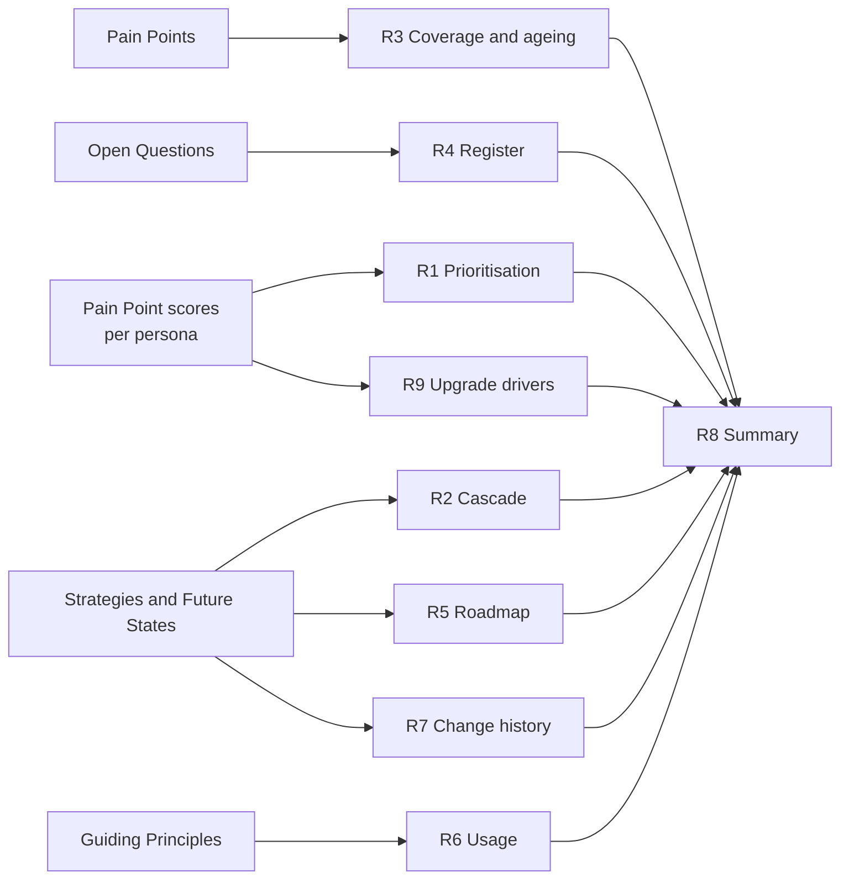
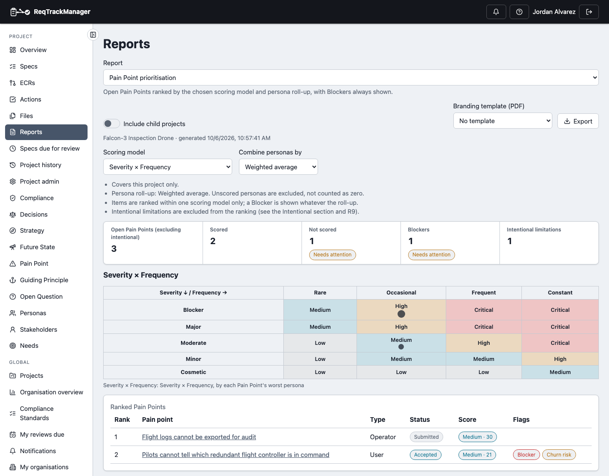
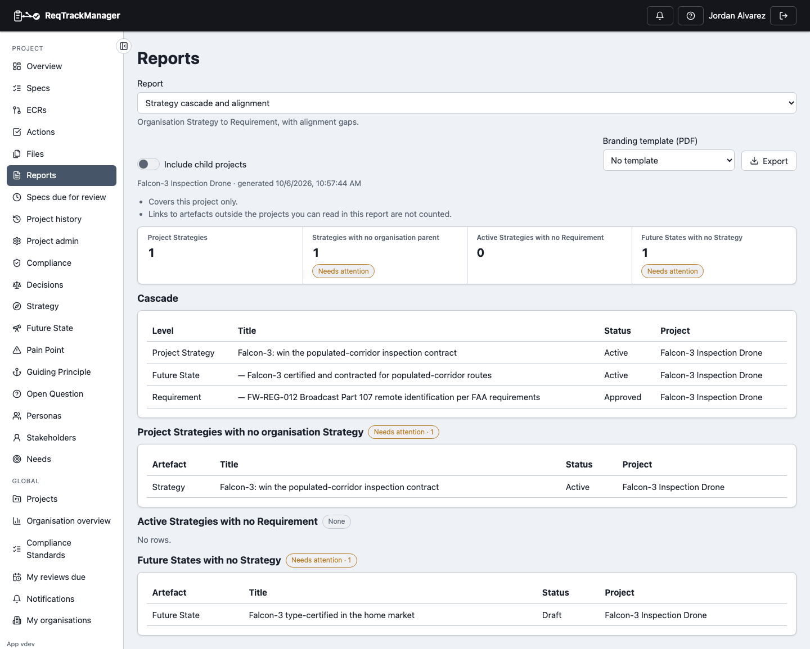
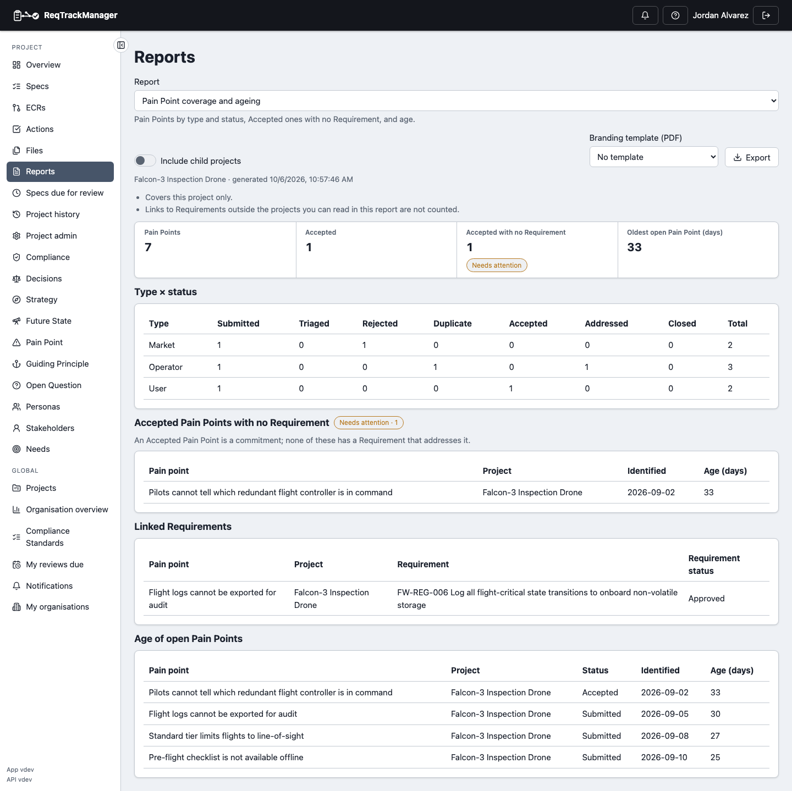
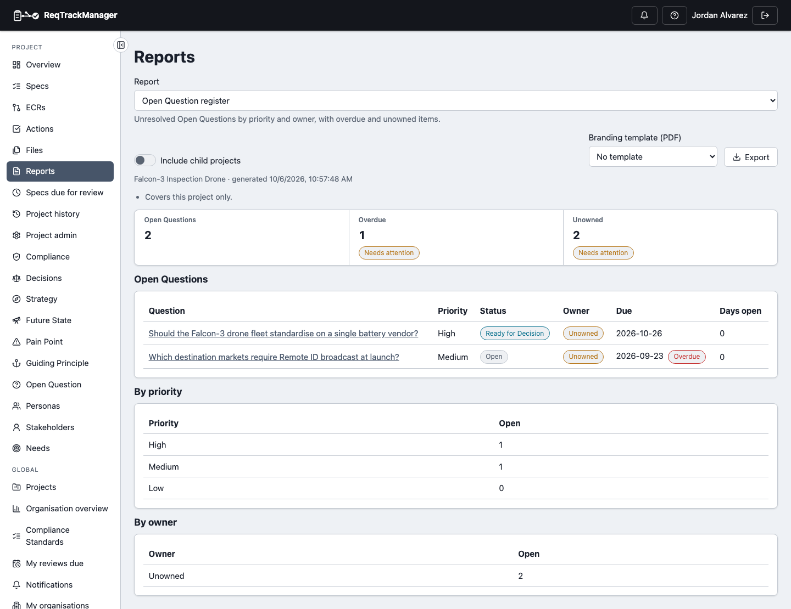
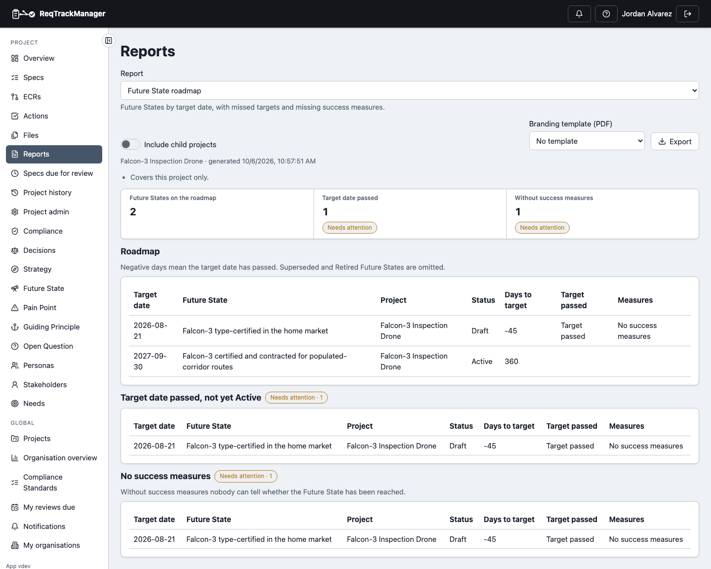
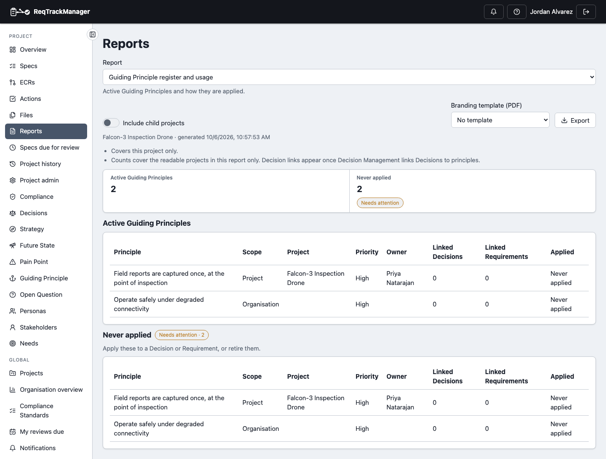
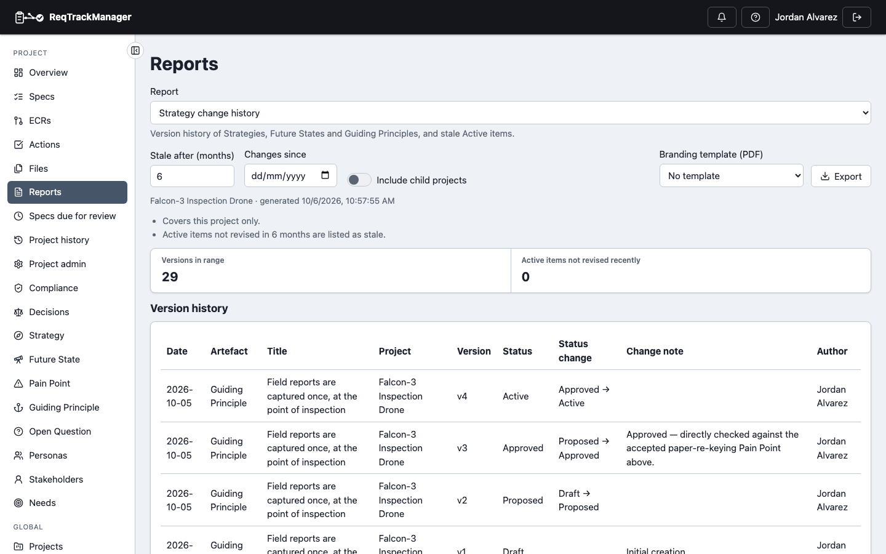
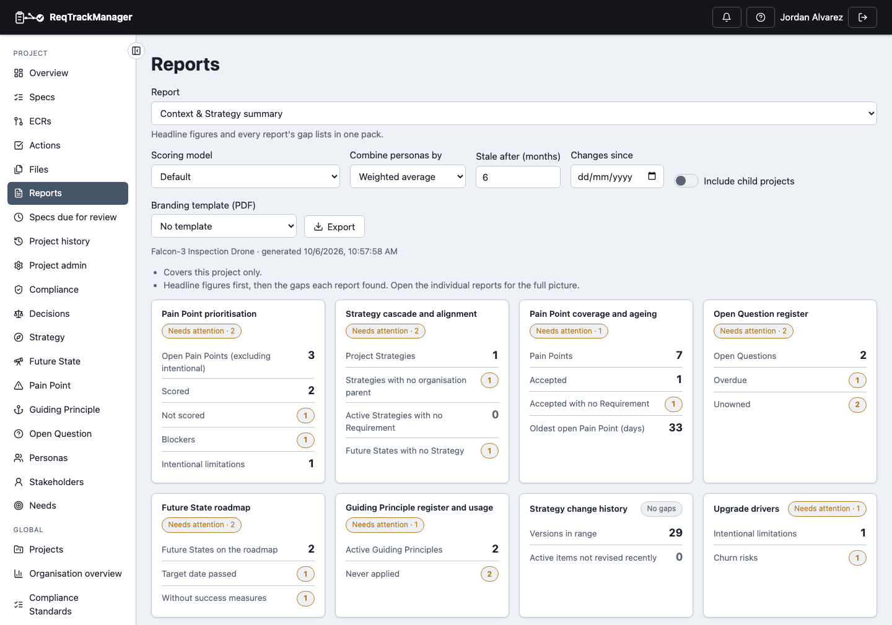
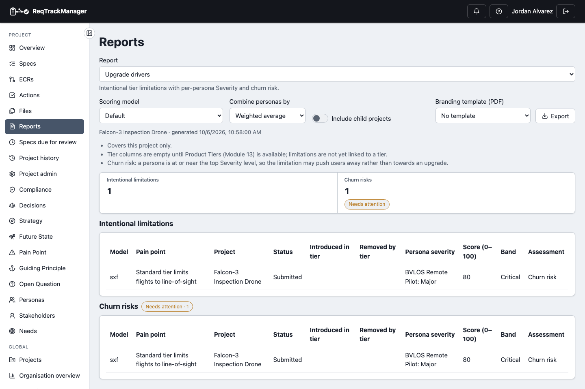

# Report reference

What each of the nine [reports](./reports.md) shows, which of its tables are gap lists, and what to do about a gap. Gap tables show a **Needs attention** count when they have rows. Most headline figures are links to what they count; see [Following a figure](./reports.md#following-a-figure). The figures in the screenshots come from the Falcon-3 demo project.

R1 and R9 build on the [per-persona scores](./pain-point-scoring.md), so an unscored Pain Point shows up as a gap rather than as a low-priority one.

## R1 Pain Point prioritisation

Ranks the open Pain Points under the scoring model and persona roll-up you choose, and shows which are Blockers. Intentional limitations are excluded from the ranking and listed on their own. Available per project and across the organisation.

| R1 with the Severity × Frequency matrix |
| --- |
| Each Pain Point sits in the cell of its worst-affected persona (a dot per Pain Point, larger for higher Confidence); the ranked list below carries the Blocker and Churn risk flags |
|  |

| Table | Holds | Act on it by |
| --- | --- | --- |
| Severity × Frequency matrix | Cells coloured by rating band, with a dot per Pain Point sized by Confidence (the exported tables give the counts, with Confidence in brackets) | Reading where the weight of problems sits. |
| Ranked Pain Points | Rank, type, status, score, flags | Starting at the top. |
| **Blockers** (gap) | Pain Points where a persona is at the top Severity level, naming the persona | Treating these first, whatever their rank. |
| **Not scored under this model** (gap) | Pain Points no persona has every input for | Scoring them, or choosing a model whose inputs you have. |
| Intentional limitations | Deliberate restrictions, scored but not ranked | See [R9](#r9-upgrade-drivers). |
| Per-persona breakdown | Every persona's inputs, score, band and Blocker flag | Seeing why a Pain Point ranks where it does. |

A **Churn risk** flag on a ranked item means a persona is at or near the top Severity level for it.

## R2 Strategy cascade and alignment

Traces organisation Strategy → project Strategy → Future State → Requirement, and lists where the chain breaks. Per project only.

| R2 with its alignment gaps |
| --- |
| One Strategy with no organisation Strategy above it, and a Draft Future State with no Strategy |
|  |

| Gap table | Means | Fix by |
| --- | --- | --- |
| Project Strategies with no organisation Strategy | The project's direction doesn't trace to an organisation objective. | Link it to the Strategy it supports, or confirm it stands alone. |
| Active Strategies with no Requirement | Nothing implements an Active Strategy. | Link a Requirement, or retire the Strategy. |
| Future States with no Strategy | An outcome with no Strategy driving it. | Link the Strategy that defines it. |

## R3 Pain Point coverage and ageing

Shows whether Accepted Pain Points are actually being addressed. Available per project and across the organisation.

| R3 with an uncovered Accepted Pain Point |
| --- |
| One Accepted Pain Point has no Requirement; another is linked to an Approved one |
|  |

| Table | Holds | Act on it by |
| --- | --- | --- |
| Type × status | Pain Point counts per type and lifecycle status | Spotting where Pain Points pile up. |
| **Accepted Pain Points with no Requirement** (gap) | Accepted problems with nothing motivated by them | Linking a Requirement that addresses it, or reconsidering the acceptance. |
| Linked Requirements | Each Pain Point's Requirements and their statuses | Checking the work is progressing. |
| Age of open Pain Points | Days since the date identified | Reviewing the oldest first. |

## R4 Open Question register

Lists unresolved Open Questions, with overdue and unowned ones flagged on the rows. Available per project and across the organisation.

| R4 with an overdue, unowned question |
| --- |
| **Overdue** and **Unowned** badges appear on the rows themselves, as well as in their own gap tables |
|  |

| Table | Holds | Act on it by |
| --- | --- | --- |
| Open Questions | Priority, status, owner, due date, days open | Working top-down. |
| **Overdue** / **Unowned** (gap) | Past-due questions; questions with no owner | Assigning an owner, or resolving or withdrawing it. |
| By priority, By owner | Open counts | Balancing the load. |

## R5 Future State roadmap

Lists Future States by target date. Superseded and Retired ones are omitted. Per project only.

| R5 with a missed target |
| --- |
| A Draft Future State whose target date passed 45 days ago and which names no success measures appears in both gap tables |
|  |

| Table | Holds | Act on it by |
| --- | --- | --- |
| Roadmap | Target date and days remaining (negative once passed) | Reading the time-ordered view. |
| **Target date passed, not yet Active** (gap) | Targets that slipped | Re-dating it, or activating it. |
| **No success measures** (gap) | Future States nobody can tell have been reached | Adding measures. |

## R6 Guiding Principle register and usage

Lists Active Guiding Principles and how many Decisions and Requirements apply each. Per project only.

| R6 with principles never applied |
| --- |
| Both Active principles are linked to nothing yet, so both are gaps |
|  |

| Table | Holds | Act on it by |
| --- | --- | --- |
| Active Guiding Principles | Priority, owner, linked Decisions and Requirements | Reviewing the register. |
| **Never applied** (gap) | Principles linked to no Requirement or Decision | Applying it, or retiring it. |

The *Linked Decisions* column stays at zero until Decision links are available ([Known limitations](./known-limitations.md)).

## R7 Strategy change history

A change log of Strategies, Future States and Guiding Principles: every version with its status change, change note and author. Per project only.

| R7 version history |
| --- |
| Newest first; each row shows the status change, the approver's note and the author |
|  |

| Table | Holds | Act on it by |
| --- | --- | --- |
| Version history | Newest first; narrow it with **Changes since** | Reviewing what changed and why: useful evidence for change reviews. |
| **Active, not revised in N months** (gap) | Active items unrevised for **Stale after (months)** (default 6) | Reviewing them, or retiring them. |

## R8 Summary

One pack with headline figures from every report and each report's gap lists. Available per project and across the organisation; it is the report to circulate for a periodic review. It accepts the scoring, staleness and date options of the reports it combines.

| R8 summary with one card per report |
| --- |
| Each report's headline figures in its own card; a figure that is a problem to fix shows a **Needs attention** count, and the gap tables follow below |
|  |

## R9 Upgrade drivers

Reports on [intentional limitations](./pain-point-scoring.md#intentional-limitations): deliberate restrictions that exist to drive an upgrade. It shows each persona's Severity and flags a limitation as a **churn risk** rather than an **upsell lever** when a persona is at or above 80% of the top Severity level. Available per project and across the organisation.

| R9 with a churn risk |
| --- |
| A limitation that is Major for the BVLOS Remote Pilot scores 80 and is flagged as a churn risk |
|  |

| Table | Holds | Act on it by |
| --- | --- | --- |
| Intentional limitations | Per-persona Severity, score, band, assessment | Confirming each restriction is a lever, not an irritant. |
| **Churn risks** (gap) | Limitations that may push users away | Reconsidering the restriction. |

The *Introduced in tier* and *Removed by tier* columns are empty until limitations can be linked to a product tier ([Known limitations](./known-limitations.md)).

## Where this fits

See [Reports](./reports.md) for finding, generating and exporting reports, and [Pain Point scoring](./pain-point-scoring.md) for the scores behind R1 and R9.
