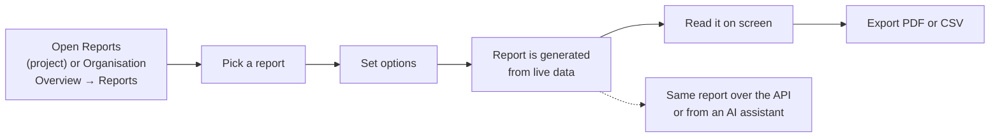
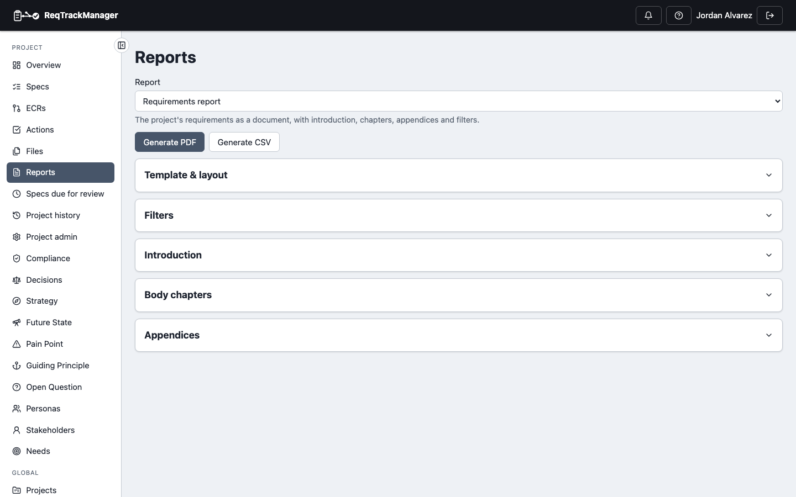
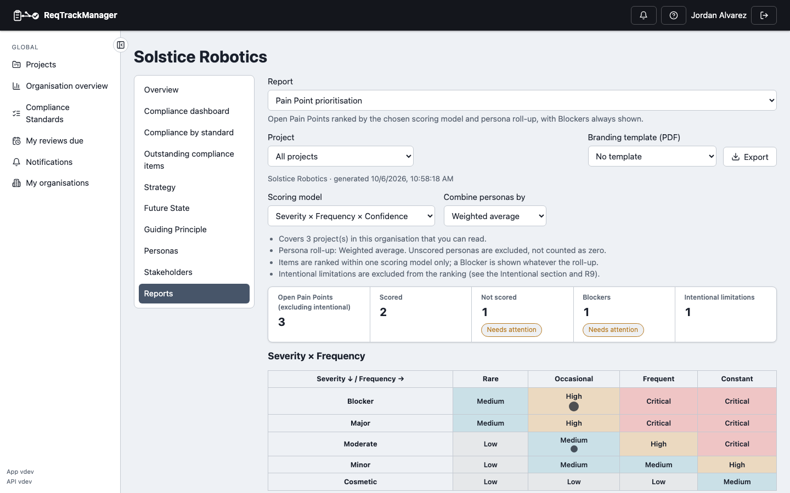
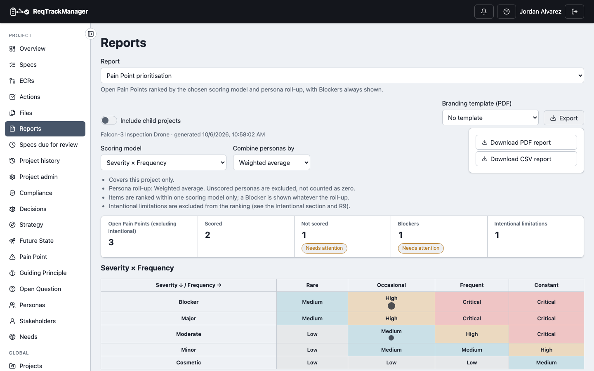
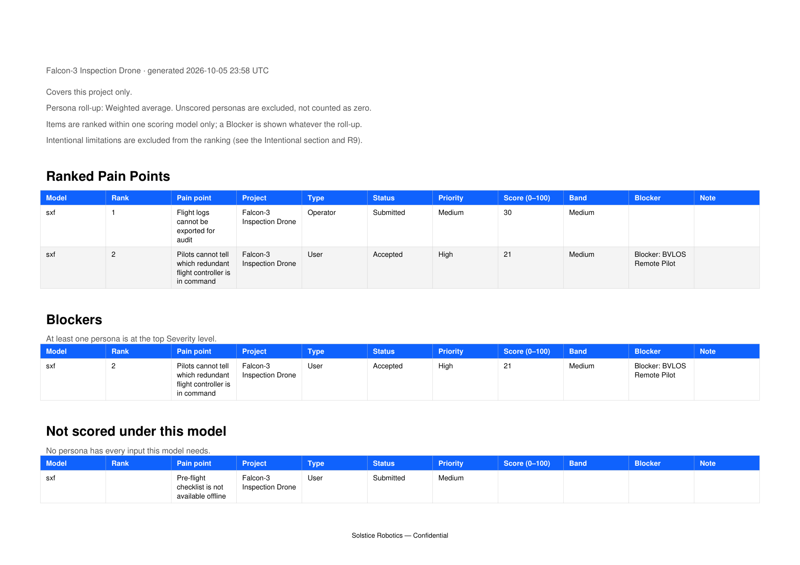

# Reports

Context & Strategy turns its records into nine reports (R1–R9): rankings, gap lists, and registers that answer questions such as *which Pain Points matter most?* or *is every Strategy traced down to Requirements?* Reports are generated on demand from live data, shown on screen, and exported as PDF or CSV. They sit on the same **Reports** page as the requirements report, so there is one place to look for any report in the app. [Report reference](./report-reference.md) explains each one.



## Generating a report

1. Open the project's **Reports** page and choose a report from the **Report** picker. The list shows *Requirements report* first, then every Context & Strategy report that applies to this project.
2. Adjust the report's **options**, if it has any. The report re-generates each time you change one.
3. Read the result on screen: headline figures first, then the tables. A figure or table that lists problems to fix carries a **Needs attention** marker; a gap table with nothing to fix is marked **None**.
4. Select **Export** to download it.

| The Reports page with the report picker |
| --- |
| One picker for the requirements report and every module report; the choice is kept in the page address (`?report=…`) so a link opens that report |
|  |

Every report is generated when you open it, so it always reflects the data as of the **generated** time shown under the title; nothing is stored or cached. A report only ever includes what you are allowed to read, and links to artefacts in projects you can't read aren't counted.

## Finding a report

- **One project:** the project's **Reports** page. A report is missing from the picker when the module (or the part of it the report needs, such as Open Questions) is turned off for the project, or you aren't a member of it.
- **Across the organisation:** **Organisation Overview → Reports**. This group appears only if you hold the **Organisation Reports Viewer** role (organisation admins hold it by default), and it lists only the organisation-wide reports. They cover the projects you can already read.

| Organisation Overview → Reports |
| --- |
| The same viewer, run across every project you can read; the **Project** picker narrows it to one |
|  |

| Report | Answers | Organisation-wide |
| --- | --- | --- |
| **R1 Pain Point prioritisation** | Which open Pain Points matter most, and which are Blockers? | Yes |
| **R2 Strategy cascade and alignment** | Is every Strategy traced down to Requirements, and where are the gaps? | No |
| **R3 Pain Point coverage and ageing** | Which Accepted Pain Points have no Requirement, and how old are the open ones? | Yes |
| **R4 Open Question register** | Which questions are unresolved, overdue, or unowned? | Yes |
| **R5 Future State roadmap** | Which Future States are due, missed, or missing success measures? | No |
| **R6 Guiding Principle register and usage** | Which Active principles exist and how are they applied? | No |
| **R7 Strategy change history** | What changed, and which Active items have gone stale? | No |
| **R8 Summary** | Headline figures and every report's gaps in one pack | Yes |
| **R9 Upgrade drivers** | Which intentional tier limitations are most likely to drive an upgrade? | Yes |

## Options

Options are generated from what each report accepts, so a report only shows the ones that apply to it.

| Option | Applies to | Effect |
| --- | --- | --- |
| **Scoring model** | R1, R8, R9 | Which [scoring model](./pain-point-scoring.md#the-three-inputs) ranks Pain Points. Blank uses the project's default. |
| **Combine personas by** | R1, R8, R9 | How per-persona scores [roll up](./pain-point-scoring.md#how-personas-combine): weighted average (default), worst case, or plain average. |
| **Stale after (months)** | R7, R8 | How long an Active item can go unrevised before it is flagged stale (default 6). |
| **Changes since** | R7, R8 | Earliest version date to include in the change history. |
| **Include child projects** | Project reports | Adds the project's readable child projects. |
| **Project** | Organisation reports | Narrows the report to one project in your scope. Leave on *All projects* for the whole-organisation view. |

## Exporting

| Exporting a report |
| --- |
| **Export** offers PDF and CSV of exactly what is on screen, with the options currently set |
|  |

| Format | Contains |
| --- | --- |
| **PDF** | The report's notes and **every table** (including the matrix and gap tables), laid out for reading or circulating, with the branding template's cover, accent colour and footer if you chose one. The on-screen figure tiles and the matrix's colouring are not drawn; the figures appear in the tables. R8 opens with a Headline figures table, so it is the one to circulate. |
| **CSV** | The report's **first table** only, as a flat file for a spreadsheet. Cell values that a spreadsheet could read as a formula are neutralised. |

| An exported PDF (R1 with a branding template) |
| --- |
| Page 2 of the PDF: the scope and notes, then each table with the template's accent colour, and the template's footer |
|  |

The same report's CSV, which is its Ranked Pain Points table:

```csv
Model,Rank,Pain point,Project,Type,Status,Priority,Score (0–100),Band,Blocker,Note
sxf,1,Flight logs cannot be exported for audit,Falcon-3 Inspection Drone,Operator,Submitted,Medium,30,Medium,,
sxf,2,Pilots cannot tell which redundant flight controller is in command,Falcon-3 Inspection Drone,User,Accepted,High,21,Medium,Blocker: BVLOS Remote Pilot,
```

**Branding template (PDF)** applies an organisation [report template](../../core-features/reports-and-export.md)'s accent colour, cover page, logo, and footer to the PDF. Its introduction and chapters belong to the requirements report and aren't used here. CSV never carries a template.

## Using reports from the API or an AI assistant

Every report is also available over REST, as JSON, PDF, or CSV, and is read-only:

```bash
# Which reports can I run on this project?
curl -H "Authorization: Bearer $TOKEN" \
  "$BASE/api/v1/projects/$PROJECT_ID/report-catalogue"

# Run one (format = json | pdf | csv)
curl -H "Authorization: Bearer $TOKEN" \
  "$BASE/api/v1/projects/$PROJECT_ID/modules/context_strategy/reports/pain-point-prioritisation?model_key=sxf&rollup=worst_case"

# The organisation-wide variant
curl -H "Authorization: Bearer $TOKEN" \
  "$BASE/api/v1/orgs/$ORG_ID/modules/context_strategy/reports/pain-point-prioritisation?project_id=$PROJECT_ID"
```

The catalogue lists each report's address, formats and options, so a script can discover them. Use a [personal access token](../../core-features/personal-access-tokens.md) for automation. An AI assistant reaches the same reports through the module's `get_…_report` tools: see [AI assistant (MCP) integration](./mcp-integration.md). The organisation-wide variants aren't exposed there.

## Access

| To | You need |
| --- | --- |
| Run a project report | Membership of the project, and the module (and the report's part of it) enabled. |
| Run an organisation report | The **Organisation Reports Viewer** role. It covers only projects you can already read, so it never shows more than your project access does. |
| Export | The same access as running it. |

## Where this fits

See [Report reference](./report-reference.md) for what each report shows and how to act on its gaps, [Pain Point scoring](./pain-point-scoring.md) for the scores behind R1 and R9, and [Reports and export](../../core-features/reports-and-export.md) for the requirements report.
