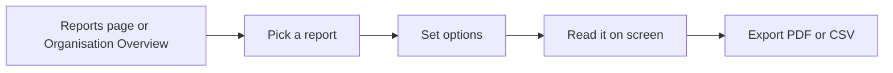

# Reports

Context & Strategy ships nine reports (R1–R9) that turn its records into rankings, gap lists, and registers. They appear on the same **Reports** page as the requirements report, and organisation-wide ones appear on the **Organisation Overview**, so there is one place to look for any report in the app.

## Finding a report

- **One project:** open the project's **Reports** page. The **Report** picker lists *Requirements report* first, then every Context & Strategy report that applies to this project. Switching reports keeps the page address (`?report=…`), so you can bookmark or share a link to one.
- **Across the organisation:** open **Organisation Overview → Reports**. This group appears only if you hold the **Organisation Reports Viewer** role (organisation admins hold it by default). It lists only the organisation-wide reports, and covers only projects you can already read. Use its **Project** picker to see one project's figures.

A report is missing from the picker when the module — or the part of it the report needs, such as Open Questions — is turned off for that project.

## The reports

| Report | Answers | Organisation-wide |
| --- | --- | --- |
| **R1 Pain Point prioritisation** | Which open Pain Points matter most, and which are Blockers? | Yes |
| **R2 Strategy cascade and alignment** | Is every Strategy traced down to Requirements, and where are the gaps? | No |
| **R3 Pain Point coverage and ageing** | Which Accepted Pain Points have no Requirement, and how old are the open ones? | Yes |
| **R4 Open Question register** | Which questions are unresolved, overdue, or unowned? | Yes |
| **R5 Future State roadmap** | Which Future States are due, missed, or missing success measures? | No |
| **R6 Guiding Principle register and usage** | Which Active principles exist and how are they applied? | No |
| **R7 Strategy change history** | What changed, and which Active items have gone stale? | No |
| **R8 Summary** | Headline figures and every report's gaps in one pack | Yes |
| **R9 Upgrade drivers** | Which intentional tier limitations are most likely to drive an upgrade? | Yes |

Most reports show their results as tables, with a count badge on any table that lists problems to fix. Two have a purpose-built view:

- **R1** draws the **Severity × Frequency matrix**, placing each Pain Point in the cell of its worst-affected persona, with a ranked list beside it. Choose the **Scoring model** and how personas are combined (**Combine personas by**) above the matrix. A **Blocker** badge stays on a Pain Point whatever you choose, so a problem that stops one persona is never averaged away.
- **R4** shows one ageing table with **Overdue** and **Unowned** flagged on the rows themselves.

## Options, branding and export

- **Options** (for example the scoring model, or *Include child projects*) are generated from what each report accepts. The report re-runs when you change one.
- **Project** (organisation reports only) narrows the report to a single project. Leave it on *All projects* for the whole-organisation view. It lists only the projects that report covers for you.
- **Export** downloads the report as **PDF** or **CSV**. Both use the options currently on screen. The CSV contains the report's first table.
- **Branding template (PDF)** applies an organisation [report template](../../core-features/reports-and-export.md)'s accent colour, cover page, logo, and footer to the PDF. Its introduction and chapters belong to the requirements report and are not used here.

## Where this fits

See [Pain Point](./pain-point.md#scoring-configuration) for how scores are set, and [Reports and export](../../core-features/reports-and-export.md) for the requirements report.
