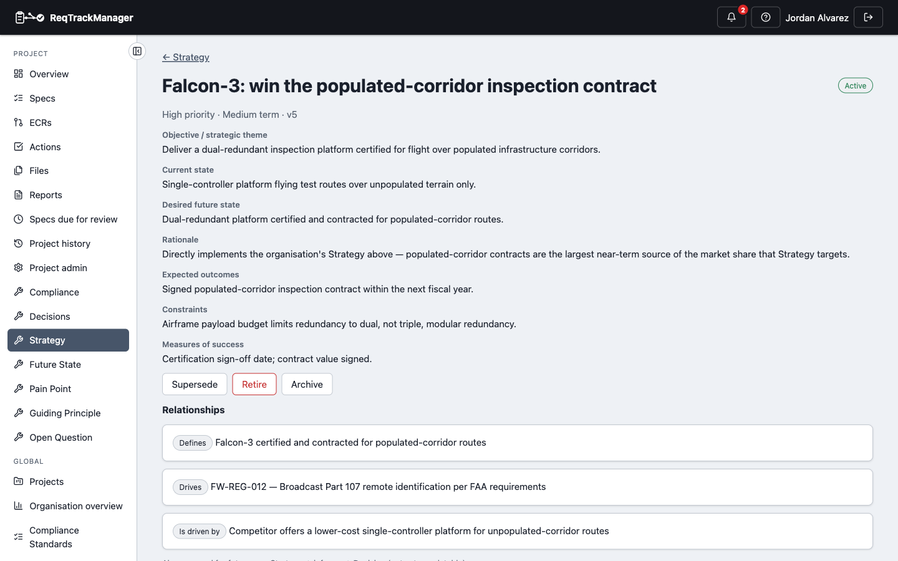
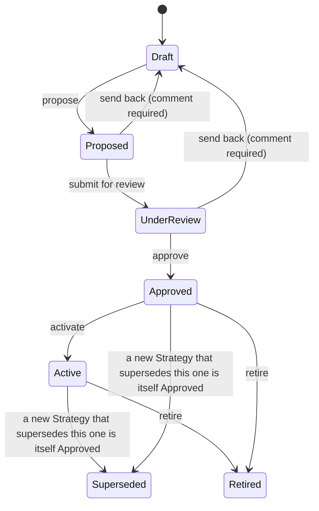

# Strategy

A **Strategy** records a specific objective and the plan for reaching it — current state, desired future state, rationale, expected outcomes, constraints, and how success will be measured. An organisation records its own Strategy (e.g. "lead the market in autonomous aerial inspection"); a project can record a narrower Strategy that implements a slice of it (e.g. "win the populated-corridor inspection contract") — see [Overview → The chain](./overview.md#the-organisation-strategy--project-strategy--requirements--implementation-chain) for how the two connect.

| A project Strategy in Active status |
| --- |
| Falcon-3's Strategy record: fields, its own Drives/Defines relationships, and its version history |
|  |

## Scope

Exactly one of `organization_id`/`project_id` is set on a Strategy — `scope` is `organization` or `project`.

## Fields

| Field | Holds |
| --- | --- |
| `title` | Short display title. |
| `objective` | The Strategy's objective/strategic theme. |
| `current_state` / `desired_future_state` | Short current- and desired-future-state text (see [Future State](./future-state.md) for the fuller elaboration of the latter). |
| `rationale` | Why this Strategy exists. |
| `expected_outcomes` | What success looks like. |
| `constraints` | Known constraints. |
| `measures_of_success` | How success will be measured. |
| `priority` | `low` / `medium` / `high`. |
| `time_horizon` | `short_term` / `medium_term` / `long_term`. |
| `status` | Lifecycle state, below. |

## Lifecycle

There is no `Rejected` status; a Strategy sent back for rework from `Proposed`/`Under Review` returns to `Draft` instead, with a mandatory comment.

**Content lock:** every field above becomes read-only from **Approved** onward — Approved, Active, Superseded, and Retired all lock.

**Version history:** full — every edit closes the current version and opens a new one (`StrategyVersion`).

## Roles

| Role | Scope | Grants |
| --- | --- | --- |
| **Strategy Owner** | Project | Creates and manages a project's Strategy records. |
| **Strategy Approver** | Project | Approves, activates, supersedes, and retires a project's Strategy records. |
| **Organisation Strategy Owner** | Organisation | The organisation-scoped equivalent of Strategy Owner. |
| **Organisation Strategy Approver** | Organisation | The organisation-scoped equivalent of Strategy Approver. |

Both compose with roles that already carry equivalent authority elsewhere — a server admin, an org admin, or (for the project-scoped pair) that project's own Project Manager.

## Relationships

| Relationship | Target | Reverse label |
| --- | --- | --- |
| Drives | Requirement | Is driven by |
| Defines | Future State | Is defined by |
| Requires resolution of | Open Question | Resolution is required by |
| Contributes to | Strategy (another one) | Is contributed to by |

`Contributes to` is the mechanism for a project Strategy to reference the organisation Strategy (or another Strategy) it implements a slice of. A Strategy is also the target of two relationships built from the other side: [Pain Point](./pain-point.md)'s **Drives** (shown here as "Is driven by") and [Guiding Principle](./guiding-principle.md)'s **Supports** (shown here as "Is supported by"). See [Relationships → Cross-artefact relationships](./relationships-and-types.md#cross-artefact-relationships) for the full picture across all five artefact types.

Creating a relationship from a Strategy, or supersession below, requires the **Strategy Owner** role (or its organisation-scoped equivalent for an org-scoped Strategy).

`Strategy → Informs → Decision` is reserved but not yet built — see [Relationships → Reserved relationship types](./relationships-and-types.md#reserved-relationship-types-not-yet-available).

## Supersession

A Strategy supports **Supersedes** / **Is superseded by**, the same mechanism Decision Management's own Decisions use: creating the link and having the new Strategy itself reach Approved is what flips the old one's status to Superseded.

## Where this fits

See [Overview](./overview.md) for the artefact-type summary and enabling the module, and [Future State](./future-state.md) for the vision a Strategy is aiming at.
