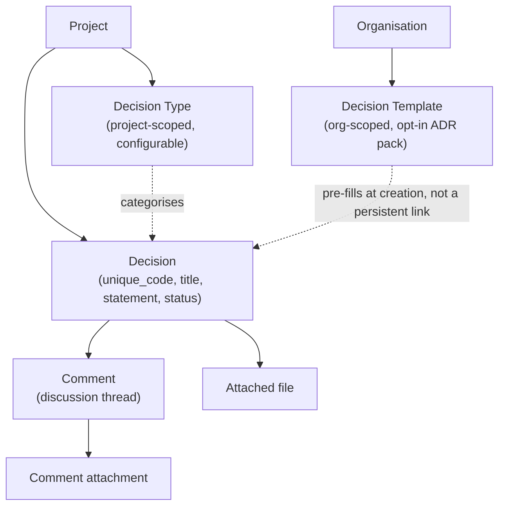
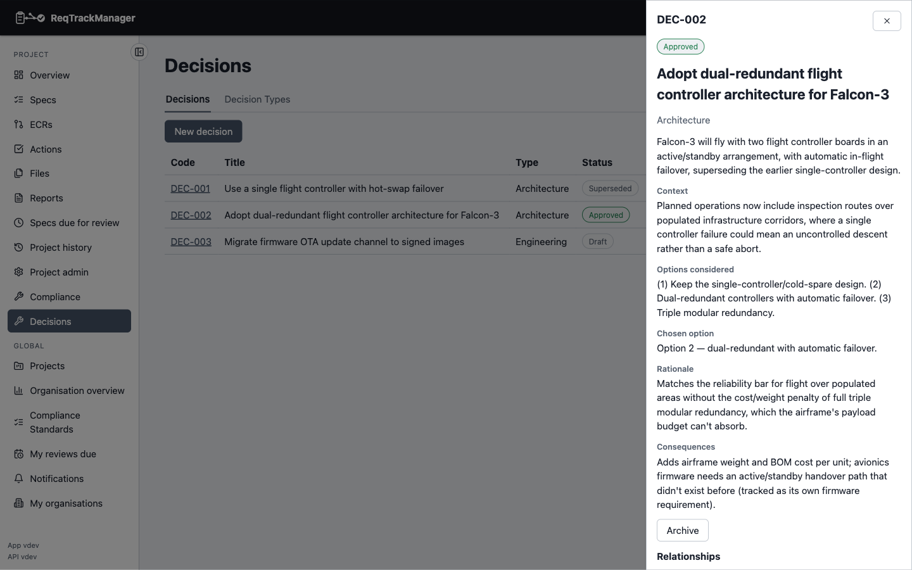
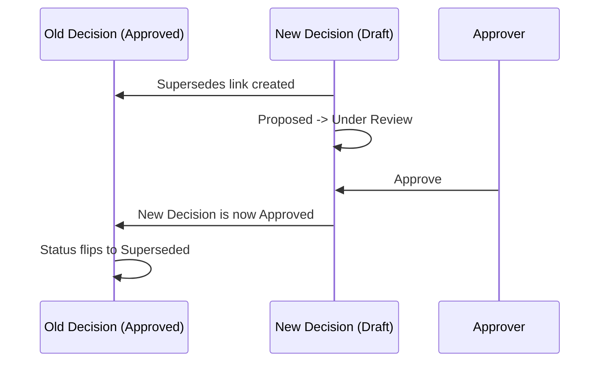

# Data model and lifecycle

This page covers the shape of a Decision record, what happens to its content once it's approved, and exactly how supersession works. See [Overview](./overview.md) for the lifecycle diagram and when to use a Decision in the first place.

## Data model

### Fields

| Field | Holds |
| --- | --- |
| `unique_code` | Project-scoped identifier (e.g. `DEC-003`), assigned automatically. |
| `title` | Short display title. |
| `decision_statement` | The decision itself, in one sentence or paragraph. |
| `decision_type` | Which project Decision Type this belongs to. |
| `status` | Lifecycle state — see [Overview → The lifecycle](./overview.md#the-lifecycle). |
| `decision_date` | The date the decision was actually made — which may precede formal approval, e.g. a decision made in a meeting and formally approved days later. |
| `decision_maker` | Who actually made (or is expected to make) this specific decision — distinct from who may *approve* it (the Decision Approver role) and distinct from who owns the record. |
| `owner` | Who maintains the record. |
| `context` / `options_considered` / `chosen_option` / `rationale` / `consequences` / `assumptions` / `constraints` | Free-text fields capturing the reasoning — rationale and consequences are deliberately kept as separate fields rather than folded into one description, so "why we chose it" and "what it costs us" can each be read on their own. |

A Decision can also carry a discussion thread (comments, with their own file attachments) and direct file attachments, both listable independently of the Decision's own content.

## Content lock after approval

Once a Decision reaches **Approved** or **Superseded**, every content field above becomes read-only — no further edits are possible through the normal edit form. This mirrors how an Approved or Completed Requirement locks in ReqTrackManager: once a decision is formally on the record, changing its stated reasoning after the fact would undermine the point of recording it. A Decision can still move forward from Approved (to Superseded, via a later Decision) or be archived/unarchived, but its content itself cannot silently drift once it's been approved.

| An Approved Decision's detail view |
| --- |
| Content fields, the Supersedes relationship, and the locked-attachments notice on an Approved Decision |
|  |

## Supersession

Superseding a Decision is a first-class relationship, not a status you set directly on the old Decision:

1. A new Decision is created to replace the old one, and a **Supersedes** link is drawn from the new Decision to the old one (this also creates the reverse **Is superseded by** link on the old Decision, the same forward/reverse pairing every ReqTrackManager link type uses).
2. The old Decision's status only flips to **Superseded** once *two* things are both true: the Supersedes link exists, **and** the new Decision itself reaches **Approved**.

This means creating the Supersedes link alone does **not** retire the old Decision — a predecessor keeps working from its current status (including one already Rejected, or not yet Approved) until the new Decision that supersedes it has itself cleared approval. A Decision can only be superseded once it's Approved in the first place; an already-Rejected Decision has no valid transition to Superseded at all (see the lifecycle diagram in [Overview](./overview.md#the-lifecycle) — Rejected has no outgoing transitions).

## Where this fits

See [Overview](./overview.md) for enabling the module, roles, Decision Types, and Decision Templates, and [Relationships and templates](./relationships-and-templates.md) for how a Decision links to Requirements and other Decisions beyond supersession.
