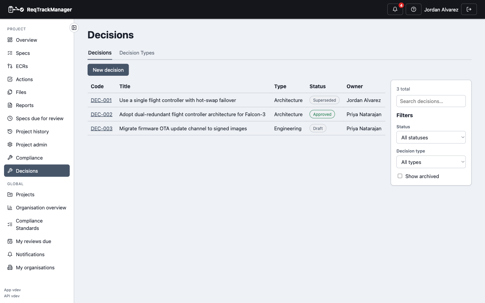
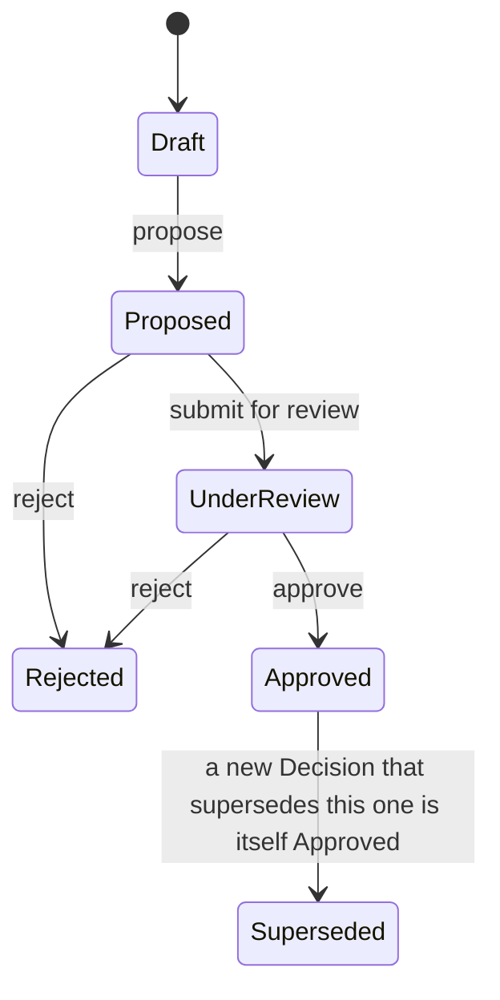
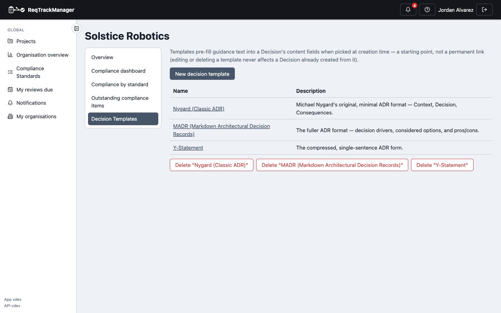
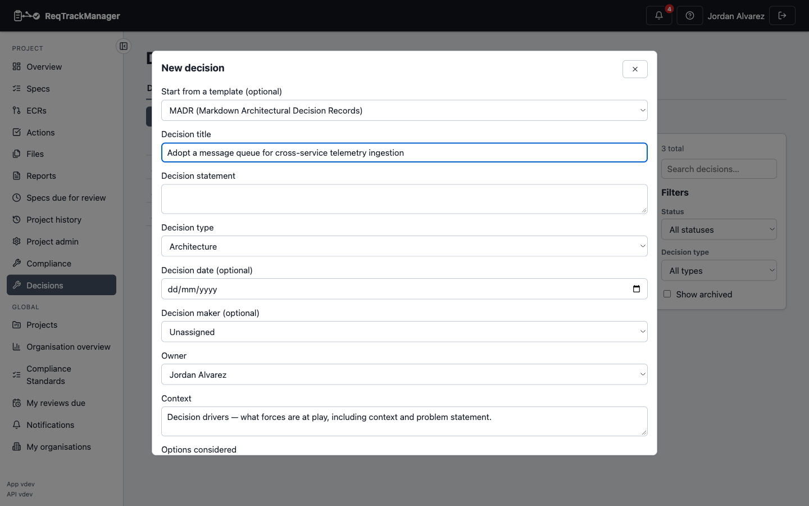

# Overview

The Decision Management module gives "why did we choose this" an authoritative, linkable answer instead of leaving it in a meeting note or a chat thread. It records formal **Decisions** — architecture, design, engineering, strategy, and operational calls made during a project's lifecycle — as first-class, versioned, approvable records, each linkable back to the Requirements it affects and to other Decisions it depends on, supersedes, or conflicts with.

For example, a project team choosing between two authentication approaches records a Decision capturing the options considered, the chosen option, the rationale, and the consequences; that Decision can then be linked to the Requirements it implements, referenced by a later Decision that supersedes it once the approach changes, and pulled up by anyone later asking "why does this project use OAuth instead of SAML."

| The Decisions list |
| --- |
| A project's Decisions, filterable by status and type — a mix of Superseded, Approved, and Draft in this example |
|  |

## When to use a Decision Record

Use a Decision Record for a choice worth being able to answer for later — one with real consequences, alternatives that were seriously considered, or an owner accountable for it — not for routine implementation detail already covered by a requirement or a code comment. Recording the decision separately from the requirement it produced keeps the *why* (context, options considered, rationale, consequences) distinct from the *what* (the requirement's own content), and lets one decision justify several requirements, or several decisions each justify one part of a larger requirement.

## Enabling the module

Decision Management is **not** enabled by default — an org admin opts in per organisation from the organisation's Modules settings, the same entitlement/enablement mechanism every module uses (see [Modules → Overview](../overview.md#gating-entitlement--enablement)). Enabling it seeds each of that organisation's projects with a default set of Decision Types (see below); disabling it hides its navigation and endpoints, but deletes no data.

## The lifecycle

A Decision moves through a fixed sequence of statuses, enforced server-side — there is no way to skip a step or move backwards outside of the two terminal-ish exits:

**Rejected** and **Superseded** are both real, queryable statuses in their own right — a rejected or superseded Decision stays fully visible for historical purposes, filterable and reportable by its own status, rather than only recoverable from the audit log. A Decision's content fields (statement, options considered, chosen option, rationale, consequences, assumptions, constraints) become locked — no further edits — the moment it reaches **Approved** or **Superseded**; see [Data model and lifecycle](./data-model-and-lifecycle.md) for the full field list and supersession mechanics.

An ordinary project member can create a Decision and move it through **Draft → Proposed → Under Review** for a Decision they own, with no special grant needed. Approving, rejecting, or superseding a Decision requires the **Decision Approver** role — see [Roles](#roles) below.

## Roles

Decision Management defines two of its own roles, module-contributed rather than new core role values:

| Role | Scope | Grants |
| --- | --- | --- |
| **Decision Owner** | Project | Creates and manages Decision records and this project's Decision Types — the module's management-level role. |
| **Decision Approver** | Project | May approve, reject, and supersede Decisions in this project. |

Both compose with roles that already carry equivalent authority elsewhere: a server admin, an org admin, or the project's own Project Manager can do everything either role can, on that project. Every other project member has read access once the module is enabled, plus the ability to create a Decision and propose/submit their own for review — no role grant is needed just to participate.

**Decision Approver is today a single, flat, project-wide role** — it applies to every Decision Type in the project equally. There is no way yet to restrict approval to a specific Decision Type (e.g. "only an Architecture Approver may approve an Architecture decision") — see [Known limitations](./known-limitations.md).

## Decision Types

A **Decision Type** (e.g. "Architecture", "Design", "Engineering", "Strategy", "Operational") categorises a Decision and is project-scoped and project-configurable — a Decision Owner can rename, reorder, or delete a project's own types (deleting one reassigns its existing Decisions, the same delete-with-reassignment pattern used elsewhere in ReqTrackManager). Every new project is seeded with the five defaults above once the module is enabled for its organisation.

## Decision Templates

A **Decision Template** is an org-scoped, opt-in preset of guidance text applied to a new Decision's free-text fields at creation time — a convenience for authoring, not a persistent relationship (a Decision keeps no reference back to the template it was created from). An organisation opts into any combination of three seeded ADR-style packs when the organisation itself is created:

| Template | What it provides |
| --- | --- |
| **Nygard (Classic ADR)** | Michael Nygard's original, minimal ADR format — Context, Decision, Consequences. |
| **MADR (Markdown Architectural Decision Records)** | The fuller ADR format — decision drivers, considered options, and pros/cons. |
| **Y-Statement** | The compressed, single-sentence ADR form. |

An organisation can also define its own custom templates alongside (or instead of) the seeded packs.

| Managing an organisation's Decision Templates |
| --- |
| The org-scoped Decision Templates list, from Organisation Overview |
|  |

| Picking a template at creation time |
| --- |
| The "Start from a template" picker on the New decision form |
|  |

## In this section

- [Data model and lifecycle](./data-model-and-lifecycle.md) — fields, supersession semantics, and content-lock-after-approval.
- [Relationships and templates](./relationships-and-templates.md) — Decision↔Requirement and Decision↔Decision links, and the relationship types still reserved for modules that don't exist yet.
- [AI assistant (MCP) integration](./mcp-integration.md) — the read-only tools an AI assistant can call against a project's Decisions.
- [Known limitations](./known-limitations.md) — what this module deliberately doesn't do yet.

## Where this fits

See [Modules → Overview](../overview.md) for how the module system itself works, and [Modules → Building your own module](../building-your-own-module.md) for how a module like this one is put together.
