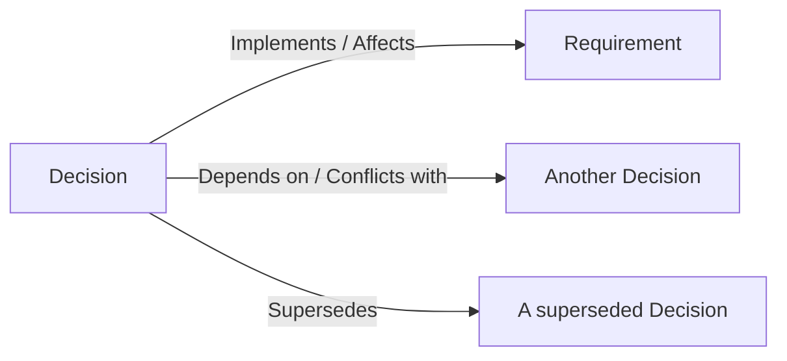

# Relationships and templates

A Decision Record earns most of its value from the trail it leaves, not from existing in isolation — this page covers how a Decision links to the Requirements it affects and to other Decisions, plus the relationship types reserved for modules that don't exist yet. For the Supersedes/Is-superseded-by relationship specifically, see [Data model and lifecycle → Supersession](./data-model-and-lifecycle.md#supersession).

## Decision ↔ Requirement

A Decision can be linked to a Requirement with either of two typed relationships:

| Relationship | Meaning |
| --- | --- |
| **Implements** | This Decision is realised by (or realises) the linked Requirement. |
| **Affects** | This Decision has a bearing on the linked Requirement without directly implementing it. |

## Decision ↔ Decision

Beyond Supersedes, a Decision can be linked to another Decision with either of two typed relationships:

| Relationship | Meaning |
| --- | --- |
| **Depends on** | This Decision only makes sense given the linked Decision. |
| **Conflicts with** | This Decision and the linked Decision pull in different directions — recorded rather than silently left unreconciled. |

Creating any of the relationships above requires the **Decision Owner** role on the project (the same role that gates editing a Decision's own content) — mirroring how creating a traceability link between two Requirements is gated behind the role that gates other requirement edits, rather than being open to any viewer.

## Reserved relationship types (not yet available)

Six further relationship targets are reserved in the plan for this module but **not built yet** — they are blocked on other modules that don't exist in ReqTrackManager today:

| Relationship | Blocked on |
| --- | --- |
| Decision → Resolves → Open Question | Context & Strategy module |
| Decision → Addresses → Pain Point | Context & Strategy module |
| Decision → Supports/Implements → Strategy | Context & Strategy module |
| Decision → Guided by/Constrained by → Guiding Principle | Context & Strategy module |
| Decision → Addresses/Constrained by → Compliance | Integration work between this module and the Compliance module (Compliance itself already ships, but this specific link is not built) |
| Decision → Selects/Constrains/Influences → Design | Engineering Design module |

Don't rely on any of the six above being available in the product today — they're documented here only so the reserved scope is clear, not as a currently usable feature. See [Modules → Roadmap](../roadmap.md) for the modules these depend on.

## Where this fits

See [Data model and lifecycle](./data-model-and-lifecycle.md) for supersession mechanics and content-lock-after-approval, and [Requirements management → Traceability links](../../core-features/requirements-management.md#traceability-links) for how Requirement-to-Requirement links work, which the Decision↔Requirement relationship above reuses the same underlying mechanism as.
