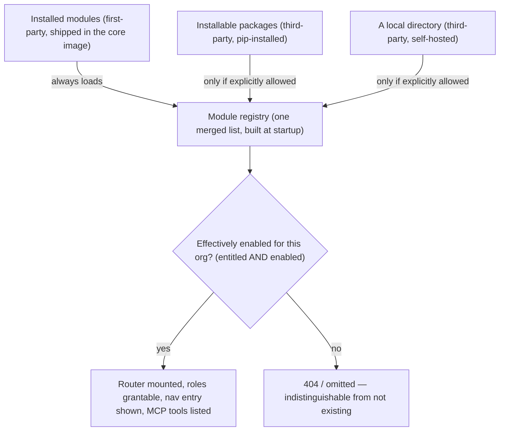

# Overview

Some capabilities are large, optional, and not every organisation wants them — Compliance is the first, with more planned. Rather than bolt each one directly into the core application (a bespoke enable/disable switch per feature, roles permanently added to the core enums whether or not an organisation ever uses them, a UI either crammed into the core bundle or built as a second, inconsistent way of extending it), ReqTrackManager plugs optional capabilities in through one small, fixed mechanism: a **module**.

A module is a self-contained unit — backend endpoints, database tables, RBAC roles, frontend pages, and optionally AI-assistant tools — that plugs into the application through this mechanism rather than through edits scattered across core code. A module can ship inside this repository ("first-party") or be built and installed independently ("third-party"). Either way it's gated the same way, uses the same RBAC and UI conventions as the core application, and can be turned on or off per deployment and per organisation without any code changes.

## Core concepts, at a glance

| Concept | What it is |
|---|---|
| Registry | The merged list of every currently-known module, built once at server startup from three discovery sources — a first-party module shipped in this repository, an installable third-party package, or a local directory a deployment operator points at. |
| Entitlement | Server-tier: is this organisation *allowed* to use this module at all (the licensing/plan lever)? |
| Enablement | Org-tier: has this organisation's own admin actually *turned it on*? |
| Module-contributed role | An RBAC role a module defines for itself (e.g. "Compliance Manager"), without touching the core role set. |
| Tier A / Tier B / Tier C | The three ways a module supplies frontend UI — compiled into the app (Tier A), rendered in a sandboxed iframe (Tier B), or dynamically loaded at runtime with no rebuild and no sandbox (Tier C). |
| Module MCP tools | AI-assistant tools a module contributes, proxied declaratively to its own REST endpoints. |

## Gating: entitlement × enablement

A module is gated at two independent tiers, and **both** must pass for it to be usable by a given organisation:

- **Entitlement** — the server-tier licensing/plan lever. Is this organisation allowed to use this module at all? Managed by a server admin, deployment-wide or per organisation.
- **Enablement** — the org-tier day-to-day switch. Among modules the organisation is entitled to, has this organisation's own admin actually turned it on? Set from the organisation's Modules settings.

A disabled or non-entitled module's endpoints return a plain 404 — indistinguishable from not existing — never a 403 that would leak the module's presence to an organisation that shouldn't see it.

## Roadmap

Compliance is the first module built on this system, and more are planned to follow the same pattern — each one an optional, self-contained capability an organisation can entitle and enable independently, rather than a feature permanently bolted into the core application. See [Roadmap](./roadmap.md) for a brief look at what's currently being explored — none of it is scheduled or committed yet.

## Where this fits

- [Compliance module](./compliance-module/overview.md) — the one module shipped today: what it does and how to work with it.
- [Building your own module](./building-your-own-module.md) — the contract for a module that ships inside this repository (Tier A).
- [Third-party and federated modules](./third-party-and-federated-modules.md) — building and installing a module that was never compiled into this deployment's own images.
- [Roadmap](./roadmap.md) — modules being explored beyond Compliance.
- [Installation & Deployment → Scaling and adding modules](../installation-deployment/scaling-and-modules.md) — the operator-side steps for actually mounting a third-party module into a running deployment.
