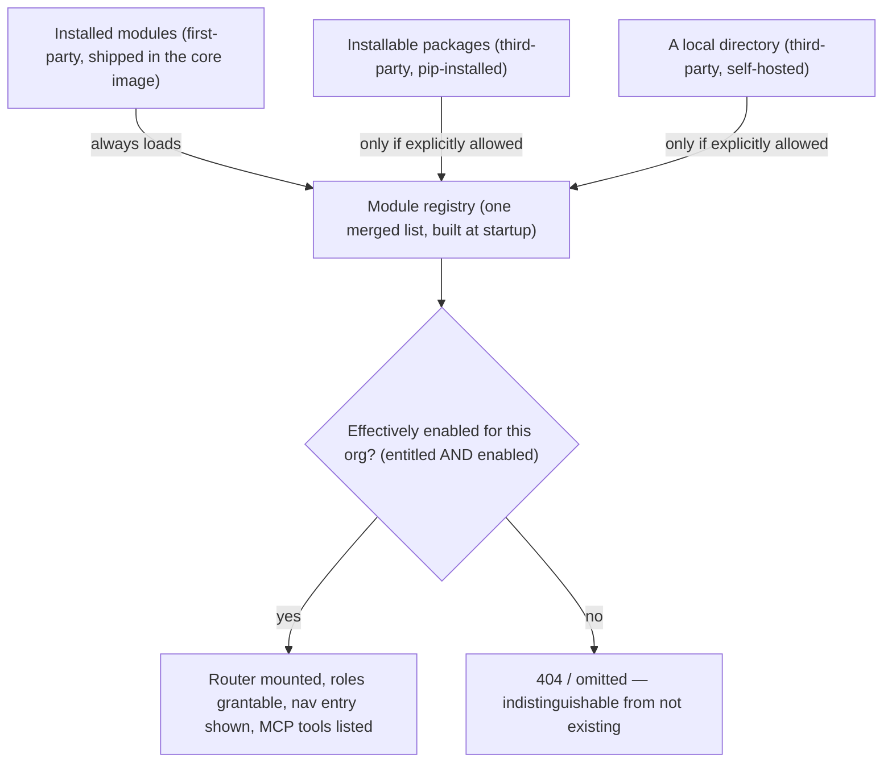
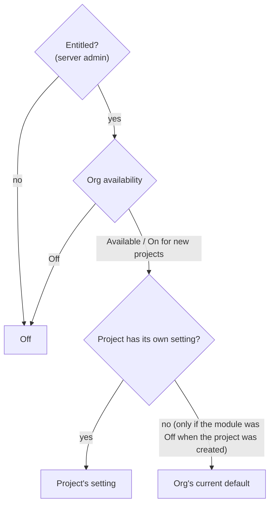
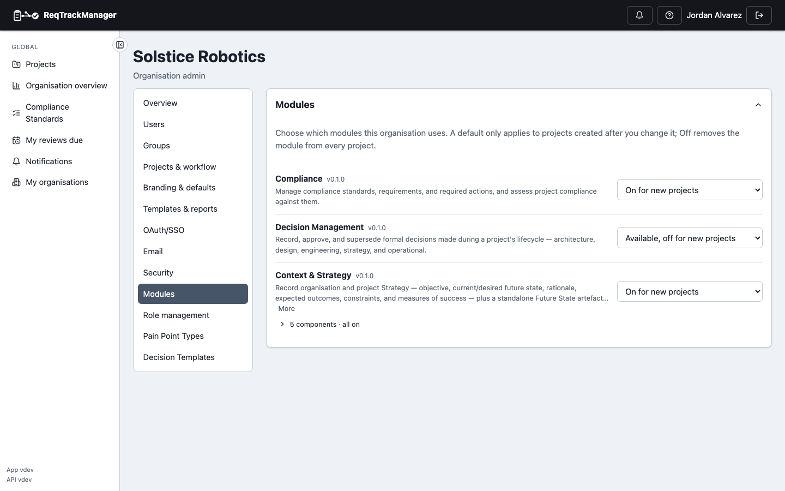
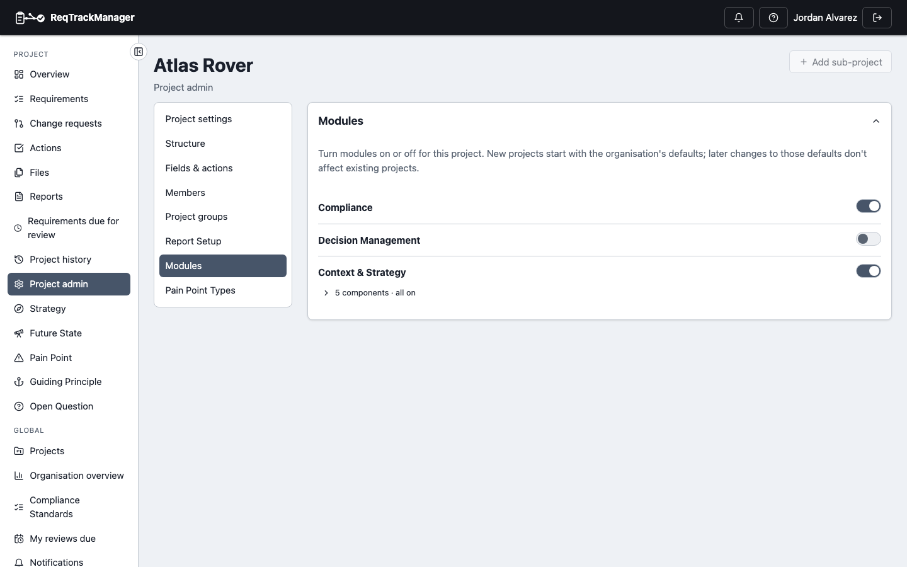

# Overview

Some capabilities are large, optional, and not every organisation wants them — Compliance, Decision Management, Context & Strategy, and Stakeholders & Personas are the first four, with more planned. Rather than bolt each one directly into the core application (a bespoke enable/disable switch per feature, roles permanently added to the core enums whether or not an organisation ever uses them, a UI either crammed into the core bundle or built as a second, inconsistent way of extending it), ReqTrackManager plugs optional capabilities in through one small, fixed mechanism: a **module**.

A module is a self-contained unit — backend endpoints, database tables, RBAC roles, frontend pages, and optionally AI-assistant tools — that plugs into the application through this mechanism rather than through edits scattered across core code. A module can ship inside this repository ("first-party") or be built and installed independently ("third-party"). Either way it's gated the same way, uses the same RBAC and UI conventions as the core application, and can be turned on or off per deployment and per organisation without any code changes.

```mermaid
flowchart TD
    INSTALLED["Installed modules (first-party, shipped in the core image)"]
    ENTRY["Installable packages (third-party, pip-installed)"]
    PATH["A local directory (third-party, self-hosted)"]
    REG["Module registry (one merged list, built at startup)"]
    GATE{"Effectively enabled for this org? (entitled AND enabled)"}
    LIVE["Router mounted, roles grantable, nav entry shown, MCP tools listed"]
    HIDDEN["404 / omitted — indistinguishable from not existing"]

    INSTALLED -->|always loads| REG
    ENTRY -->|only if explicitly allowed| REG
    PATH -->|only if explicitly allowed| REG
    REG --> GATE
    GATE -->|yes| LIVE
    GATE -->|no| HIDDEN
```

## Core concepts, at a glance

| Concept | What it is |
|---|---|
| Registry | The merged list of every currently-known module, built once at server startup from three discovery sources — a first-party module shipped in this repository, an installable third-party package, or a local directory a deployment operator points at. |
| Entitlement | Server-tier: is this organisation *allowed* to use this module at all (the licensing/plan lever)? |
| Enablement | Org-tier: has this organisation's own admin actually *turned it on*? |
| Module-contributed role | An RBAC role a module defines for itself (e.g. "Compliance Manager"), without touching the core role set. |
| Tier A / Tier B / Tier C | The three ways a module supplies frontend UI — compiled into the app (Tier A), rendered in a sandboxed iframe (Tier B), or dynamically loaded at runtime with no rebuild and no sandbox (Tier C). |
| Module MCP tools | AI-assistant tools a module contributes, proxied declaratively to its own REST endpoints. |
| Availability | Org-tier, per module and per sub-component: **Off** (hard floor — no project may use it), **Available, off for new projects**, or **On for new projects**. |
| Project setting | A project's own on/off for a module or sub-component — copied from the org's default when the module becomes available to the project, then changed only by a project admin. |
| Sub-component | One independently-toggleable piece of a module (e.g. Context & Strategy's Strategy vs. Pain Points) — a module declares which of its own pieces can be toggled this finely; not every module has any. |

## Gating: entitlement × enablement × overrides

```mermaid
flowchart TD
  A{"Entitled?<br/>(server admin)"} -- no --> OFF["Off"]
  A -- yes --> B{"Org availability"}
  B -- Off --> OFF
  B -- "Available / On for new projects" --> C{"Project has its own setting?"}
  C -- yes --> P["Project's setting"]
  C -- "no (only if the module was Off when the project was created)" --> D["Org's current default"]
```

- **Entitlement** — server-tier licensing lever. Not entitled = off everywhere.
- **Org Off is a hard floor** — reaches every project immediately; a project can't turn it back on (a `PUT` with `enabled: true` is rejected with 400). Turning it back on restores each project's own setting.
- **Defaults only affect new projects** — a project copies the org's default when it's created (for every module the org has available), so changing a default later never flips an existing project. Before a default changes, any project still without its own setting gets the old value written in first. **Why:** a module silently disappearing from (or appearing in) live projects is surprising and disruptive.
- **Projects can opt in or out** — within the floor, a project admin can turn a module on even if the org default is off, or off if it's on.
A disabled or non-entitled module's endpoints return a plain 404 — indistinguishable from not existing — never a 403 that would leak the module's presence.

### Sub-component enablement (finer-grained than a whole module)

A module can declare independently-toggleable pieces (Context & Strategy: one per artefact type). They follow the same rules one level down — org availability (Off is a hard floor), copied into new projects, project opt-in/out. A module that's off for a project turns off all its sub-components. An **org-scoped** artefact (e.g. org-level Strategy records) has no project tier: the org's Off/on is the effective value.

### Where to set this

**Organisation admin → Modules**: one availability dropdown per module. Sub-components sit behind a collapsed "5 components · all on" summary; expanding it shows one dropdown per sub-component. Long descriptions are clamped with a **More** link.

| Organisation admin: Modules |
| --- |
| One availability dropdown per module; Context & Strategy's sub-components collapsed behind a summary |
|  |

**Project admin → Modules**: one on/off switch per module (and per sub-component, behind the same collapsed summary). A hint shows when the project differs from the org's default for new projects; a module the org has turned Off is greyed out with an explanation.

| Project admin: Modules |
| --- |
| One switch per module; sub-components collapsed behind a summary |
|  |

Both pages call the same REST endpoints, which remain directly callable:

| Tier | Method + path | Who |
|---|---|---|
| Org module availability | `GET`/`PUT /api/v1/orgs/{organization_id}/modules/{module_key}` | Org admin |
| Org sub-component availability | `GET`/`PUT /api/v1/orgs/{organization_id}/modules/{module_key}/subcomponents[/{subcomponent_key}]` | Org admin |
| Project module setting | `GET`/`PUT /api/v1/projects/{project_id}/modules/{module_key}/enablement` | Project admin (or higher) |
| Project sub-component setting | `GET`/`PUT /api/v1/projects/{project_id}/modules/{module_key}/subcomponents[/{subcomponent_key}]` | Project admin (or higher) |

Org `PUT` bodies carry `enabled` (Off = `false`) and an optional `default_project_enabled` (omit to keep the current value). Project `GET`/`PUT` responses include `effective_enabled`, `org_default_enabled` (the default for new projects) and `org_hard_enabled` (the floor).

## Roadmap

Compliance, Decision Management, Context & Strategy, and Stakeholders & Personas are the modules built on this system today, and more are planned to follow the same pattern — each one an optional, self-contained capability an organisation can entitle and enable independently, rather than a feature permanently bolted into the core application. See [Roadmap](./roadmap.md) for a brief look at what's currently being explored — none of it is scheduled or committed yet.

## Where this fits

- [Compliance module](./compliance-module/overview.md) — what it does and how to work with it.
- [Decision Management module](./decision-management-module/overview.md) — what it does and how to work with it.
- [Context & Strategy module](./context-strategy-module/overview.md) — what it does and how to work with it.
- [Stakeholders & Personas module](./stakeholders-personas-module/overview.md) — what it does and how to work with it.
- [Building your own module](./building-your-own-module.md) — the contract for a module that ships inside this repository (Tier A).
- [Third-party and federated modules](./third-party-and-federated-modules.md) — building and installing a module that was never compiled into this deployment's own images.
- [Roadmap](./roadmap.md) — modules being explored beyond what's shipped today.
- [Installation & Deployment → Scaling and adding modules](../installation-deployment/scaling-and-modules.md) — the operator-side steps for actually mounting a third-party module into a running deployment.
