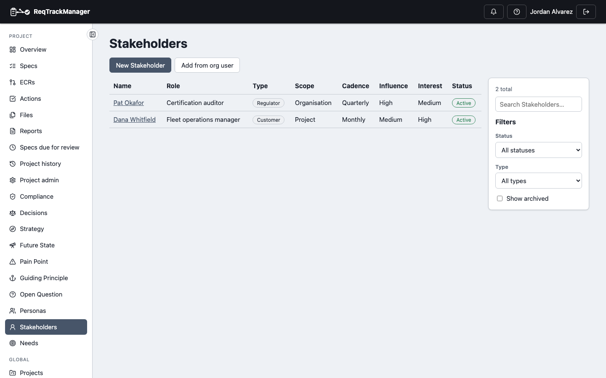
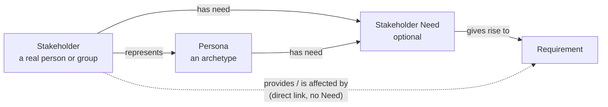

# Overview

The Stakeholders & Personas module records *who* a project is for, and keeps what they need separate from the Requirements that answer it. It has three kinds of first-class, linkable record: a **Stakeholder** (a specific person or group with a stake in the project, rated on influence and interest), a **Persona** (a representative user archetype — goals, behaviours, an importance weight), and a **Stakeholder Need** (what a Stakeholder or Persona needs, in their own words).

For example, a fleet operations manager is recorded as a Stakeholder who represents the "BVLOS Remote Pilot" Persona. She needs "to trust the flight status at a glance". That Need gave rise to a precise Requirement about how the redundant flight controllers' status is displayed. Anyone reading the Requirement later can follow it back to the wording of the need, and to the person who raised it.

| A project's Stakeholders |
| --- |
| Falcon-3's Stakeholders, with type, scope and status columns |
|  |

## The three record types

| Record | Scope | When to use it |
| --- | --- | --- |
| [**Stakeholder**](./stakeholder.md) | Organisation or project | A specific person or group: a regulator, a customer, a sponsor. Carries contact details, interests, responsibilities, an Influence and Interest rating, and how often you aim to engage them. |
| [**Persona**](./persona.md) | Organisation or project | A representative archetype, not a real person: a "Field Inspector" or "Safety Officer". Carries goals, needs, behaviours, context and an importance weight. |
| [**Stakeholder Need**](./stakeholder-need.md) | Project only | What a Stakeholder or Persona needs, recorded separately from any Requirement. Optional — a Stakeholder or Persona can still be linked straight to a Requirement. |

An *organisation-scoped* Stakeholder or Persona is one shared record every project in the organisation can see and link to; a *project-scoped* one belongs to a single project. A Need is always project-scoped, because it links to that project's own Requirements.

## Stakeholder → Need → Requirement

A Need is **optional**. A simple project can link a Stakeholder or Persona straight to a Requirement ("Provides", "Is affected by"); a project that cares about the difference between what someone said they need and the formal, testable Requirement written in response adds the Need in between. Keeping the Need's own wording is what preserves the reason a Requirement's threshold is what it is — why 30 seconds, not 10 or 60.

A Persona is a **separate record from a Stakeholder**, not a kind of Stakeholder. A Stakeholder is a specific, named party; a Persona is a representative pattern, and one Persona can be represented by several Stakeholders (and a Stakeholder can represent several Personas). Keeping them separate means a Persona can carry an importance weight and persona-specific fields without cluttering the Stakeholder register.

## Enabling the module

Stakeholders & Personas is **not** enabled by default — an org admin opts in per organisation from the organisation's Modules settings, the same entitlement/enablement mechanism every module uses (see [Modules → Overview](../overview.md#gating-entitlement--enablement--overrides)). Enabling it seeds the organisation's default **Persona types** (Primary, Secondary, Negative) and **Stakeholder types** (Customer, End user, Operator, Maintainer, Service engineer, Business owner, Project sponsor, Regulator, Supplier, Internal engineering team, Support organisation), available to every project from then on. Disabling the module hides its navigation and endpoints but deletes no data.

Its three record types are [sub-components](../overview.md#sub-component-enablement-finer-grained-than-a-whole-module): Personas, Stakeholders and Stakeholder Needs can each be switched on or off independently, per organisation and per project.

## Roles

The module defines seven roles of its own, rather than additions to the core role set. Each record type has an *owner* role that creates, edits and retires it; there is no approver role, because none of these records has an approval step.

| Record | Role | Scope | Grants |
| --- | --- | --- | --- |
| Persona | **Persona Owner** | Project | Creates, edits, retires and re-weights a project's Personas, manages the project's Persona types, and hides organisation Personas from the project. |
| Persona | **Organisation Persona Owner** | Organisation | The same for organisation-wide Personas. |
| Persona | **Persona Type Admin** | Organisation | Manages the organisation's shared Persona type vocabulary. |
| Stakeholder | **Stakeholder Owner** | Project | Creates, edits, retires and permanently deletes a project's Stakeholders, manages their Persona links, manages the project's Stakeholder types, and hides organisation Stakeholders from the project. |
| Stakeholder | **Organisation Stakeholder Owner** | Organisation | The same for organisation-wide Stakeholders. |
| Stakeholder | **Stakeholder Type Admin** | Organisation | Manages the shared Stakeholder type vocabulary and the Influence/Interest scoring levels and bands. |
| Stakeholder Need | **Stakeholder Need Owner** | Project | Creates, edits and retires the project's Needs and links them to Stakeholders, Personas and Requirements. |

Each composes with roles that already carry equivalent authority: a server admin, an org admin, or (for a project-scoped role) the project's Project Manager can do everything the module role can. The roles don't overlap — a Stakeholder Owner can't change a Persona, and neither can change a Need. Every other project member can read the module's content once it's enabled.

## In this section

- [Persona](./persona.md) — fields, importance weight and its per-project override, lifecycle, and types.
- [Stakeholder](./stakeholder.md) — fields, Influence × Interest rating, engagement cadence, linking to a platform user, and permanent deletion.
- [Stakeholder Need](./stakeholder-need.md) — fields, who has a Need, and the Requirements it gave rise to.
- [Relationships](./relationships.md) — how Stakeholders and Personas relate to Pain Points, Requirements and Decisions.
- [AI assistant (MCP) integration](./mcp-integration.md) — the tools an AI assistant can call against this module's content.
- [Known limitations](./known-limitations.md) — what this module doesn't do yet.

## Where this fits

See [Modules → Overview](../overview.md) for how the module system works, and [Requirements management](../../core-features/requirements-management.md) for how a Requirement links back to what motivated it.
