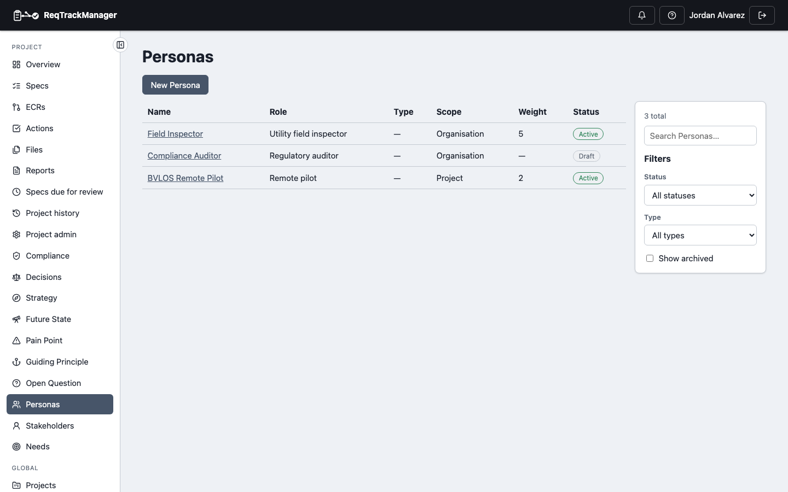
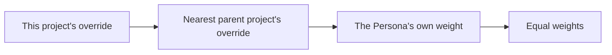
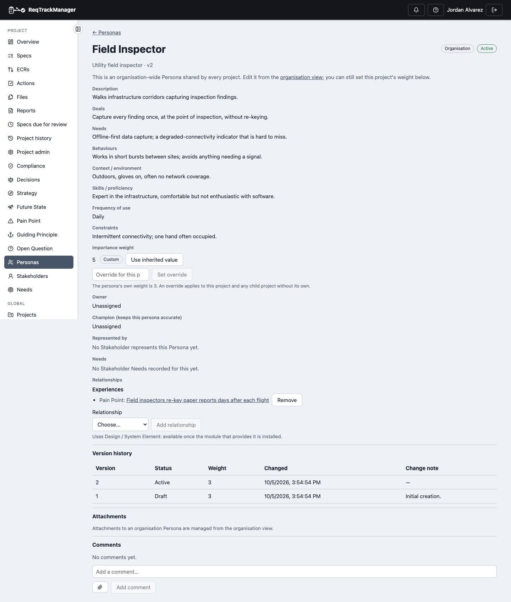

# Persona

A Persona is a representative user archetype — a "Field Inspector", a "Compliance Auditor" — recorded so a project designs for a defined person rather than an average one. It is descriptive only: a Persona never grants anyone permissions, and it is not a user account.

| A project's Personas |
| --- |
| Falcon-3's Personas, including two shared from the organisation |
|  |

## Fields

| Field | What it holds |
| --- | --- |
| Name, description | Who the Persona is, in a sentence or two. |
| Type | Primary, Secondary or Negative (an anti-persona: someone the product must *not* be designed for) by default; see [Types](#persona-types). |
| Role / job title | The role the Persona represents. |
| Goals, needs, behaviours | What they are trying to achieve, what they need, how they work. |
| Context / environment, skills / proficiency, frequency of use, constraints | The conditions they work under and how skilled and how often they use the product. |
| Importance weight | A positive number used to weight this Persona when scores are rolled up per Persona; see [Weight](#importance-weight-and-the-project-override). |
| Owner, champion | The owner maintains the record. The **champion** is the colleague accountable for keeping the Persona accurate — often the person closest to the real users. |

## Scope

An **organisation** Persona is one shared record: every project in the organisation can see and link to it, and edits are made once, from the organisation view. A **project** Persona belongs to one project. A project opening an organisation Persona sees it read-only, apart from the project's own weight override below.

## Importance weight and the project override

The weight says how much this Persona matters when something is scored per Persona. A Persona may have no weight, in which case every Persona counts equally.

An organisation Persona has one weight, but different projects may care about it differently, so each project can set its **own override**. The weight a project actually uses is the first of these that is set:

A child project with no override of its own therefore inherits its parent project's. The Persona page shows the weight in use, whether it is the project's own ("Custom") or inherited, and offers **Set override** and **Use inherited value**.

:::note
Per-Persona scoring of Pain Points is not available yet, so the weight is recorded and resolved but nothing consumes it today. See [Known limitations](./known-limitations.md).
:::

| A Persona opened from a project |
| --- |
| An organisation Persona with this project's weight override, and its Pain Point relationship |
|  |

## Lifecycle

A Persona moves **Draft → Active → Retired**, and a Retired Persona can be reactivated. There is no approval step: the Persona Owner makes each change directly, with an optional comment. Every edit creates a new version, so the full history of a Persona is kept. **Archive** is separate from Retired: it hides a Persona from the default list without changing its status, and is reversible.

## Persona types

Persona types are a two-tier list. The organisation maintains a shared list (a Persona Type Admin manages it); each project can rename, reorder, disable or add to it for itself, without affecting other projects. A type that a Persona currently uses can't be deleted.

## Where this fits

A Persona is linked from a [Stakeholder](./stakeholder.md#representing-personas) who represents it, can have a [Stakeholder Need](./stakeholder-need.md), and can have [relationships](./relationships.md) to Pain Points and Requirements. See [Overview](./overview.md) for the three record types together.
