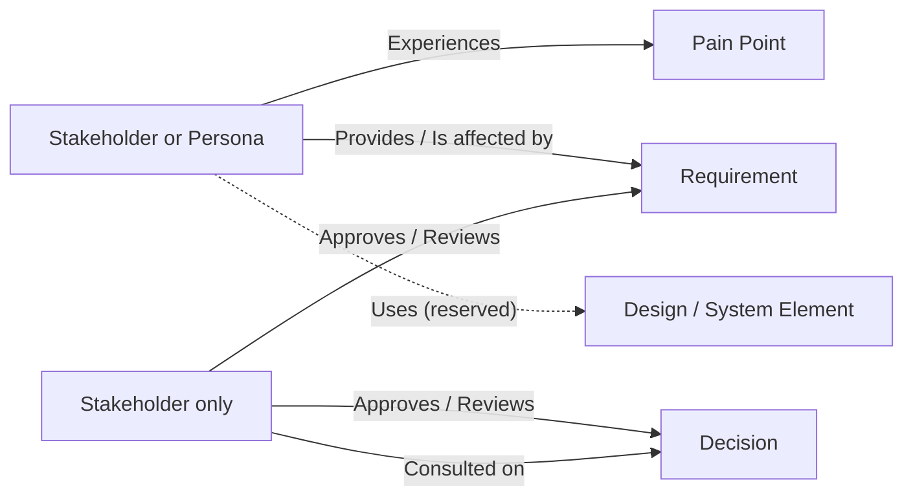

# Relationships

Beyond the Persona links and Needs described on their own pages, a Stakeholder or Persona can be related to the project's Pain Points, Requirements and Decisions. These links record traceability for the people side of the project — who feels a problem, who asked for something, who signed it off — independently of formal requirement-to-requirement traceability.

## The relationship kinds

| Kind | From | To | Meaning |
| --- | --- | --- | --- |
| **Experiences** | Stakeholder or Persona | Pain Point | They feel this problem. Needs the [Context & Strategy](../context-strategy-module/overview.md) module. |
| **Provides** | Stakeholder or Persona | Requirement | They are the source of this Requirement. |
| **Is affected by** | Stakeholder or Persona | Requirement | This Requirement changes things for them. |
| **Consulted on** | Stakeholder | Decision | They were consulted when it was made. Needs the [Decision Management](../decision-management-module/overview.md) module. |
| **Approves** | Stakeholder | Requirement or Decision | They sign it off. |
| **Reviews** | Stakeholder | Requirement or Decision | They review it. |
| **Uses** | Stakeholder or Persona | Design or System Element | **Reserved** — see below. |

A Persona can't be consulted, approve or review, because a Persona is an archetype rather than a person; the picker only offers a Persona the kinds that apply to it. These records describe a relationship only — approving here does not approve the Requirement or Decision itself, which still goes through its own approval workflow.

## Adding and removing

On a Stakeholder's or Persona's page, the **Relationships** panel lists each relationship grouped by kind, with a link to the target's own page. To add one, choose the relationship, then (if the kind can point at more than one type, such as Approves) the target type, then the record, and select **Add relationship**. Removing one asks for confirmation and removes only the link — both records stay. Changing relationships needs the same role as editing that Stakeholder or Persona (Stakeholder Owner or Persona Owner), and the target must belong to the same project.

Relationships are always shown for the **current project**: an organisation-wide Stakeholder or Persona linked to Pain Points in two projects shows each project only its own. If a target's module is switched off, or you lack permission to view that type of record, its links are hidden rather than shown with a title you couldn't otherwise read.

## Reserved: Design and System Element

"Uses a Design / System Element" is part of the model but can't be created yet, because there is no module that provides Designs. The Relationships panel shows it as a note rather than an option. It becomes available automatically when such a module is installed.

## Where this fits

See [Stakeholder Need](./stakeholder-need.md) for the "has need" and "gives rise to" links, [Stakeholder](./stakeholder.md#representing-personas) for "represents", and [AI assistant (MCP) integration](./mcp-integration.md) for the tools that read and change these links.
