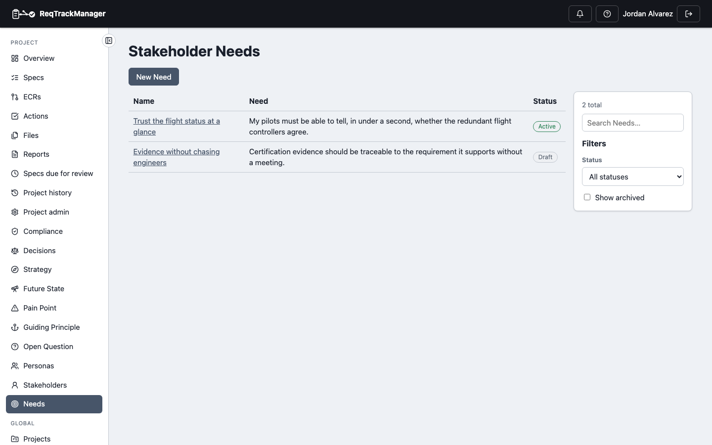
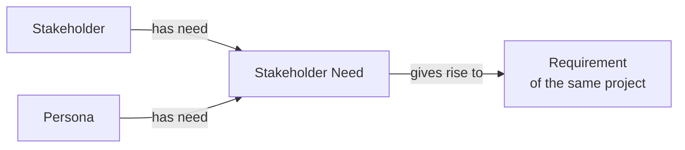

# Stakeholder Need

A Stakeholder Need records what a Stakeholder or Persona needs, in their own words, as its own record — separate from the Requirement the project writes in response. The two are different statements at different levels of precision: "diagnose faults quickly while working remotely" is a need; "the system shall provide remote diagnostic information within 30 seconds" is a Requirement. Losing the need's wording loses the intent that justifies the Requirement's exact threshold.

A Need is **optional**. Use it where the distinction matters; skip it where a direct link from a Stakeholder or Persona to a Requirement is enough.

| A project's Needs |
| --- |
| Falcon-3's Needs: one Active, one still Draft |
|  |

## Fields

| Field | What it holds |
| --- | --- |
| Name | A short title for the need. |
| Need | The need in the Stakeholder's or Persona's own words. |
| Rationale | Why it matters, where it came from, or the evidence for it. |
| Owner | The person who maintains the record. |

A Need is deliberately thin. It has no priority or severity: those belong to the Requirement it gives rise to and to scoring elsewhere.

## Who has it, and what it led to

From the Need's page, add the Stakeholders and Personas that **have** it (organisation-wide ones included) and the Requirements it **gave rise to**. The Requirement must belong to the same project. A Stakeholder's or Persona's own page lists the Needs of the *current project* that they have, read-only. An organisation-wide Stakeholder shared by several projects therefore never reveals one project's Needs in another.

Removing a link removes only the link; both records remain.

## Scope and lifecycle

A Need is **project-scoped only**: it sits between people and the project's own Requirements, so there is no organisation-level Need. It has the same Draft → Active → Retired lifecycle, version history and Archive as the other records, and no approval step. The **Stakeholder Need Owner** role manages it, including its links.

A Need can quote what a person said, so a project export that includes Needs should be handled as Confidential, like Stakeholder contact details. Permanently deleting a Stakeholder removes their "has need" links but leaves the Need itself.

## Where this fits

See [Relationships](./relationships.md) for the other ways Stakeholders and Personas link to a project's records, and [Overview](./overview.md) for the Stakeholder → Need → Requirement chain.
