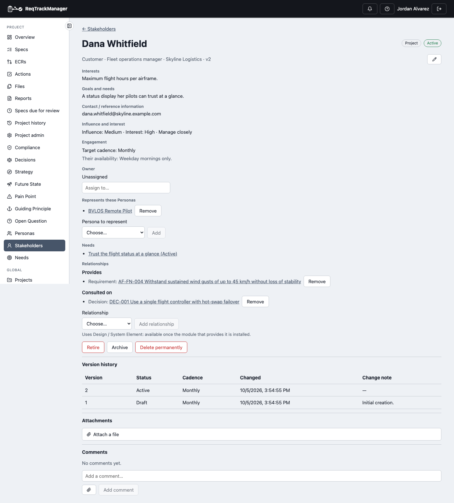
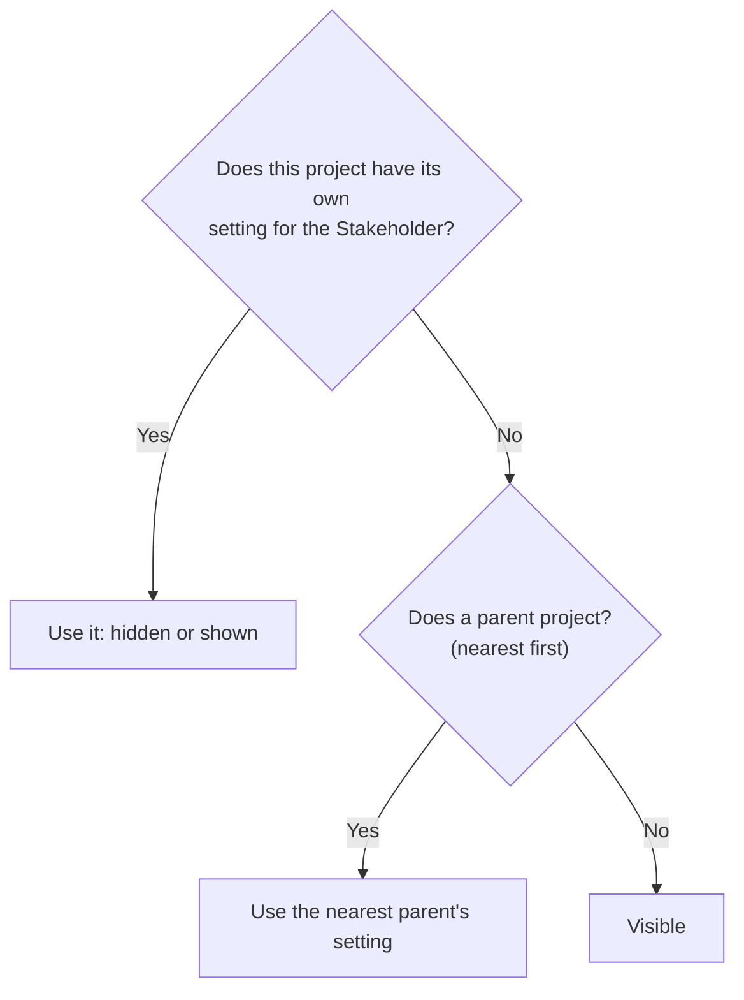

# Stakeholder

A Stakeholder is a specific person or group with a stake in the project: a regulator, a customer, a sponsor, a service team. Recording one gives the reasoning behind a Requirement an owner, so intent isn't lost between the people who asked for something and the Requirement that was written.

Because a Stakeholder record holds contact details about an identifiable person, it is treated as personal data — see [Permanent deletion](#permanent-deletion).

## Fields

| Field | What it holds |
| --- | --- |
| Name, type, description | Who they are. Type defaults to one of eleven, such as Customer, Regulator or Project sponsor, and is configurable like Persona types. |
| Role, organisation / group | Their job title and the organisation or team they belong to. |
| Interests, responsibilities | What they care about and what they are responsible for. |
| Goals and needs, priorities, constraints | What they want, in what order, and under which limits. |
| Workflows / use scenarios | How they would use or be affected by the product. |
| Contact / reference information | How to reach them. Visible only to people who can view the module. |
| Influence, Interest | Ratings on the module's own scoring scheme; see below. |
| Target cadence, availability | How often you aim to engage them, and their own limits; see below. |
| Owner, platform user | Who maintains the record, and — optionally — the platform user this Stakeholder is. |

| A Stakeholder opened from a project |
| --- |
| Falcon-3's fleet operations manager: their rating, cadence, the Persona they represent, their Needs and relationships |
|  |

## Influence × Interest

A Stakeholder is rated **Low, Medium or High** for Influence (their ability to change the project's direction) and for Interest (how affected they are), using the same configurable scoring matrix as other scored records. A Stakeholder Type Admin can edit the level names and descriptions for the organisation, and a project can adjust them for itself.

The pair places the Stakeholder in one of four standard positions:

| | Low interest | Medium or High interest |
| --- | --- | --- |
| **Medium or High influence** | Keep satisfied | Manage closely |
| **Low influence** | Monitor | Keep informed |

A rating counts as "high" when it is in the upper half of its axis, so on the default levels **Medium counts as high**. A position is shown only when both ratings are set.

## Engagement cadence and availability

Two separate fields, because they answer different questions. **Target cadence** is *our* goal — One-off, Ad hoc, Weekly, Monthly, Quarterly or Yearly. **Availability constraints** is free text for *their* limit, for example "prefers email, unavailable in Q1". Keeping them apart makes the risky gap visible: we want to talk monthly, but they will only agree to quarterly.

When both ratings are set, the form shows a **suggested cadence** next to the field: Manage closely suggests Monthly, Keep satisfied and Keep informed suggest Quarterly, and Monitor suggests Ad hoc. It is only a suggestion and never fills the field itself.

A party consulted once — a regulator, an auditor — is still a Stakeholder, with cadence One-off, so it can be linked to Requirements and Needs.

## Linking to a platform user

A Stakeholder can optionally be marked as a platform user, for a colleague who is also a stakeholder. **Create from user** starts a Stakeholder from an organisation member. Most stakeholders have no account, so the link is optional, and being linked grants no permissions.

## Representing Personas

A Stakeholder can **represent** any number of Personas, and a Persona can be represented by any number of Stakeholders; each end shows the link. A project Stakeholder may represent an organisation Persona or one from its own project. An organisation Stakeholder may represent only organisation Personas, so a record shared by every project never depends on one project's data.

## Hiding an organisation Stakeholder from a project

Every project in the organisation sees every organisation Stakeholder. A project that has no dealings with one can **hide** it: open the Stakeholder from that project and choose **Hide from this project**. Hiding changes only that project's view. The shared record, its links and its Needs are untouched, and every other project still sees it.

While hidden, the Stakeholder is left out of the project's Stakeholders list, can't be picked when linking a Need or relationship, and drops out of the lists of Stakeholders that represent a Persona. Links it already had stay recorded and reappear when it is shown again. Turn on **Show hidden** in the list's filters to see hidden Stakeholders, who hid them, and a **Show** action. A project's own Stakeholders can't be hidden — archive them instead.

A child project follows its parent, and the **nearest** setting wins, so a child can show again what its parent hid without affecting the parent:

Hiding needs the project's **Stakeholder Owner** role (or Project Manager, org admin or server admin), the same as editing a project Stakeholder. Each change is audit-logged without the Stakeholder's name.

## Lifecycle

Draft → Active → Retired (reactivatable), with no approval step, full version history, and a separate reversible **Archive**, exactly as for a [Persona](./persona.md#lifecycle).

## Permanent deletion

Retiring or archiving a Stakeholder keeps their data. When a person must be removed, an owner can choose **Delete permanently**. It is a two-step confirmation that requires typing the Stakeholder's exact name, and cannot be undone. It deletes the record, every version of it (contact information included), its comments, its attachments and files, and every link to or from it. Needs and Requirements they were linked to remain. The audit trail records only that a deletion happened and who did it, not who the person was. This is available only in the app, never through an AI assistant.

## Where this fits

A Stakeholder can have [Stakeholder Needs](./stakeholder-need.md) and [relationships](./relationships.md) to Pain Points, Requirements and Decisions. See [Overview](./overview.md) for the three record types together.
