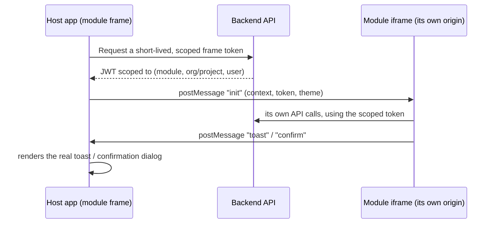
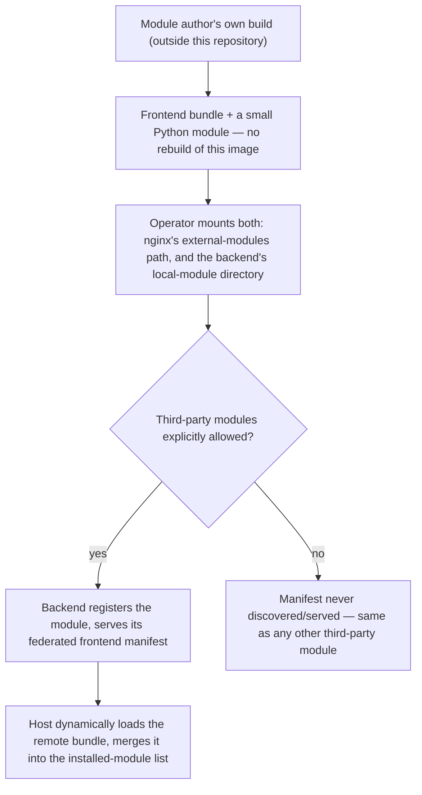

# Third-party and federated modules

[Building your own module](./building-your-own-module.md) covers Tier A — a module compiled directly into this deployment's own backend and frontend images, the way the Compliance module itself is built. This page covers the two tiers for a module that **wasn't**: Tier B, rendered in a sandboxed frame, and Tier C, dynamically loaded at runtime with no rebuild and no sandbox at all. Both apply equally whether you're the module's author (building it) or the deployment operator (installing someone else's).

## Tier B — remote (an iframe, no build step)

For a module genuinely not installed into the deployment — an org admin pointing at an external tool's URL at runtime — the module declares a `"remote"`-tier frontend manifest naming its own URL. The host renders it inside a sandboxed `<iframe sandbox="allow-scripts allow-same-origin allow-forms">` — but with a **Host UI Bridge**: the iframe's own page body is isolated, but shared chrome (a toast, a confirmation dialog) is requested over `postMessage` and rendered by the real host components, so it still feels native for what matters most.

A few details that make this safe, not just convenient:

- **The token is never the user's real session token.** It's a short-lived (~15 minute) token minted server-side, scoped to exactly one (module, organisation or project, user) tuple, and rejected if the request it's presented with doesn't match that exact scope — checked before any admin-override bypass, so a mis-scoped token can't reach further just because the underlying user happens to hold a higher role.
- **A module-frame token can't mint another one** — minting requires a normal session, not a module-frame token.
- **Every message is origin-checked, both directions**, against the module's own declared origin — never a wildcard.
- **The module's own origin must be on an explicit allowlist.** A module whose origin isn't allowlisted is excluded from the frontend manifest entirely, logged rather than trusted from the module's own declaration; the same allowlist drives the page's Content-Security-Policy as an independent, browser-enforced backstop.

## Tier C — federated (genuinely third-party, no rebuild required)

Tier A requires a rebuild of this frontend image — a production frontend bundle is a static build artifact, nothing to rescan once it exists. Tier B can run without a build step, but only by giving up native component reuse for iframe isolation. **Tier C is for a self-hosted operator who wants to add a genuinely third-party frontend module — one never compiled into this image — the same way the backend has always supported for a third-party Python module**: the module author builds their own remote bundle, on their own schedule, with their own tooling, entirely outside this repository; the operator drops the built artifact somewhere this frontend can reach at runtime; the host dynamically loads it, sharing its own React instance rather than an isolated iframe.

A federated manifest is only ever legitimate for a module discovered through the third-party pipeline (an installable package or a local directory) — never a first-party one. A first-party module has no reason to use Tier C at all: it can use Tier A directly, with full build-time review. The backend enforces this mechanically (excludes and logs a first-party module's attempt to declare Tier C) rather than trusting a module not to misdeclare it.

### The trust model, stated plainly

This is a materially **bigger** trust concession than either Tier A or Tier B — not a restatement of the same risk one level up:

| | Tier A (installed) | Tier B (remote/iframe) | Tier C (federated) |
|---|---|---|---|
| Code review | This repository's own PR review, before the image is built | The module's own origin's own process — but sandboxed | **None at all** — code the operator never compiled or reviewed |
| Isolation | N/A — genuinely part of the app | Sandboxed iframe, no DOM/cookie access to the host | **None** — same origin, same DOM, same cookies, same live component tree as the host |
| Rebuild required | Yes | No | No |
| Native component reuse | Full | Only via the Host UI Bridge's message-passing | Full — shares the host's own React instance |

A Tier C module's code runs with everything the current page's own script already has access to — the user's session, the live DOM, every other component's state. There is no sandbox standing between "this manifest was served" and "this code runs with full page access." The mitigation is the same shape as the backend's own third-party discovery gate — an explicit, logged, opt-in decision by the deployment operator — but the *consequence* of that decision is larger here than for a router-only third-party backend module, whose blast radius is still bounded by the backend's own authorization checks, while a Tier C frontend module's blast radius is "whatever the current user's browser session can do." Do not understate this when advising an operator whether to enable it.

### Module-author guide

A Tier C module author never touches this repository. Their own build produces two artifacts:

1. **A frontend bundle** exporting an `init(sharedScope)` function and a `get(exposedModuleName)` function that resolves to a factory whose return value has a `moduleDefinition` property, shaped exactly like a Tier A module definition: `{ key, routes?, orgAdminSections? }`. `key` **must** match the `module_key` your backend definition registers — a mismatch is rejected by the host loader (logged, and the module simply doesn't appear), not silently accepted under a different key.
2. **Use the host's own shared React instance, don't bundle your own.** The host hands your `init(sharedScope)` its own already-loaded `react`/`react-dom` — building your components against these (rather than your own bundled copy) is what makes your module render through the same live component tree as the host, avoiding the classic footgun of two different React instances fighting over one page (hooks silently breaking, context providers not being seen by consumers in the "wrong" copy).
3. **What you may import directly, versus what you must receive from the host**: only React itself needs to come from the shared scope — this application's own shared component library is **not** exposed to a Tier C module the way it is to a Tier A module compiled into this bundle. A Tier C module builds its own UI (using the host's shared React instance, so hooks and context still work correctly), styled to visually match using this application's own CSS custom properties, rather than importing component source it has no access to.
4. **Your backend counterpart** is a router-less module definition — see the operator guide below for the exact shape; you'll typically supply both the frontend bundle and this file to the operator together, as one package.

Nothing about your own build tooling, bundler choice, or repository structure is dictated beyond "produces a bundle implementing this container contract."

### Operator guide

None of this requires rebuilding either the backend or frontend Docker image.

1. **Get the module's two artifacts from its author**: a frontend bundle and a backend module definition file. A router-less module needs no database migration of its own either, but may have one, exactly like any other externally-discovered module.
2. **Write (or receive from the author) the backend module definition** — a plain Python module declaring a `ModuleDefinition` with a `"federated"`-tier frontend manifest naming the bundle's URL and its exposed-module name. This reuses the entire existing third-party discovery pipeline (entitlement, org enablement, audit logging, the Modules admin toggle) with zero new backend discovery code.
3. **Place it where the backend's local-module discovery can find it, and explicitly allow third-party modules** — the same two settings any other third-party module needs; nothing Tier-C-specific about either.
4. **Mount the frontend bundle into the frontend container's reserved external-modules path** (or host it elsewhere entirely and point the module's manifest at that absolute URL instead).
5. **Restart both containers** — no rebuild.
6. **Enable it for an organisation** via the existing Modules admin UI, exactly like any other module.

See [Installation & Deployment → Scaling and adding modules](../installation-deployment/scaling-and-modules.md) for the exact bind-mount steps and environment variables.

**Before enabling third-party modules and mounting a Tier C module in particular** (more so than a router-only backend module — see the trust model above), review the module's own code, reputation, and maintenance posture the way any third-party vendor is reviewed — its code will run with full access to whatever the current page's own session and DOM already have, with no sandbox.

## Where this fits

See [Modules → Overview](./overview.md) for the registry/gating model this all sits on top of, [Modules → Building your own module](./building-your-own-module.md) for the `ModuleDefinition`/RBAC/MCP-tool contract every tier shares, and [Installation & Deployment → Scaling and adding modules](../installation-deployment/scaling-and-modules.md) for the operator-side deployment mechanics.
