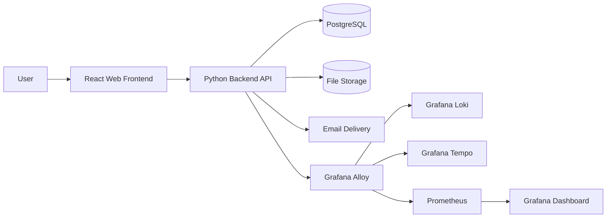
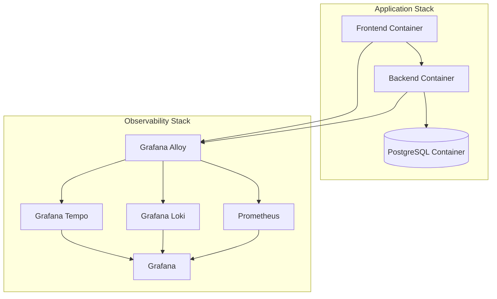
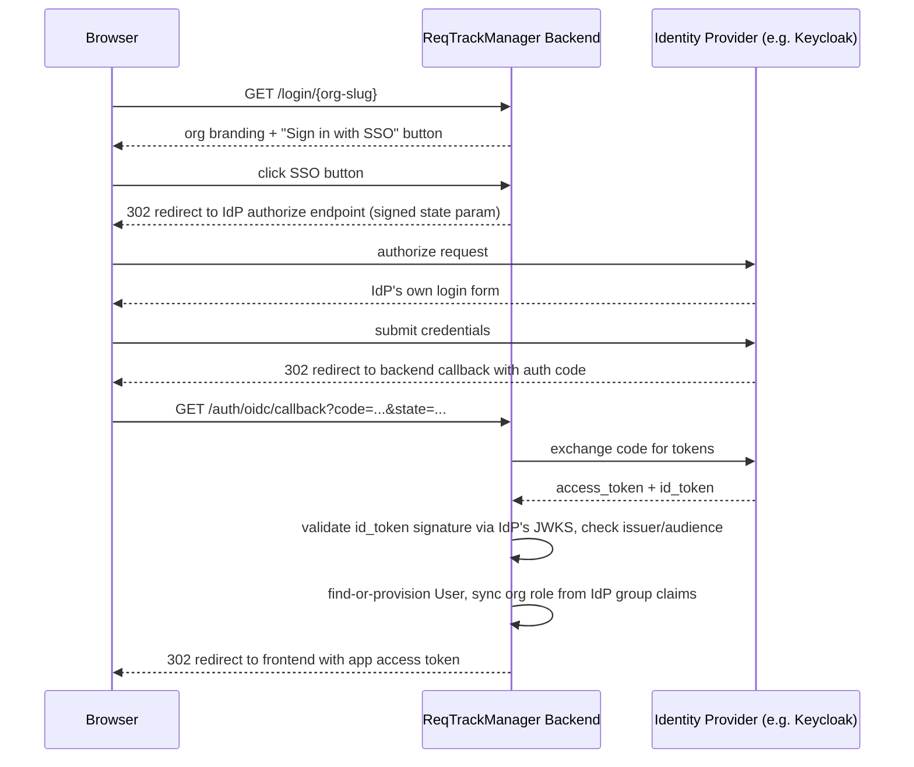
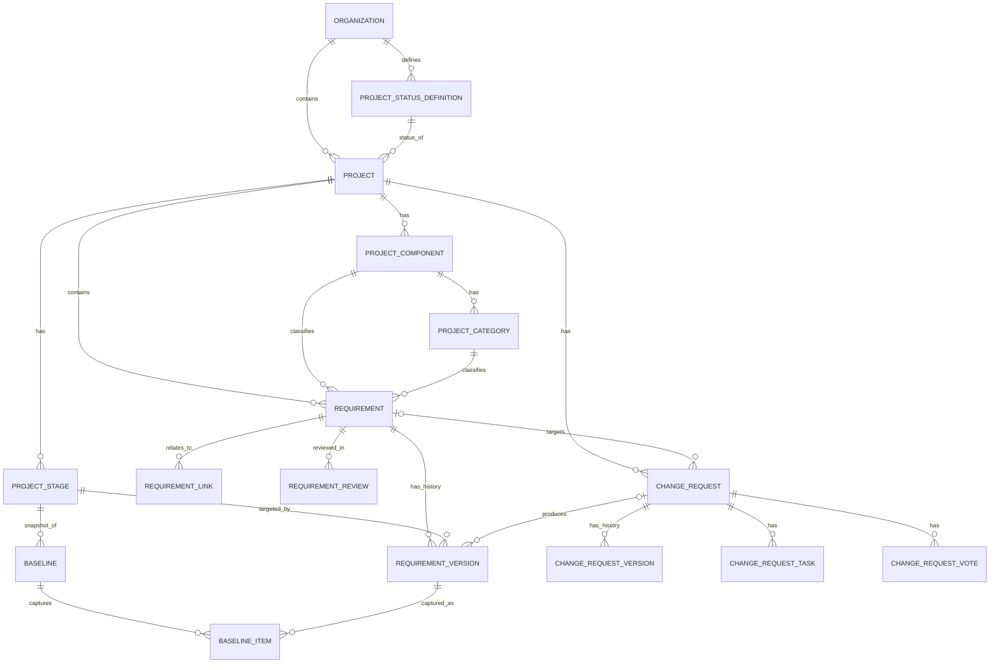

# Architecture overview

ReqTrackManager is a container-first, three-tier application: a React frontend, a Python (FastAPI) backend API, and a PostgreSQL database, with a small set of supporting services for file storage, email, and observability. This page is the high-level map — for the detailed *why* behind any one piece, follow the links throughout to the relevant Concepts, Core Features, Installation & Deployment, or Enterprise & Security page.

## Goals

The architecture is guided by a small set of goals that show up throughout the rest of this page:

- A complete, formal requirements lifecycle — scoping through review, approval, completion, and archival — enforced by the backend, not left to convention.
- A simple deployment model to start: one frontend container, one backend container, one database, with an explicit, documented path to scale beyond that.
- Enterprise-style concerns — role-based access control, audit trails, SSO — built in rather than bolted on.
- A **temporal** data model, so requirement and change history can be queried and audited reliably, not just observed in its current state.
- Real operational visibility: health checks, metrics, logs, and traces, not just application logs.

## System context

Users interact with the frontend, the frontend calls the backend API, and the backend stores data in PostgreSQL and files in a configurable storage backend. Observability data is collected by Grafana Alloy and routed to Loki (logs), Tempo (traces), and Prometheus (metrics).

## Core principles

- **Layered separation of concerns** — presentation, application services, persistence, and operational concerns are kept independent, so each can evolve on its own.
- **Domain-driven backend modules** — the backend is organised around business domains (organisations/projects, requirements, change requests, reviews, audit, reporting) rather than technical layers alone.
- **Container-first deployment** — the application runs in containers from local development through production, via Docker Compose.
- **Secure-by-default design** — authentication, authorization, audit logging, and data sanitisation are first-class platform concerns, enforced centrally rather than left to each feature to reimplement.

## Components

- **Presentation layer** — a React single-page application: project/requirement browsing and editing, change-request review, dashboards and reports, preferences and notifications. See [Core Features](../core-features/requirements-management.md) for what it actually does, and [Workflows](../workflows/signing-in.md) for how a user does it.
- **Application layer** — a Python REST API organised into discrete modules (auth/identity, organisations/projects, requirements, change requests, reviews/approvals, reporting, notifications, audit/history, file management). This is where the requirements lifecycle, RBAC, and every business rule is actually enforced. See [API & Integrations](../api-integrations/rest-api-overview.md) for calling it directly.
- **Data layer** — PostgreSQL is the sole transactional store: organisations, users, projects, requirements, change requests, roles, and audit history. Schema changes go through versioned migrations (Alembic).
- **File storage layer** — a pluggable backend (local filesystem or S3-compatible object storage, e.g. MinIO) for attachments and uploaded documents. See [Installation & Deployment → Configuration reference](../installation-deployment/configuration-reference.md) for `STORAGE_BACKEND` and related settings.
- **Observability layer** — Prometheus metrics, Loki log aggregation, Tempo distributed tracing, and Grafana Alloy shipping all three — see [Observability](#observability-and-operations) below.
- **AI integration layer** — a [Model Context Protocol](https://modelcontextprotocol.io) server exposes requirements/projects/organisations to AI assistants as a second, independent consumer of the same REST API the frontend uses. It holds no credentials of its own and performs no authorization itself — every request forwards the caller's own bearer token, so the backend's existing RBAC is the single point of enforcement regardless of whether the caller is a human or an AI assistant. See [AI assistants (MCP)](../api-integrations/ai-assistants-mcp/overview.md).

## Modular feature system

Large, optional capability areas — Compliance being the first — ship as **modules**: self-contained units of backend endpoints, database tables, RBAC roles, frontend pages, and optionally AI-assistant tools, gated per deployment (entitlement) and per organisation (enablement), rather than permanently-on core features. See [Modules → Overview](../modules/overview.md) for the full mechanism, including how a third-party module can be installed without a rebuild of either the frontend or backend image.

## Deployment architecture

The initial deployment model is deliberately simple — one frontend container, one backend container, one PostgreSQL container, plus optional observability services — suitable for local development, CI, and small production deployments alike. The same Docker Compose approach scales up later: multiple backend replicas behind a load balancer, separate worker services for background tasks, dedicated object storage, and additional services for search, caching, or queueing, once a single backend replica is no longer sufficient. See [Installation & Deployment](../installation-deployment/overview.md) for the full chapter, including the two separate Compose stacks (production vs. local development/evaluation) and [Scaling and adding modules](../installation-deployment/scaling-and-modules.md) for what's already built versus what remains a documented future step.

## Security architecture

Authentication supports native credentials and optional per-organisation SSO (OIDC); authorization is role-based at both the organisation and project level; every mutating action is audit-logged; and secrets (OIDC client secrets, SMTP passwords, TOTP secrets) are encrypted at the application layer, not left to infrastructure alone. See [Enterprise & Security](../enterprise-security/encryption-and-secrets-handling.md) for the full posture, and [API & Integrations → Single sign-on](../api-integrations/single-sign-on.md) for setting SSO up.

The diagram below is the one flow in the system where a third party (the identity provider) is trusted to assert who a user is — every other auth path only ever trusts the application's own database. Read it top to bottom; the two "Backend validates..." steps are the security-critical points.

## Data and workflow model

The platform centres on a formal requirements workflow: a project is created within an organisation, its stages are configured, requirements are scoped and reviewed, a stage's approval baselines and locks them, and any further change to a locked requirement must go through a formal change request. See [Requirements, versions, and the lifecycle](../concepts/requirements-versions-and-lifecycle.md) and [Change requests and baselines](../concepts/change-requests-and-baselines.md) for the conceptual account.

The database is **temporal** rather than storing only latest state: a requirement's stable identity (project, component, category, generated ID) lives separately from its versioned content (name, description, status, custom field values), so a change never overwrites history — it closes the current version and opens a new one. This supports point-in-time queries ("what did this requirement say on a given date") for audit, reporting, and compliance review, without any code path that lets an approved requirement change without leaving a record.

The diagram below shows the core requirements and change-management schema — the part of the database every other feature (baselining, reporting, audit) ultimately reads from:

Read the two dashed-duality (`|o--o{`) relationships as the two places a zero-or-one matters: a `NEW_REQUIREMENT`-kind change request has no target requirement yet (it creates one on approval), and most requirement versions come from a direct edit rather than an approved change request — only the ones that are do carry that link.

This is one of six diagrams covering the full schema (roughly 70 tables at last count) in the repository's own [`docs/solution-architecture.md`](https://github.com/ballardr/reqtrackmanager/blob/main/docs/solution-architecture.md) — requirement actions, discussion/engagement/files, identity and access control, and platform administration/audit each get their own diagram there, along with the exhaustive table-by-table inventory. That document, and [`docs/decisions.md`](https://github.com/ballardr/reqtrackmanager/blob/main/docs/decisions.md) alongside it, are written for someone implementing against this codebase rather than for a general audience — worth a look if you're contributing code, not required reading to use the product.

## Observability and operations

Every service exposes health endpoints for container orchestration. The backend exposes a Prometheus-compatible `/metrics` endpoint covering HTTP request rate/latency/error rate, database connection pool utilisation, requirement and change-request workflow counts, login/authentication activity, notification delivery, and storage usage. Logs and traces ship through Grafana Alloy to Loki and Tempo respectively. See [Installation & Deployment → Observability](../installation-deployment/observability.md) for setup.

## Non-functional considerations

- **Scalability** — see [Deployment architecture](#deployment-architecture) above: the initial single-container model has an explicit, documented path to more services once needed, rather than a rewrite.
- **Maintainability** — the domain-driven module structure and containerised, documented deployment model keep the codebase approachable for new contributors.
- **Extensibility** — SSO, external object storage, and multi-tenant enterprise features (per-organisation branding, SCIM, the module system) are already built, not just left extensible in the abstract. The one item still genuinely future rather than built: dedicated notification/scheduler worker services — the notification digest, disk-usage monitor, and review-deadline scheduler all still run in-process in the single backend container today.

## Known limitations

A candid, non-exhaustive list of what's deliberately scoped down or not yet built, mirroring the [README](https://github.com/ballardr/reqtrackmanager#known-limitations)'s own "Known limitations" section:

- A standalone separate-port provisioning API is documented as an implementable blueprint rather than built — SCIM provisioning itself is built; see [SCIM provisioning](../api-integrations/scim-provisioning.md).
- The backend does not yet emit OpenTelemetry traces — the Alloy/Tempo pipeline is wired and ready to receive them, but nothing currently sends any.
- Login IP is logged but not geolocated; requirement/component/category ordering is move-up/move-down rather than drag-and-drop; permission revocation does not send a notification (only granting one does).
- Notification/digest delivery, the disk-usage monitor, and the review/stage-deadline scheduler run as in-process background tasks in the backend container rather than a separately-scaled worker service.
- Project/organisation bundle export deliberately excludes Restricted secrets and project-level group membership — see [Core Features → Zip export/import](../core-features/zip-export-import.md).

See [Enterprise & Security → SOC 2 compliance posture](../enterprise-security/soc-2-compliance-posture.md) for the fuller, ongoing catalogue of security-control gaps.

## Recommended stack

- **Frontend**: React
- **Backend**: Python, FastAPI, RESTful and OpenAPI-compliant
- **Database**: PostgreSQL
- **Containerisation**: Docker and Docker Compose
- **Observability**: Prometheus, Loki, Tempo, Grafana Alloy, Grafana

## Where this fits

- [Installation & Deployment](../installation-deployment/overview.md) — standing up and configuring a real deployment.
- [Modules → Overview](../modules/overview.md) — the modular feature system in full.
- [Enterprise & Security](../enterprise-security/encryption-and-secrets-handling.md) — the security posture this architecture is built to support.
- [Contributing](./contributing.md) — building and testing this codebase locally.
