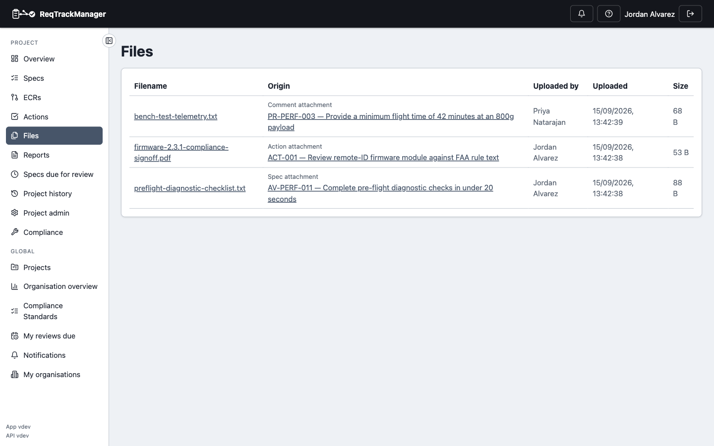
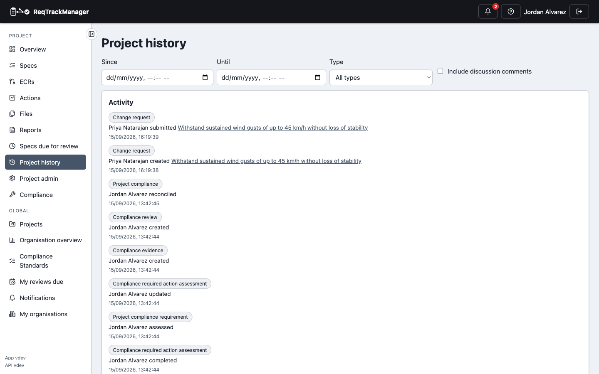

# Files, comments, and history

## Attaching a file

Use the file picker at the bottom of a requirement's (or action's) Attachments card to upload a supporting document; click a filename to download it, or the trash icon to remove it. Once a requirement is locked, this direct upload is no longer available — a file can still be attached via an approved [change request](./change-requests.md), or informally via a discussion comment, which stays available on locked requirements since it isn't part of the governed content.

## Commenting and editing comments

Add a comment to a requirement's or change request's discussion thread for informal back-and-forth, distinct from the formal change log. Attach a file with the paperclip icon while writing a comment, or while editing your own existing one — there's no way to attach a file to someone else's comment, or to an already-posted comment you're not editing. Edit your own comment with **Edit**; an edited comment shows "(edited)" next to its timestamp.

## Browsing every file in a project

A project's **Files** page lists every file attached anywhere within it — requirements, change requests, and actions — in one combined list, since a file has no single natural home of its own otherwise.

| Project files |
| --- |
| Every file attached within a project, in one list |
|  |

## Reviewing project history

A project's **Project history** page is a unified timeline of everything that's happened — requirement and change-request version history, plus other audit events (stage transitions, group membership changes, and more) — filterable by date range and entity type.

| Project history |
| --- |
| A unified activity timeline, filterable by date range and entity type |
|  |

Discussion comments are excluded from the timeline by default, since they're informal discussion rather than the formal change log — tick **Include discussion comments** to bring them into view alongside everything else.

## Where this fits

See [Core Features → File attachments and shared resources](../core-features/file-attachments-and-shared-resources.md) for organisation-wide shared resource files, and [Change requests and baselines](../concepts/change-requests-and-baselines.md) for why the version history this page surfaces exists in the first place.
