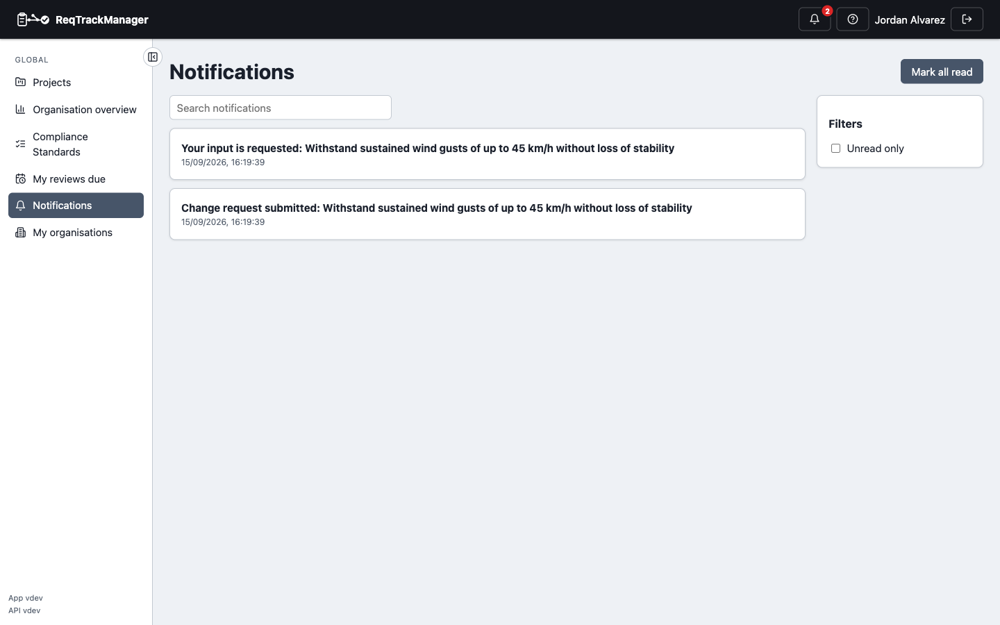

# Notifications

## The bell icon

The bell icon in the top bar shows your recent notifications, with an unread count badge — see [Core Features → Notifications and email](../core-features/notifications-and-email.md) for the full list of what triggers one. Click a notification to mark it read and, for anything tied to a specific requirement, change request, or project, jump straight to it. **Mark all read** clears every unread one without navigating anywhere.

## The Notifications page

For your full notification history — searchable, and not limited to the dropdown's recent slice — go to **Notifications** in the nav's Global section. The same click-to-open behaviour applies, plus an **Unread only** filter.

| Notifications page |
| --- |
| Full notification history with search and an unread-only filter |
|  |

## Choosing how you're notified

**Preferences → Notification preferences** sets, per notification type, whether you want it in-app, by email, or both, and whether email notifications go out instantly or are batched into a daily digest. See [Preferences and help](./preferences-and-help.md).

## Where this fits

See [Discussions, notifications, and audit](../concepts/discussions-notifications-and-audit.md) for the model behind what gets notified and why, and [Core Features → Notifications and email](../core-features/notifications-and-email.md) for the full type-by-type reference and unsubscribe mechanics.
