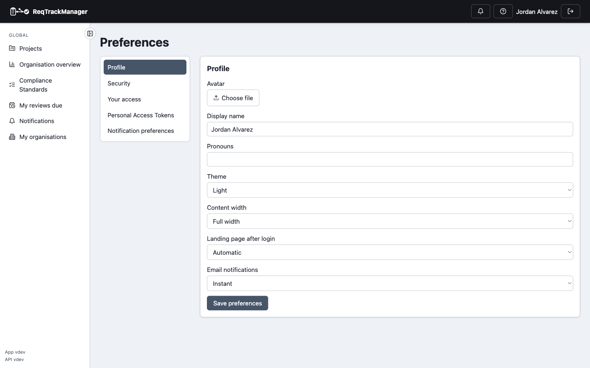

# Preferences and help

## Opening your preferences

Click your name in the top bar to open **Preferences**, a tabbed page:

- **Profile** — avatar, display name (an organisation admin can lock this so members can't rename themselves), pronouns, theme (light/dark/system), and which page you land on after login (a specific project, the project list, or automatic).
- **Security** — change your password, and enable/disable [two-factor authentication](./two-factor-authentication.md).
- **Your access** — every organisation you belong to, your role(s) there, a **Manage organisation** link wherever you hold `org_admin`, and the projects within it you can see with your role(s) on each. The quickest way to check "what can I actually do here."
- **Personal Access Tokens** — create and revoke tokens for API or MCP access. See [Core Features → Personal access tokens](../core-features/personal-access-tokens.md).
- **Notification preferences** — per-type in-app/email toggles and digest mode.

| Preferences page |
| --- |
| Profile tab: theme, pronouns, and landing-page-after-login mode |
|  |

The landing-page preference only takes effect at the moment you next log in, not on ordinary in-app navigation — clicking the brand logo always goes to the plain project list, regardless of what you've set here.

## Setting notification preferences

From **Preferences → Notification preferences**, choose per-notification-type whether you want it in-app, by email, or both, and whether email notifications are sent instantly or batched into a daily digest. See [Notifications](./notifications.md) for what each type covers.

## Getting help in-app

The **?** icon in the top bar opens the **Help** page: a quick reference covering how the app is organised, roles, the requirement and change-request lifecycles (with diagrams), and components/categories — without leaving the app.

## Where this fits

See [Roles, groups, and access control](../concepts/roles-groups-and-access-control.md) for what the roles listed on **Your access** actually mean, and [Core Features → Two-factor authentication](../core-features/two-factor-authentication.md) for the security tab's 2FA mechanics in detail.
