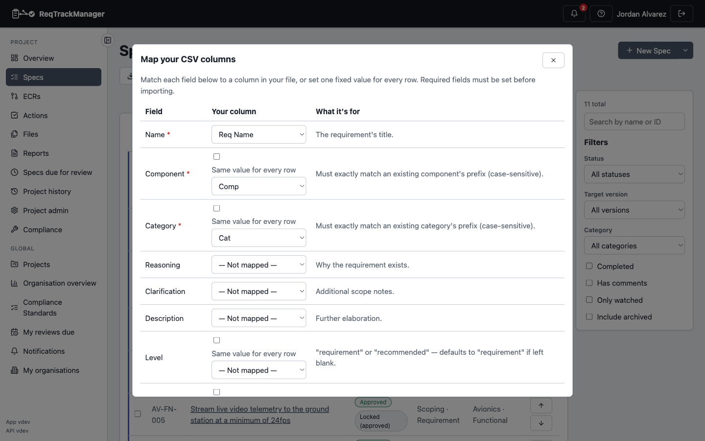

# Reporting and CSV import/export

## Generating a PDF or CSV report

Open a project's **Reports** page:

1. Filter by component, category, status, or keyword to scope what's included.
2. Optionally pick one of the organisation's **report templates** for a PDF export — an accent colour, cover page, and footer, for consistent on-brand output.
3. Generate the report — a PDF includes the project's own introduction/chapters/appendices (**Project Admin → Report Setup**), falling back to the organisation's defaults field by field wherever the project leaves one blank.

| Reports page |
| --- |
| Filtered PDF/CSV export with a selectable organisation branding template |
|  |

## Exporting requirements to CSV

The same Reports page exports requirements as CSV — every field, including custom field values and target stage — a full round-trip counterpart to CSV import, below.

## Importing requirements from a CSV file

From a project's **Requirements** page, click **Import CSV**:

1. Choose a file. A **mapping** screen appears, listing every requirement field (Name, Component, Category required; Reasoning, Description, Level, Target version, and more optional) alongside a dropdown to pick which column in your file supplies it — or, for several fields, a fixed value applied to every row instead of a per-row column.
2. Component and Category must match an existing component/category prefix exactly (case-sensitive) — set as a fixed value if every row in the file belongs to the same one.
3. A live **preview** of the first rows updates as you map columns, so you can confirm the mapping looks right before importing anything.

| CSV column mapping |
| --- |
| Mapping a CSV file's columns onto requirement fields, with a live preview |
|  |

4. Click **Import** once every required field is mapped. Each row is validated independently — one row succeeding and another failing (an unrecognised component prefix, say) is reported per-row, not as a whole-import failure.

Click **Download template** on the Requirements page for a starter CSV pre-filled with the project's own component/category prefixes. Rows that omit a target version default to the project's first stage, the same as creating a requirement directly.

## Where this fits

See [Core Features → Reports and export](../core-features/reports-and-export.md) for report-content editing (Markdown/WYSIWYG, image inserts, organisation defaults), and [Authoring and reviewing requirements](./authoring-and-reviewing-requirements.md) for creating requirements one at a time instead of in bulk.
