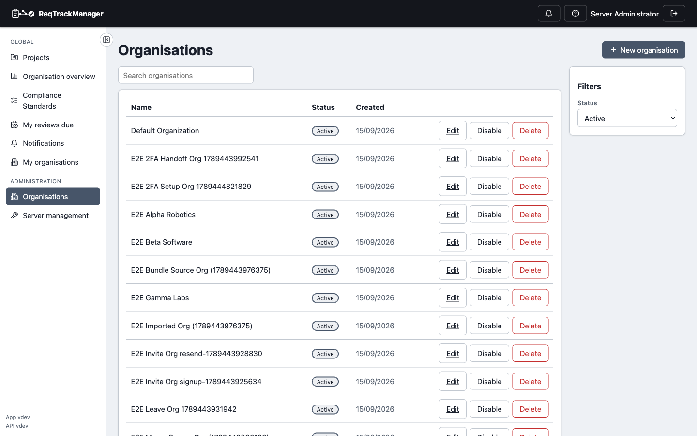
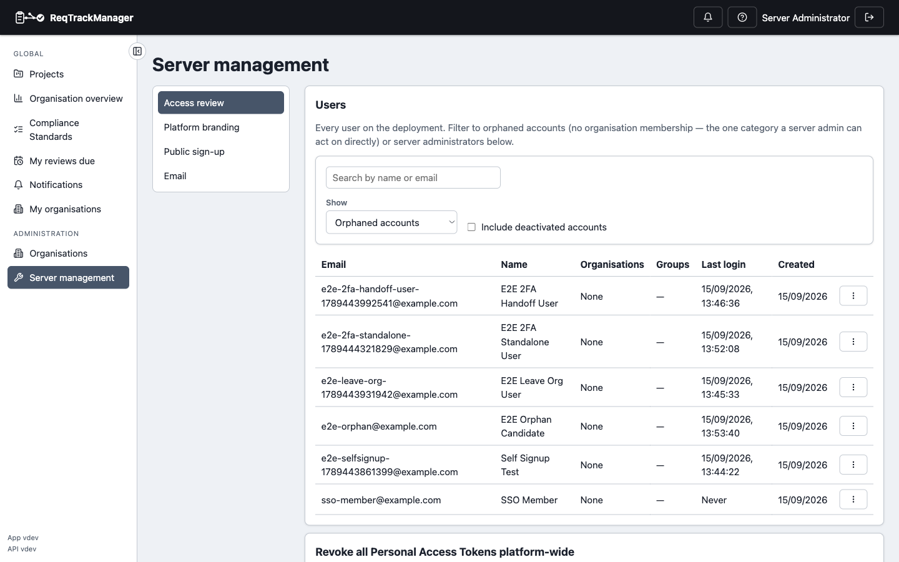

# Server administration

Server administration is a narrow, cross-tenant management role — a server admin can see every organisation on the deployment for oversight and support, without that visibility becoming a way to read or act on any specific org's or project's actual content. Reaching this role at all requires being granted `is_server_admin`, separate from any organisation or project role.

## Seeing every organisation

**Server Management → Organisations** lists every organisation on the deployment — creation date, active/disabled status — regardless of whether the server admin belongs to any of them.

| Server: organisations |
| --- |
| Every organisation on the deployment, visible to a server admin regardless of membership |
|  |

Opening any one org's admin page from here as a server admin (rather than an org member) reveals nothing about its actual content — users, groups, and resources all refuse access, so the org's requirements and change requests stay off-limits even to this role.

## Server Management

**Server Management** groups deployment-wide settings and platform-level user directory tools:

| Server management |
| --- |
| Access review, platform branding, public sign-up, and email settings |
|  |

- **Access review** — the platform-wide user directory: every user on the deployment, filterable to orphaned accounts (no organisation membership at all) or other server administrators.
- **Platform branding** — the deployment's own logo and login-page styling, distinct from an organisation's own branding.
- **Public sign-up** — the deployment-wide sign-up mode: disabled (accounts created by an admin or invite only), always on (anyone can create an account, joining no organisation automatically), or restricted to organisations that have opted in by email domain. See [Signing in → Signing up](./signing-in.md#signing-up) for what a user sees on the other side of this setting.
- **Email** — deployment-wide outbound email configuration.

## Managing orphaned accounts

An **orphaned account** — a user with no organisation membership at all — is the one category of user a server admin can act on directly: deactivate/reactivate, or ban. A banned account can't be granted a fresh organisation role even via a direct API call.

## Incident response: revoking every Personal Access Token

**Server Management** also offers a platform-wide **Revoke all Personal Access Tokens** action — an incident-response tool that revokes every non-revoked token in the deployment regardless of who owns it or which organisation(s) it's scoped to. Use it only for an actual credential-compromise incident, not routine token management (revoke an individual token from [Preferences → Personal Access Tokens](../core-features/personal-access-tokens.md) instead).

## Where this fits

See [Roles, groups, and access control](../concepts/roles-groups-and-access-control.md) for how server-admin scope compares to organisation and project roles, and [Administering an organisation](./administering-an-organisation.md) for what an org admin (a narrower, single-tenant role) can do instead.
