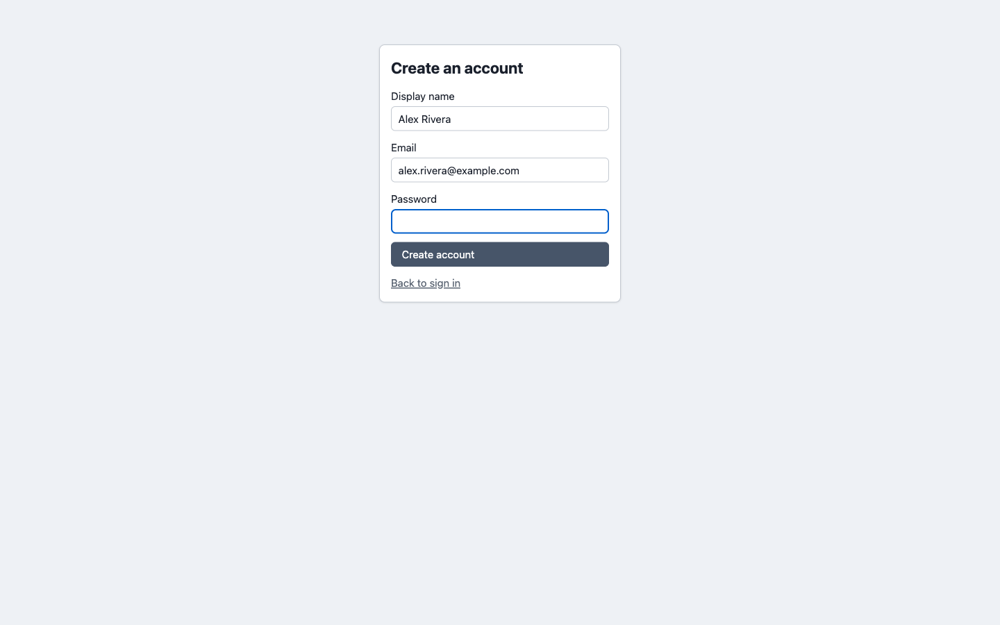

# Signing in

## With email and password

1. Go to the frontend URL and enter your email and password.
2. If your account has [two-factor authentication](./two-factor-authentication.md) enabled, you're prompted for a code from your authenticator app after the password is accepted — a second step, not a replacement for it.
3. If your organisation requires 2FA for every member and you haven't set it up yet, you can still sign in, but nothing else works until you enrol from **Preferences → Security**.

| Sign-in page |
| --- |
| Email/password form; a "Sign up" link appears here when public sign-up is enabled |
|  |

If you belong to more than one organisation, an organisation switcher appears wherever an organisation context is needed (creating a new project, for example) — the same account, regardless of whether you signed in natively or via SSO.

## With single sign-on (SSO)

If your organisation has SSO configured, go to its branded login page (`/login/{org-slug}` — ask your org admin for the link) instead of the plain sign-in page. A "Sign in with SSO" button appears there, alongside the regular email/password form unless your org has hidden it:

1. Click **Sign in with SSO**.
2. You're redirected to your organisation's own identity provider to authenticate — this app never sees your IdP password.
3. You land back in the app already signed in, provisioned with whatever role your IdP group maps to.

If your organisation requires membership in a specific identity-provider group and you're not in it, you'll see a message explaining your organisation hasn't provisioned you access yet — contact your org admin rather than retrying. See [API & Integrations → Single sign-on](../api-integrations/single-sign-on.md) for how an org admin sets this up.

## Signing up

If a server admin has turned on public sign-up (**Server Management → Public sign-up**, see [Server administration](./server-administration.md)), a **Sign up** link appears below the login form:

1. Click **Sign up** and fill in your display name, email, and a password.
2. Depending on how sign-up is configured, this either creates an account with no organisation yet (an admin assigns you to one afterward), or — if it's restricted to specific organisations by email domain — joins you to the matching organisation as a member immediately.

| Sign-up page |
| --- |
| Display name, email, and password for self-service account creation |
|  |

If you were sent an invite link by a project admin instead, follow that link rather than the plain sign-up page — it already knows which organisation and project to grant you once you finish creating your account. See [Administering a project → Adding external users](./administering-a-project.md#adding-external-users) for how those invites work.

## Where this fits

See [Organisations and projects](../concepts/organisations-and-projects.md) for the containment model your account sits inside once you're in, and [API & Integrations → Authenticating](../api-integrations/authenticating.md) for signing in programmatically (Personal Access Tokens) rather than through the browser.
