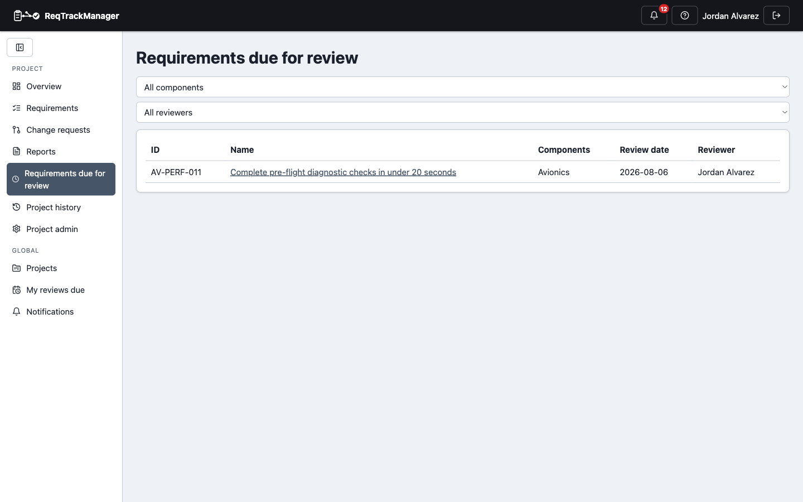

# Stages, baselining, and reviews

## Viewing a project's stages

**Project Admin → Structure** shows a project's stage sequence (e.g. Scoping → Development → Hardening).

| Project stages |
| --- |
| A project's stage sequence, with review/approve actions per stage |
|  |

## Moving a stage through review to approval

A stage progresses through a fixed sequence — it can't skip a step or move backwards:

1. **Start review** — moves a stage from Scoping into Review. Optionally set a **review deadline**.
2. While in review, stakeholders record an explicit approve/reject response. If the deadline passes with no rejection, the stage auto-approves — silence is treated as approval. An explicit rejection blocks the auto-approval and leaves it for a manager to resolve.
3. **Approve stage** — baselines every non-archived requirement still in draft or reviewed status (snapshotting its current version) and locks them: from this point, they can only change via a [change request](./change-requests.md).
4. Once the stage's work is delivered, a project manager can mark the **stage itself completed**, optionally cascading completion to every approved requirement targeting it.

Only a project manager or administrator can approve a stage; a plain member's attempt is rejected server-side even if they try it directly against the API rather than through the UI.

## Renaming and deleting a stage

Anyone who can create a stage can rename it inline or delete it. Deleting one requires picking another stage to reassign everything currently targeting it to, and a stage with an approved baseline can't be deleted at all — see [Core Features → Stages and baselining](../core-features/stages-and-baselining.md#renaming-and-deleting-stages) for the full reassignment rules.

## Scheduling and recording an individual review

Separately from a stage's own review deadline above, a single requirement can carry its own **review date** and an assigned reviewer, set from the requirement's detail page (see [Authoring and reviewing requirements](./authoring-and-reviewing-requirements.md)). Once that date passes, it appears on:

- the assigned reviewer's own **My reviews due** page, and
- the project's **Reviews due** page, filterable by component and reviewer —

until someone records an outcome: met, or failed with a required comment explaining why.

| Reviews due |
| --- |
| Requirements past their review date, filterable by component and reviewer |
|  |

Recording an outcome is restricted to the assigned reviewer or a project manager — a plain member attempting it is rejected, both in the UI and by the server directly.

## Where this fits

See [Change requests and baselines](../concepts/change-requests-and-baselines.md) for what a baseline is and why it's immutable, [Core Features → Stages and baselining](../core-features/stages-and-baselining.md) for the full mechanics, and [Authoring and reviewing requirements](./authoring-and-reviewing-requirements.md) for creating and editing the requirements whose reviews this page schedules.
