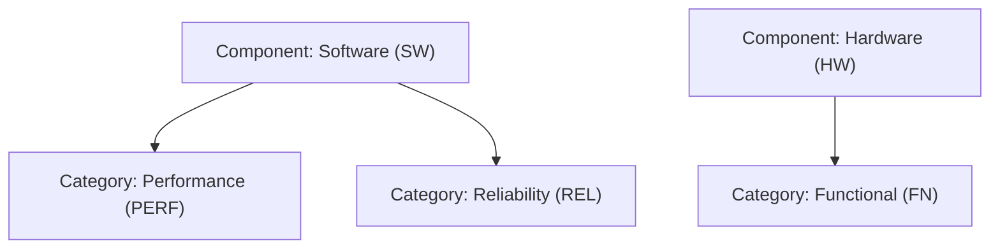

# How this app is organised

ReqTrackManager is structured as three levels, each nested inside the one above it:

- **Organisations** are the top tenant boundary. Every project belongs to exactly one organisation, and every project member must also be a member of that organisation.
- **Projects** live inside an organisation. Each project has its own requirements, change requests, components, categories, custom fields, and stages.
- **Requirements and change requests** live inside a project. A requirement is a single tracked item; a change request proposes either a brand new requirement or a modification to an existing one.

## Roles

Roles are assigned at two levels, and they're independent of each other:

- **Organisation roles** — org admin, project creator, or member. An org admin manages the organisation itself (branding, SSO, shared resources, membership) but does **not** automatically get access to any project's content — that's a separate, deliberate design choice.
- **Project roles** — project manager, project administrator, stakeholder, or member. These control what you can do inside one specific project: creating and editing requirements, managing components and categories, approving stages, and so on.

If something you expect to see or edit is missing, it's almost always a role question — check both your organisation role and your role on that specific project.

## Components and categories

Every requirement is filed under a **component** and, within it, a **category** — a two-level tree, not two independent lists. A category belongs to exactly one component; the same category name (e.g. "Performance") can exist under several different components, since each is really that component's own child, not a project-wide label shared across all of them.

This diagram shows two components ("Software" and "Hardware"), each with its own categories nested underneath — read top-to-bottom as parent-then-child, the same shape shown in Project Admin's Components/Categories tab. It matters because a requirement's identifier is built from both prefixes together (component first, then its category) — e.g. a "Performance" category under "Software" produces IDs like `SW-PERF-014`, and picking a category in the requirement/change-request forms always narrows to that component's own list rather than every category in the project.

## Where to start

New to a project? Start on its **overview** page for a dashboard of where things stand, then look at **requirements** to see what's being tracked.
