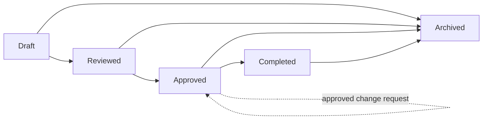

# The requirement lifecycle

Every requirement moves through a fixed set of statuses:

- **Draft** — still being written or discussed. Freely editable.
- **Reviewed** — has been through a review pass but isn't approved yet.
- **Approved** — locked. See below.
- **Completed** — approved *and* delivered.
- **Archived** — no longer active, kept for history.

The diagram below shows how a requirement moves between these statuses. Solid arrows are direct transitions; the dashed loop on **Approved** shows that once a requirement is locked, the only way to change it is through an approved change request — which updates it while it stays locked, rather than unlocking it. Any status can move to **Archived** once a requirement is no longer active.

## What "locked" means

Once a requirement reaches **approved** or **completed**, it's locked — you can no longer edit it directly, and you can no longer attach a file to it directly either. This is deliberate: an approved requirement is a commitment, and silently editing it after the fact (or quietly adding supporting files to it) would undermine the whole point of tracking it.

To change a locked requirement, or attach a new file to it, raise a **change request** instead (see the next section). This keeps a clear record of what changed, why, and who approved it. If you just need to share a file informally rather than attach it to the requirement itself, a discussion comment can carry its own attachment at any time, locked or not.

## Reviews

A requirement can have a review date and a reviewer assigned to it. When the review date arrives (or is approaching, based on the configured lead time), it shows up on the reviewer's **My reviews due** page and the project's **requirements due for review** page. Recording a review outcome as "met" or "failed" is separate from the requirement's status — it's a record of whether the requirement still holds up, not a status change by itself.

## Components and categories

Every requirement belongs to one component and one category, and its ID is built from both (for example `AUTH-SEC-001` for a requirement in the "Authentication Service" component and "Security" category). A project needs at least one component and one category before you can create requirements — if you hit that wall, either an admin needs to add them in Project admin, or, if you have manager/administrator access yourself, you'll be offered a quick way to create one right from the requirement form.
