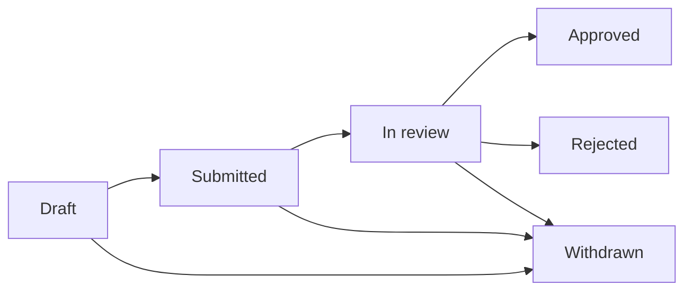

# Change requests

A change request is how you propose adding or modifying a requirement without editing it directly. There are two kinds:

- **New requirement** — propose an entirely new requirement.
- **Modify requirement** — propose a change to an existing (usually locked) requirement.

## Workflow

A change request moves through: draft → submitted → in review → approved or rejected (or withdrawn at any point before a decision). A project manager or administrator makes the actual approve/reject decision.

The diagram below shows every path a change request can take. Approved and rejected are both dead ends (a rejected proposal isn't reopened — raise a new one instead); withdrawn is available from either open state and is always the proposer's own choice, not a decision made about them.

## Stakeholder voting

Stakeholders can cast an advisory vote (approve or reject) with an optional comment. This is genuinely advisory — it doesn't change the manager's decision automatically — but it's a useful, visible signal of how the people affected by a change feel about it before a decision is made.

## Tasks

A change request can have a checklist of tasks attached to it, each with an assignee and an optional due date. These are for tracking the follow-up work a change request implies (updating a diagram, notifying a team, and so on), separate from the approval decision itself.
