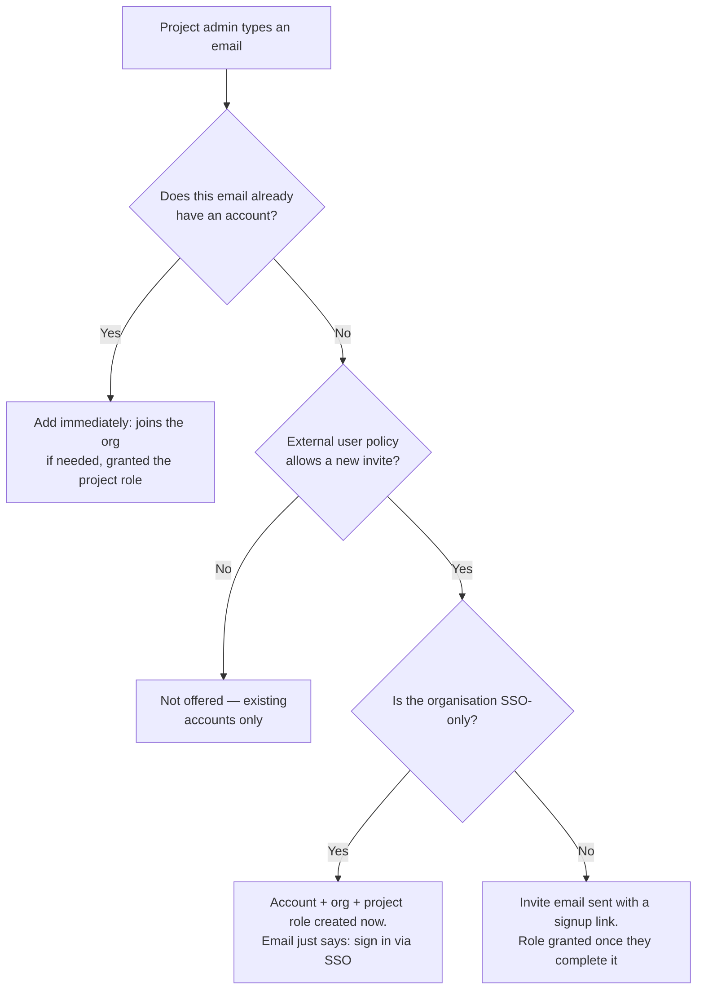

# Signing up and adding external users

There are three ways someone gets an account and access to an organisation or project: a server admin/org admin creates them directly (see the Roles section above), they sign themselves up through a public form, or a project admin invites them by email. This page covers the second and third.

## Public sign-up

A server admin controls whether the `/signup` page works at all, from Server Management's **Public sign-up** tab, with three modes:

- **Disabled** — the default. No public sign-up; every account is created by an admin or an invite.
- **Always on** — anyone can create an account. They don't automatically join any organisation; an admin assigns them to one afterward.
- **Org specified** — sign-up only succeeds when the typed email's domain matches an organisation that has opted in. An organisation opts in from its own **Advanced Settings**: set an accepted email domain and turn on **Allow self-signup**. A matching sign-up joins that organisation as a member immediately; a non-matching email is rejected.

An organisation that requires SSO (its login page hides the native email/password form entirely) can't also allow self-signup — self-signup would hand out exactly the kind of password credential that organisation has chosen not to use.

## Adding an external user to a project

When adding someone to a project, the picker normally only shows people already in your organisation. Typing a full email address that isn't a current member can also work, if your organisation's admin has enabled it (Org admin → Advanced Settings → **External users on projects**):

- **Disabled** (default) — only existing organisation members can be added.
- **Domain only** — an email that already has an account *anywhere* in the system can always be added; a brand-new email can only be invited if its domain matches the organisation's accepted domain.
- **Anyone** — any email can be added or invited, existing account or not.

What happens next depends on whether the email already has an account:

- **Existing account** — added immediately, gaining organisation membership if it didn't already have it.
- **No account, ordinary organisation** — an email is sent with a link to finish creating an account; the project access is granted the moment they complete it.
- **No account, SSO-only organisation** — there's no password to set, so access is granted immediately and the email just points them at signing in via SSO next time.

The diagram below shows all three outcomes:

Read it top to bottom: the first branch is whether an account exists at all, the second is whether your organisation's policy allows reaching a new one, and the third — only relevant for a genuinely new account — is whether the organisation uses SSO. It matters because those last two paths look different to the person being added: one gets an email with a link to set a password, the other gets an email telling them to just sign in via SSO, since there's no working password path for an SSO-only organisation.
